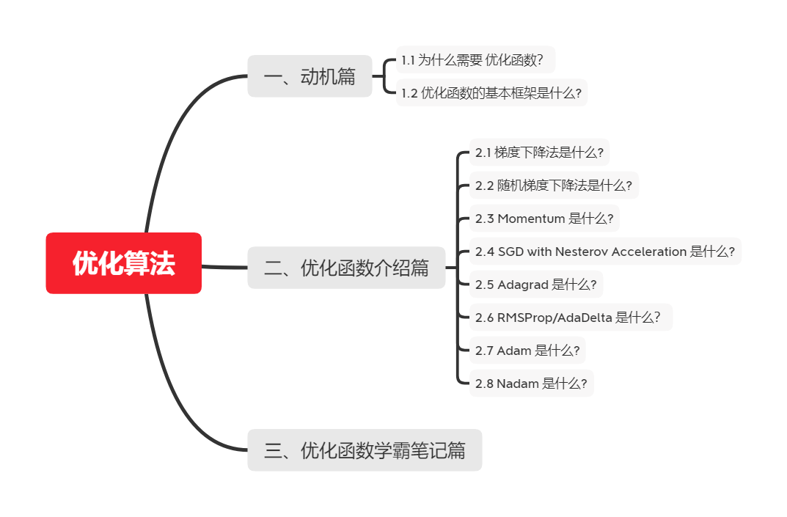

# 【关于 优化算法】那些你不知道的事

## 一、动机篇

### 1.1 为什么需要 优化函数？

在机器学习算法中，通常存在很多问题并没有最优的解，或是要计算出最优的解要花费很大的计算量，面对这类问题一般的做法是利用迭代的思想尽可能的逼近问题的最优解。将解决此类优化问题的方法叫做优化算法，优化算法本质上是一种数学方法。

### 1.2 优化函数的基本框架是什么?

- 基本框架：定义当前时刻待优化参数为$\theta_t\in R^{d}$，损失函数为$J(\theta)$，学习率为$\eta$，参数更新框架为：

1. 计算损失函数关于当前参数的梯度：$g_t=\nabla J(\theta_t)$；
2. 根据历史梯度计算一阶动量（一次项）和二阶动量（二次项）：$m_t=\phi(g_1,g_2,...,g_t),V_t=\psi(g_1,g_2,...,g_t)$；
3. 计算当前时刻的下降梯度：$\Delta\theta_t=-\eta\cdot\cfrac{m_t}{\sqrt{V_t}}$
4. 根据下降梯度更新参数：$\theta_{t+1}=\theta_t+\Delta\theta_t$

## 二、优化函数介绍篇

### 2.1 梯度下降法是什么?

每次使用一批数据进行梯度的计算，而非计算全部数据的梯度，因为如果每次计算全部数据的梯度，会导致运算量加大，运算时间变长，容易陷入局部最优解，而随机梯度下降可能每次不是朝着真正最小的方向，这样反而可以跳出局部的最优解。

### 2.2 随机梯度下降法是什么?

- 介绍：由于SGD没有动量的概念，也即没有考虑历史梯度，所以当前时刻的动量即为当前时刻的梯度$m_t=g_t$，且二阶动量$V_t=E$，所以SGD的参数更新公式为
  
  $$\Delta\theta_t=-\eta\cdot g_t$$

  $$\theta_{t+1}=\theta_t-\eta\cdot g_t$$

- 优点：每次使用一批数据进行梯度的计算，而非计算全部数据的梯度，因为如果每次计算全部数据的梯度，会导致运算量加大，运算时间变长，容易陷入局部最优解，而随机梯度下降可能每次不是朝着真正最小的方向，这样反而可以跳出局部的最优解。

- 缺点：下降速度慢，而且可能会在沟壑（还有鞍点）的两边持续震荡，停留在一个局部最优点。

### 2.3 Momentum 是什么?

- 介绍：为了抑制SGD的震荡，SGDM认为梯度下降过程可以加入惯性。下坡的时候，如果发现是陡坡，那就利用惯性跑的快一些。SGDM全称是SGD with momentum，在SGD基础上引入了一阶动量。而所谓的一阶动量就是该时刻梯度的指数加权移动平均值：$\eta\cdot m_t:=\beta\cdot m_{t-1}+\eta\cdot g_t$（其中当前时刻的梯度$g_t$并不严格按照指数加权移动平均值的定义采用权重$1-\beta$，而是使用我们自定义的学习率$\eta$），那么为什么要用移动平均而不用历史所有梯度的平均？因为移动平均存储量小，且能近似表示历史所有梯度的平均。由于此时仍然没有二阶动量，所以$V_t=E$，那么SGDM的参数更新公式为

  $$\Delta\theta_t=-\eta\cdot m_t=-\left(\beta m_{t-1}+\eta g_t\right)$$

  $$\theta_{t+1}=\theta_t-\left(\beta m_{t-1}+\eta g_t\right)$$

- 所以，当前时刻参数更新的方向不光取决于当前时刻的梯度，还取决于之前时刻的梯度，特别地，当$\beta=0.9$时，$m_t$近似表示的是前10个时刻梯度的指数加权移动平均值，而且离得越近的时刻的梯度权重也越大。
- 优点：在随机梯度下降法的基础上，增加了动量（Momentum）的技术。其核心是通过优化相关方向的训练和弱化无关方向的振荡，来加速SGD训练。Momentum的方法能够在一定程度上缓解随机梯度下降法收敛不稳定的问题，并且有一定的摆脱陷入局部最优解的能力。
- 缺点：对于比较深的沟壑有时用Momentum也没法跳出

  - 指数加权移动平均值（exponentially weighted moving average，EWMA）：假设$v_{t-1}$是$t-1$时刻的指数加权移动平均值，$\theta_t$是$t$时刻的观测值，那么$t$时刻的指数加权移动平均值为

    $$
    \begin{aligned}
    v_t&=\beta v_{t-1}+(1-\beta)\theta_t \\
    &=(1-\beta)\theta_t+\sum_{i=1}^{t-1}(1-\beta)\beta^i\theta_{t-i}
    \end{aligned}
    $$

  > 其中$0 \leq \beta < 1,v_0=0$。显然，由上式可知，$t$时刻的指数加权移动平均值其实可以看做前$t$时刻所有观测值的加权平均值，除了第$t$时刻的观测值权重为$1-\beta$外，其他时刻的观测值权重为$(1-\beta)\beta^i$。由于通常对于那些权重小于$\frac{1}{e}$的观测值可以忽略不计，所以忽略掉那些观测值以后，上式就可以看做在求加权移动平均值。那么哪些项的权重会小于$\frac{1}{e}$呢？由于

    $$\lim_{n \rightarrow +\infty}  \left(1-\frac{1}{n}\right)^n = \frac{1}{e} \approx 0.3679$$

  > 若令$n=\frac{1}{1-\beta}$，则

    $$\lim_{n \rightarrow +\infty}  \left(1-\frac{1}{n}\right)^n =\lim_{\beta \rightarrow 1}  \left(\beta\right)^{\frac{1}{1-\beta}}=\frac{1}{e} \approx 0.3679$$

  > 所以，当$\beta\rightarrow 1$时，那些$i\geq\frac{1}{1-\beta}$的$\theta_{t-i}$的权重$(1-\beta)\beta^i$一定小于$\frac{1}{e}$。代入计算可知，那些权重小于$\frac{1}{e}$的观测值就是近$\frac{1}{1-\beta}$个时刻之前的观测值。例如当$t=20,\beta=0.9$时，$\theta_1,\theta_2,..,\theta_9,\theta_{10}$的权重都是小于$\frac{1}{e}$的，因此可以忽略不计，那么此时就相当于在求$\theta_11,\theta_12,..,\theta_19,\theta_{20}$这最近10个时刻的加权移动平均值。所以指数移动平均值可以近似看做在求最近$\frac{1}{1-\beta}$个时刻的加权移动平均值，$\beta$常取$\geq 0.9$。由于当$t$较小时，指数加权移动平均值的偏差较大，所以通常会加上一个修正因子$1-\beta^t$，加了修正因子后的公式为

    $$v_t=\cfrac{\beta v_{t-1}+(1-\beta)\theta_t}{1-\beta^t} \\$$

  > 显然，当$t$很小时，修正因子$1-\beta^t$会起作用，当$t$足够大时$(1-\beta^t)\rightarrow 1$，修正因子会自动退场。

### 2.4 SGD with Nesterov Acceleration 是什么?

- 介绍：除了利用惯性跳出局部沟壑以外，我们还可以尝试往前看一步。想象一下你走到一个盆地，四周都是略高的小山，你觉得没有下坡的方向，那就只能待在这里了。可是如果你爬上高地，就会发现外面的世界还很广阔。因此，我们不能停留在当前位置去观察未来的方向，而要向前一步、多看一步、看远一些。NAG全称Nesterov Accelerated Gradient，是在SGD、SGD-M的基础上的进一步改进，改进点在于当前时刻梯度的计算，我们知道在时刻t的主要下降方向是由累积动量决定的，自己的梯度方向说了也不算，那与其看当前梯度方向，不如先看看如果跟着累积动量走了一步，那个时候再怎么走。也即在Momentum的基础上将当前时刻的梯度$g_t$换成下一时刻的梯度$\nabla J(\theta_t-\beta m_{t-1})$，由于此时也没有考虑二阶动量，所以$V_t=E$，NAG的参数更新公式为
  
  $$\Delta\theta_t=-\eta\cdot m_t=-\left(\beta m_{t-1}+\eta\nabla J(\theta_t-\beta m_{t-1})\right)$$

  $$\theta_{t+1}=\theta_t-\left(\beta m_{t-1}+\eta\nabla J(\theta_t-\beta m_{t-1})\right)$$

- 优点：在Momentum的基础上进行了改进，比Momentum更具有前瞻性，除了利用历史梯度作为惯性来跳出局部最优的沟壑以外，还提前走一步看看能否直接跨过沟壑。

### 2.5 Adagrad 是什么?

- 介绍：此前我们都没有用到二阶动量。二阶动量的出现，才意味着“自适应学习率”优化算法时代的到来。SGD及其变种以同样的学习率更新每个维度的参数（因为$\theta_t$通常是向量），但深度神经网络往往包含大量的参数，这些参数并不是总会用得到（想想大规模的embedding）。对于经常更新的参数，我们已经积累了大量关于它的知识，不希望被单个样本影响太大，希望学习速率慢一些；对于偶尔更新的参数，我们了解的信息太少，希望能从每个偶然出现的样本身上多学一些，即学习速率大一些。因此，AdaGrad则考虑对于不同维度的参数采用不同的学习率，具体的，对于那些更新幅度很大的参数，通常历史累计梯度的平方和会很大，相反的，对于那些更新幅度很小的参数，通常其累计历史梯度的平方和会很小（具体图示参见：https://zhuanlan.zhihu.com/p/29920135 ）。所以在一个固定学习率的基础上除以历史累计梯度的平方和就能使得那些更新幅度很大的参数的学习率变小，同样也能使得那些更新幅度很小的参数学习率变大，所以AdaGrad的参数更新公式为
  
  $$v_{t,i}=\sum_{t=1}^{t}g_{t,i}^2$$
  $$\Delta\theta_{t,i}=-\frac{\eta}{\sqrt{v_{t,i}+\epsilon}}g_{t,i}$$

  $$\theta_{t+1,i}=\theta_{t,i}-\frac{\eta}{\sqrt{v_{t,i}+\epsilon}}g_{t,i}$$

> 其中$g_{t,i}^2$表示第$t$时刻第$i$维度参数的梯度值，$\epsilon$是防止分母等于0的平滑项（常取一个很小的值$1e-8$）。显然，此时上式中的$\frac{\eta}{\sqrt{v_{t,i}+\epsilon}}$这个整体可以看做是学习率，分母中的历史累计梯度值$v_{t,i}$越大的参数学习率越小。上式仅仅是第$t$时刻第$i$维度参数的更新公式，对于第$t$时刻的所有维度参数的整体更新公式为

  $$V_{t}=\operatorname{diag}\left(v_{t,1},v_{t,2},...,v_{t,d}\right)\in R^{d\times d}$$

  $$\Delta\theta_{t}=-\frac{\eta}{\sqrt{V_{t}+\epsilon}}\odot g_t$$

  $$\theta_{t+1}=\theta_{t}-\frac{\eta}{\sqrt{V_{t}+\epsilon}}\odot g_t$$

> 注意，由于$V_t$是对角矩阵，所以上式中的$\epsilon$只用来平滑$V_t$对角线上的元素。

- 优点：Adagrad即adaptive gradient，是一种自适应学习率的梯度法。它通过记录并调整每次迭代过程中的前进方向和距离，使得针对不同问题都有一套自适应学习率的方法。Adagrad最大的优势是不需要手动来调整学习率，但与此同时会降低学习率。
- 缺点：随着时间步的拉长，历史累计梯度平方和$v_{t,i}$会越来越大，这样会使得所有维度参数的学习率都不断减小（单调递减），无论更新幅度如何。而且，计算历史累计梯度平方和时需要存储所有历史梯度，而通常神经网络的参数不仅多维度还高，因此存储量巨大。

### 2.6 RMSProp/AdaDelta 是什么？

- 介绍a：由于AdaGrad单调递减的学习率变化过于激进，我们考虑一个改变二阶动量计算方法的策略：不累积全部历史梯度，而只关注过去一段时间窗口的下降梯度，采用Momentum中的指数加权移动平均值的思路。这也就是AdaDelta名称中Delta的来历。首先看最简单直接版的RMSProp，RMSProp就是在AdaGrad的基础上将普通的历史累计梯度平方和换成历史累计梯度平方和的指数加权移动平均值，所以只需将AdaGrad中的$v_{t,i}$的公式改成指数加权移动平均值的形式即可，也即

  $$v_{t,i}=\beta v_{t-1,i}+(1-\beta)g_{t,i}^2$$

  $$V_{t}=\operatorname{diag}\left(v_{t,1},v_{t,2},...,v_{t,d}\right)\in R^{d\times d}$$

  $$\Delta\theta_{t}=-\frac{\eta}{\sqrt{V_{t}+\epsilon}}\odot g_t$$

  $$\theta_{t+1}=\theta_{t}-\frac{\eta}{\sqrt{V_{t}+\epsilon}}\odot g_t$$

  而AdaDelta除了对二阶动量计算指数加权移动平均以外，还对当前时刻的下降梯度$\Delta\theta_{t}$也计算一个指数加权移动平均，具体地

  $$\operatorname{E}[\Delta\theta^2]_{t,i}=\gamma\operatorname{E}[\Delta\theta^2]_{t-1,i}+(1-\gamma)\Delta\theta^2_{t,i}$$

  由于$\Delta\theta^2_{t,i}$目前是未知的，所以只能用$t-1$时刻的指数加权移动平均来近似替换，也即

  $$\operatorname{E}[\Delta\theta^2]_{t-1,i}=\gamma\operatorname{E}[\Delta\theta^2]_{t-2,i}+(1-\gamma)\Delta\theta^2_{t-1,i}$$

  除了计算出$t-1$时刻的指数加权移动平均以外，AdaDelta还用此值替换我们预先设置的学习率$\eta$，因此，AdaDelta的参数更新公式为

  $$v_{t,i}=\beta v_{t-1,i}+(1-\beta)g_{t,i}^2$$

  $$V_{t}=\operatorname{diag}\left(v_{t,1},v_{t,2},...,v_{t,d}\right)\in R^{d\times d}$$

  $$\operatorname{E}[\Delta\theta^2]_{t-1,i}=\gamma\operatorname{E}[\Delta\theta^2]_{t-2,i}+(1-\gamma)\Delta\theta^2_{t-1,i}$$

  $$\Theta_{t}=\operatorname{diag}\left(\operatorname{E}[\Delta\theta^2]_{t-1,1},\operatorname{E}[\Delta\theta^2]_{t-1,2},...,\operatorname{E}[\Delta\theta^2]_{t-1,d}\right)\in R^{d\times d}$$

  $$\Delta\theta_{t}=-\frac{\sqrt{\Theta_{t}+\epsilon}}{\sqrt{V_{t}+\epsilon}}\odot g_t$$

  $$\theta_{t+1}=\theta_{t}-\frac{\sqrt{\Theta_{t}+\epsilon}}{\sqrt{V_{t}+\epsilon}}\odot g_t$$

> 显然，对于AdaDelta算法来说，已经不需要我们自己预设学习率$\eta$了，只需要预设$\beta$和$\gamma$这两个指数加权移动平均值的衰减率即可。
- 优点：和AdamGrad一样对不同维度的参数采用不同的学习率，同时还改进了AdamGrad的梯度不断累积和需要存储所有历史梯度的缺点（因为移动平均不需要存储所有历史梯度）。特别地，对于AdaDelta还废除了预设的学习率，当然效果好不好还是需要看实际场景。

### 2.7 Adam 是什么?

- 介绍：Adam即Adaptive Moment Estimation，是能够自适应时刻的估计方法，能够针对每个参数，计算自适应学习率。这是一种综合性的优化方法，在机器学习实际训练中，往往能够取得不错的效果。

Adam=adagrad(用于处理稀疏的梯度)+RMSPro(处理非常态数据)

- 流程：
  
1. 首先计算一阶动量

$$m_t = \beta_1 m_{t-1} + (1 - \beta_1) g_t $$

2. 类似AdaDelta和RMSProp计算二阶动量

$$v_{t,i}=\beta_2 v_{t-1,i}+(1-\beta_2)g_{t,i}^2$$

$$V_{t}=\operatorname{diag}\left(v_{t,1},v_{t,2},...,v_{t,d}\right)\in R^{d\times d}$$

3. 分别加上指数加权移动平均值的修正因子

$$
\begin{aligned} 
\hat{m}_t &= \dfrac{m_t}{1 - \beta^t_1} \\ 
\hat{v}_{t,i} &= \dfrac{v_{t,i}}{1 - \beta^t_2} \\
\hat{V}_{t}&=\operatorname{diag}\left(\hat{v}_{t,1},\hat{v}_{t,2},...,\hat{v}_{t,d}\right)\in R^{d\times d}
\end{aligned}
$$

所以，Adam的参数更新公式为

$$\Delta\theta_{t}=-\frac{\eta}{\sqrt{\hat{V}_{t}+\epsilon}}\odot \hat{m}_t$$

$$\theta_{t+1}=\theta_{t}-\frac{\eta}{\sqrt{\hat{V}_{t}+\epsilon}}\odot \hat{m}_t$$

- 问题：
  - 问题一、某些情况不收敛：由于Adam中的二阶动量非单调变化，导致Adam在训练后期容易出现学习率震荡，使得模型收敛不了【这也是为什么现在 SGD还被使用的原因】；
  - 问题二、有可能错过全局最优解。由于后期Adam学习率太低，影响其收敛；

### 2.8 Nadam 是什么?

- 介绍：Adam只是将Momentum和Adaptive集成了，但是没有将Nesterov集成进来，而Nadam则是在Adam的基础上将Nesterov集成了进来，也即Nadam = Nesterov + Adam。具体思想如下：由于NAG 的核心在于，计算当前时刻的梯度$g_t$时使用了「未来梯度」$\nabla J(\theta_t-\beta m_{t-1})$。NAdam 提出了一种公式变形的思路，大意可以这样理解：只要能在梯度计算中考虑到「未来因素」，就算是达到了 Nesterov 的效果。既然如此，我们就不一定非要在计算$g_t$时使用「未来因素」，可以考虑在其他地方使用「未来因素」。具体地，首先NAdam在Adam的基础上将$\hat{m}_t$展开
  
$$
  \begin{aligned} 
  \theta_{t+1}&=\theta_{t}-\frac{\eta}{\sqrt{\hat{V}_{t}+\epsilon}}\odot \hat{m}_t \\
  &= \theta_{t} - \frac{\eta}{\sqrt{\hat{V}_{t}+\epsilon}} \odot(\frac{\beta_1 m_{t-1}}{1 - \beta^t_1} + \dfrac{(1 - \beta_1) g_t}{1 - \beta^t_1}) \\
  \end{aligned}
$$

此时，如果我们将第$t-1$时刻的动量$m_{t-1}$用第$t$时刻的动量$m_{t}$近似代替的话，那么我们就引入了「未来因素」，所以将$m_{t-1}$替换成$m_{t}$即可得到Nadam的表达式

$$
  \begin{aligned} 
  \theta_{t+1}&= \theta_{t} - \frac{\eta}{\sqrt{\hat{V}_{t}+\epsilon}} \odot(\frac{\beta_1 m_{t}}{1 - \beta^t_1} + \dfrac{(1 - \beta_1) g_t}{1 - \beta^t_1}) \\
  &= \theta_{t} - \frac{\eta}{\sqrt{\hat{V}_{t}+\epsilon}} \odot(\beta_1\hat{m}_t+ \dfrac{(1 - \beta_1) g_t}{1 - \beta^t_1})
  \end{aligned}
$$

## 三、优化函数学霸笔记篇

> 作者：言溪

## 参考资料

1. [一个框架看懂优化算法之异同 SGD/AdaGrad/Adam](https://zhuanlan.zhihu.com/p/32230623)
2. [https://blog.csdn.net/u010089444/article/details/76725843](https://blog.csdn.net/u010089444/article/details/76725843)
3. [优化算法之指数移动加权平均](https://zhuanlan.zhihu.com/p/32335746)

