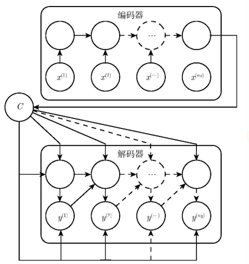
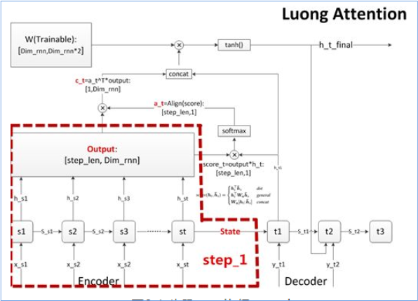
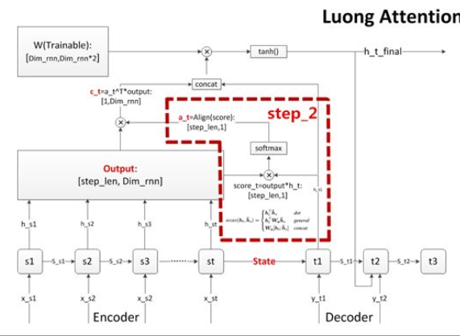
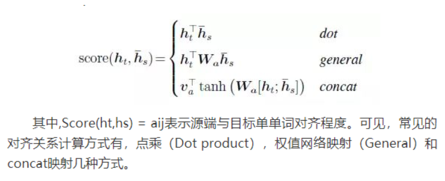
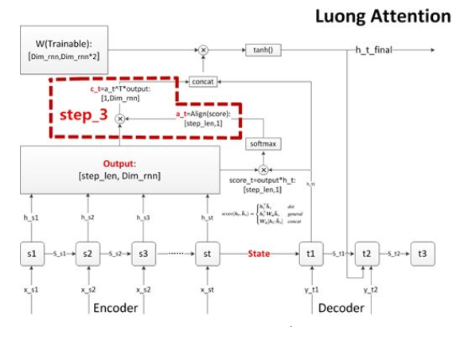
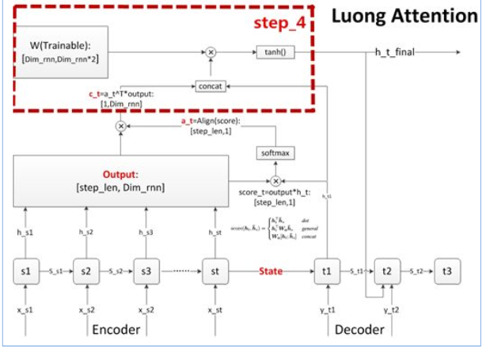
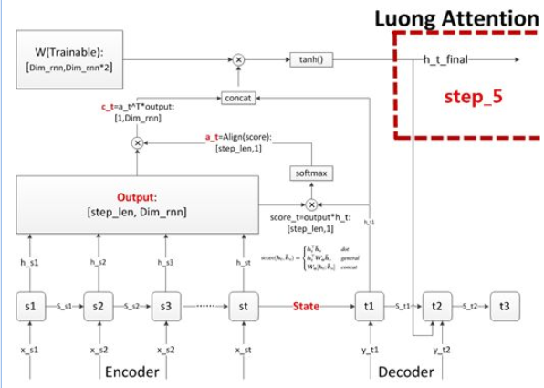

# 【关于 Attention 】那些你不知道的事

> 作者：杨夕
> 
> 项目地址：https://github.com/km1994/nlp_paper_study
> 
> 个人介绍：大佬们好，我叫杨夕，该项目主要是本人在研读顶会论文和复现经典论文过程中，所见、所思、所想、所闻，可能存在一些理解错误，希望大佬们多多指正。

## 一、seq2seq 篇

### 1.1 seq2seq （Encoder-Decoder）是什么？

- 介绍：seq2seq （Encoder-Decoder）将一个句子（图片）利用一个 Encoder 编码为一个 context，然后在利用一个 Decoder 将 context 解码为 另一个句子（图片）的过程 ；
- 应用：
  - 在 Image Caption 的应用中 Encoder-Decoder 就是 CNN-RNN 的编码 - 解码框架；
  - 在神经网络机器翻译中 Encoder-Decoder 往往就是 LSTM-LSTM 的编码 - 解码框架，在机器翻译中也被叫做 [Sequence to Sequence learning](https://papers.nips.cc/paper/5346-sequence-to-sequence-learning-with-neural-networks.pdf)。

### 1.2 seq2seq 中 的 Encoder 怎么样？

- 目标：将 input 编码成一个固定长度 语义编码 context
- context 作用：
  - 1、做为初始向量初始化 Decoder 的模型，做为 decoder 模型预测y1的初始向量；
  - 2、做为背景向量，指导y序列中每一个step的y的产出；
- 步骤：
  - 1. 遍历输入的每一个Token(词)，每个时刻的输入是上一个时刻的隐状态和输入
  - 2. 会有一个输出和新的隐状态。这个新的隐状态会作为下一个时刻的输入隐状态。每个时刻都有一个输出；
  - 3. 保留最后一个时刻的隐状态，认为它编码了整个句子的 语义编码 context，并把最后一个时刻的隐状态作为Decoder的初始隐状态；

### 1.3 seq2seq 中 的 Decoder 怎么样？

- 目标：将 语义编码 context 解码 为 一个 新的 output；
- 步骤：
  - 1. 一开始的隐状态是Encoder最后时刻的隐状态，输入是特殊的；
  - 2. 使用RNN计算新的隐状态，并输出第一个词；
  - 3. 接着用新的隐状态和第一个词计算第二个词，直到decoder产生一个 EOS token, 那么便结束输出了；

### 1.4 在 数学角度上 的 seq2seq ，你知道么？

- 场景介绍：以 机器翻译 为例，给定 一个 句子集合对 <X，Y> （X 表示 一个 英文句子集合，Y 表示 一个 中文句子集合）；

- 目标：对于 X 中 的 xi，我们需要采用 seq2seq 框架 来 生成 Y 中对应 的 yi；
- 步骤：

1. 编码器 encoder：将 输入 句子集合 X 进行编码，也就是将 其 通过 非线性变换 转化为 中间语义编码 Context C

2. 解码器 decoder：对中间语义编码 context 进行解码，根据句子 X 的中间语义编码 Context C 和之前已经生成的历史信息 y1,y2,...,yi-1 生成 当前时刻信息 yi

### 1.5 seq2seq 存在 什么 问题？

- **忽略了输入序列X的长度**：当输入句子长度很长，特别是比训练集中最初的句子长度还长时，模型的性能急剧下降；
- **对输入序列X缺乏区分度**：输入X编码成一个固定的长度，对句子中每个词都赋予相同的权重，这样做没有区分度，往往是模型性能下降。

## 二、Attention 篇

### 2.1 什么是 Attention?

- 通俗易懂介绍：注意力机制模仿了生物观察行为的内部过程，即一种将内部经验和外部感觉对齐从而增加部分区域的观察精细度的机制。例如人的视觉在处理一张图片时，会通过快速扫描全局图像，获得需要重点关注的目标区域，也就是注意力焦点。然后对这一区域投入更多的注意力资源，以获得更多所需要关注的目标的细节信息，并抑制其它无用信息。
- **Attention 介绍**：帮助模型对输入的x每部分赋予不同的权重，抽取更重要的信息，使模型做出准确判断。同时，不会给模型计算与存储带来更大开销；

### 2.2 为什么引入 Attention机制？

根据通用近似定理，前馈网络和循环网络都有很强的能力。但为什么还要引入注意力机制呢？

- 计算能力的限制：当要记住很多“信息“，模型就要变得更复杂，然而目前计算能力依然是限制神经网络发展的瓶颈。
- 优化算法的限制：虽然局部连接、权重共享以及pooling等优化操作可以让神经网络变得简单一些，有效缓解模型复杂度和表达能力之间的矛盾；但是，如循环神经网络中的长距离以来问题，信息“记忆”能力并不高。

### 2.3 Attention 有什么作用？

- 让神经网络把 “ 注意力 ” 放在一部分输入上，即：区分输入的不同部分对输出的影响；
- 从增强字 / 词的语义表示这一角度介绍
  - 一个字 / 词在一篇文本中表达的意思通常与它的上下文有关。光看 “ 鹄 ” 字，我们可能会觉得很陌生（甚至连读音是什幺都不记得吧），而看到它的上下文 “ 鸿鹄之志 ” 后，就对它立马熟悉了起来。因此，字 / 词的上下文信息有助于增强其语义表示。同时，上下文中的不同字 / 词对增强语义表示所起的作用往往不同。比如在上面这个例子中， “ 鸿 ” 字对理解 “ 鹄 ” 字的作用最大，而 “ 之 ” 字的作用则相对较小。为了有区分地利用上下文字信息增强目标字的语义表示，就可以用到 Attention 机制。

### 2.4 Attention 流程是怎么样？

#### 步骤一  执行encoder (与 seq2seq 一致)

- 思路：将源数据依次输入Encoder，执行Encoder
- 目标：将源序列的信息，编译成语义向量，供后续decoder使用

#### 步骤二  计算对齐系数 a

- 思路：在 decoder 的每个词，我们需要关注源序列的所有词和目标序列当前词的相关性大小，并输出相关（对齐）系数 a；
- 步骤：
  - 1. 在decoder输出一个预测值前，都会针对encoder的所有step，计算一个score；
  - 2. 将score汇总向量化后，每个decoder step能获得一个维度为[step_len,1]的score向量；
  - 3. 计算出score后，很自然地按惯例使用softmax进行归一化，得到对齐向量a，维度也是[step_len,1]；

- 常用对齐函数：

#### 步骤三  计算上下文语义向量 C

- 思路：对齐系数 a 作为权重，对 encoder 每个 step 的 output 向量进行加权求和（对齐向量a点乘outputs矩阵），得到decoder当前 step 的上下文语义向量 c

#### 步骤四  更新decoder状态

- 思路：更新decoder状态，这个状态可以是h，也可以是 s

#### 步骤五 计算输出预测词

- 思路：做一个语义向量到目标词表的映射（如果attention用于分类模型，那就是做一个到各个分类的映射），然后再进行softmax就可以了

### 2.5 Attention 的应用领域有哪些？

随着 Attention 提出 开始，就被 广泛 应用于 各个领域。比如：自然语言处理，图片识别，语音识别等不同方向深度学习任务中。随着 【[Transformer](https://github.com/km1994/nlp_paper_study/tree/master/transformer_study/Transformer) 】的提出，Attention被 推向了圣坛。

## 三、Attention 变体篇

### 3.1 Soft Attention 是什么？

Soft Attention：传统的 Attention 方法，是参数化的（Parameterization），因此可导，可以被嵌入到模型中去，直接训练。梯度可以经过Attention Mechanism模块，反向传播到模型其他部分。

### 3.2 Hard Attention 是什么？

Hard Attention：一个随机的过程。Hard Attention不会选择整个encoder的输出做为其输入，Hard Attention会依概率Si来采样输入端的隐状态一部分来进行计算，而不是整个encoder的隐状态。为了实现梯度的反向传播，需要采用蒙特卡洛采样的方法来估计模块的梯度。

### 3.3 Global Attention 是什么？

- Global Attention：传统的Attention model一样。所有的hidden state都被用于计算Context vector 的权重，即变长的对齐向量at，其长度等于encoder端输入句子的长度。

### 3.4 Local Attention 是什么？

- 动机：Global Attention 在做每一次 encoder 时，encoder 中的所有 hidden state 都需要参与到计算中，这种方法容易造成 计算开销增大，尤其是 句子偏长的时候。
- 介绍：Local Attention 通过结合 Soft Attention 和 Hard Attention 的一种 Attention方法

### 3.5 self-attention 是什么？

- 核心思想：self-attention的结构在计算每个token时，总是会考虑整个序列其他token的表达；
举例：“我爱中国”这个序列，在计算"我"这个词的时候，不但会考虑词本身的embedding，也同时会考虑其他词对这个词的影响

> 注：具体内容可以参考 [self-attention 长怎么样?](https://github.com/km1994/nlp_paper_study/tree/master/DL_algorithm/transformer_study#self-attention-长怎么样)

## 参考

1. [【关于 Attention 】那些你不知道的事](https://github.com/km1994/nlp_paper_study/tree/master/DL_algorithm/Attention_study)
2. [nlp中的Attention注意力机制+Transformer详解](https://zhuanlan.zhihu.com/p/53682800)
3. [模型汇总24 - 深度学习中Attention Mechanism详细介绍：原理、分类及应用](https://zhuanlan.zhihu.com/p/31547842)