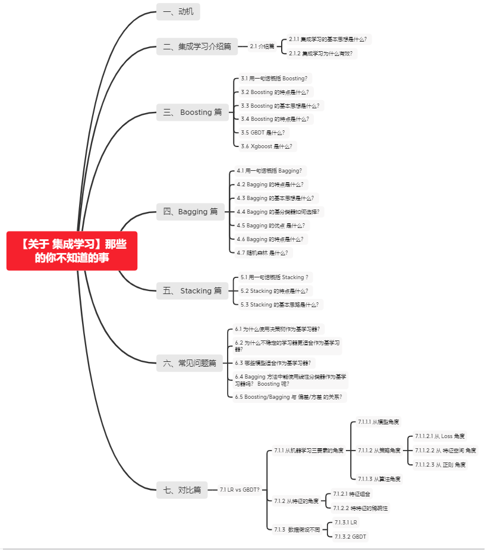
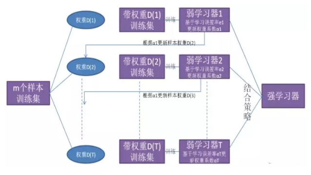
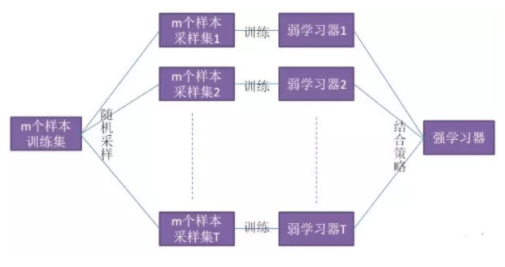
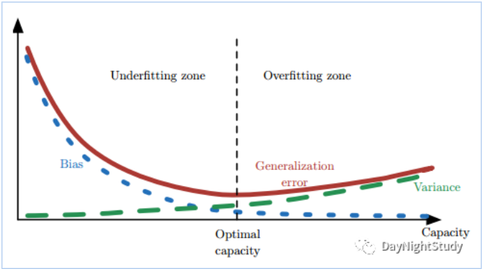

# 【关于 集成学习】那些你不知道的事

## 一、动机

不同的模型通常会在测试集上产生不同的误差；如果成员的误差是独立的，集成模型将显著地比其成员表现更好。

## 二、集成学习介绍篇

### 2.1 介绍篇

#### 2.1.1 集成学习的基本思想是什么？

结合多个学习器组合成一个性能更好的学习器

#### 2.1.2 集成学习为什么有效？

不同的模型通常会在测试集上产生不同的误差；如果成员的误差是独立的，集成模型将显著地比其成员表现更好。

## 三、 Boosting 篇

### 3.1 用一句话概括 Boosting？

Boosting 应用 迭代式学习 的方式进行学习

### 3.2 Boosting 的特点是什么？

Boosting 分类器间存在依赖关系，基学习器之间存在依赖关系，新的学习器需要根据上一个学习器生成。

### 3.3 Boosting 的基本思想是什么？

- s1：先从初始训练集训练一个基学习器；初始训练集中各样本的权重是相同的；
- s2：根据上一个基学习器的表现，调整样本权重，使分类错误的样本得到更多的关注；
- s3：基于调整后的样本分布，训练下一个基学习器；
- s4：测试时，对各基学习器加权得到最终结果；

### 3.4 Boosting 的特点是什么？

每次学习都会使用全部训练样本

### 3.5 GBDT 是什么？

- 思想：每一棵树学习的是之前所有树的整体预测和标签的误差；
- 举例说明：假如有个人30岁，我们首先用20岁去拟合，发现损失有10岁，这时我们用6岁去拟合剩下的损失，发现差距还有4岁，第三轮我们用3岁拟合剩下的差距，差距就只有一岁了。如果我们的迭代轮数还没有完，可以继续迭代下面，每一轮迭代，拟合的岁数误差都会减小。

### 3.6 Xgboost 是什么？

- 思想：不断地添加树，不断地进行特征分裂来生长一棵树，每次添加一个树，其实是学习一个新函数，去拟合上次预测的残差。当我们训练完成得到k棵树，我们要预测一个样本的分数，其实就是根据这个样本的特征，在每棵树中会落到对应的一个叶子节点，每个叶子节点就对应一个分数，最后只需要将每棵树对应的分数加起来就是该样本的预测值。

## 四、Bagging 篇

### 4.1 用一句话概括 Bagging？

Bagging 应用 基于并行策略 的方式进行学习

### 4.2 Bagging 的特点是什么？

基学习器之间不存在依赖关系，可同时生成.

### 4.3 Bagging 的基本思想是什么？

- s1：利用自助采样法对训练集随机采样，重复进行 T 次;
- s2：基于每个采样集训练一个基学习器，并得到 T 个基学习器；
- s3：预测时，集体**投票决策****。

### 4.4 Bagging 的基分类器如何选择？

所用基分类器最好本身对样本分布较为敏感（不稳定性）

### 4.5 Bagging 的优点 是什么？

集成后分类器方差比基分类器的小

### 4.6 Bagging 的特点是什么？

- 训练每个基学习器时只使用一部分样本；
- 偏好不稳定的学习器作为基学习器。

> 注：所谓不稳定的学习器，指的是对样本分布较为敏感的学习器

### 4.7 随机森林 是什么？

- 思想：用随机的方式建立一个森林，森林里面有很多的决策树组成，随机森林的每一棵决策树之间是没有关联的。在得到森林之后，当有一个新的输 入样本进入的时候，就让森林中的每一棵决策树分别进行一下判断，对于分类算法，看看这个样本应该属于哪一类，然后看看哪一类被选择最多，就预测这个样本为那一类。对回归问题，计算k个模型的均值作为最后的结果。

## 五、 Stacking 篇

### 5.1 用一句话概括 Stacking ？

Stacking 应用 基于串行策略 的方式进行学习

### 5.2 Stacking 的特点是什么？

初级学习器与次级学习器之间存在依赖关系，初学习器的输出作为次级学习器的输入

### 5.3 Stacking 的基本思路是什么？

- s1：先从初始训练集训练 T 个不同的初级学习器;
- s2：利用每个初级学习器的输出构建一个次级数据集，该数据集依然使用初始数据集的标签；
- s3：根据新的数据集训练次级学习器；
- s4：多级学习器的构建过程类似；

## 六、常见问题篇

### 6.1 为什么使用决策树作为基学习器？

- (1). 决策树的表达能力和泛化能力，可以通过剪枝快速调整；
- (2). 决策树可以方便地将**样本的权重**整合到训练过程中；（适合 Boosting 策略）
- (3). 决策树是一种**不稳定**的学习器； （适合Bagging 策略）
  - 所谓不稳定，指的是数据样本的扰动会对决策树的结果产生较大的影响；
- 类似问题：
  - 基学习器有什么特点？
  - 基学习器有什么要求？

### 6.2 为什么不稳定的学习器更适合作为基学习器？

- 不稳定的学习器容易受到样本分布的影响（方差大），很好的引入了随机性；这有助于在集成学习（特别是采用 Bagging策略）中提升模型的泛化能力。
- 为了更好的引入随机性，有时会随机选择一个属性子集中的最优分裂属性，而不是全局最优（随机森林）

### 6.3 哪些模型适合作为基学习器？

- 决策树
- 神经网络
  - 神经网络也属于不稳定的学习器；
  - 通过调整神经元的数量、网络层数，连接方式初始权重也能很好的引入随机性和改变模型的表达能力和泛化能力

### 6.4 Bagging 方法中能使用线性分类器作为基学习器吗？ Boosting 呢？

- Bagging 方法中不推荐：
  - 线性分类器都属于稳定的学习器（方差小），对数据不敏感；
  - 甚至可能因为 Bagging 的采样，导致在训练中难以收敛，增大集成分类器的偏差
- Boosting 方法中可以使用：
  - Boosting 方法主要通过降低偏差的方式来提升模型的性能，而线性分类器本身具有方差小的特点，所以两者有一定相性
  - XGBoost 中就支持以线性分类器作为基学习器

### 6.5 Boosting/Bagging 与 偏差/方差 的关系？

- 提升弱分类器性能的原因：
  - Boosting ：降低了偏差
  - Bagging ：降低了方差
- Boosting 方法
  - 基本思路：减小模型的训练误差拟合残差或者加大错类的权重），加强模型的学习能力，减小偏差
  - 缺点：但 Boosting 不会显著降低方差，因为其训练过程中各基学习器是强相关的，缺少独立性。
- Bagging 方法
  - 对 n 个独立不相关的模型预测结果取平均，方差是原来的 1/n
  - 假设所有基分类器出错的概率是独立的，超过半数基分类器出错的概率会随着基分类器的数量增加而下降
- 泛化误差、偏差、方差、过拟合、欠拟合、模型复杂度（模型容量）的关系图

## 七、对比篇

### 7.1 LR vs GBDT?

#### 7.1.1 从机器学习三要素的角度

##### 7.1.1.1 从模型角度

- 相同点：
  - 监督学习；
  - 判别模型；
  - 直接对数据的分布建模；
  - 不尝试挖掘隐含变量；
- 不同点：
  - Logistic Regression：
    - 线性模型；
    - 分类器：线性分类器；
    - VC 维度： d+1;
  - GBDT:
    - 非线性模型;
    - boosting 模型，可以无限分类，具有无限逼近样本 VC 维的特点；
    - VC 维度：远远大于 d+1；

##### 7.1.1.2 从策略角度

 Loss(经验风险最小化) + 正则(结构风险最小化) 

###### 7.1.1.2.1 从 Loss 角度

- Logistic Regression：
  - 输出： y = 1 的概率；
  - Loss 损失函数：交叉熵；
  - 准则：最大熵原理，“为了追求最小分类误差，追求最大熵 Loss”;
  - 本质：分类器算法，而且对数据的噪声具有高斯假设；
- GBDT：
  - 基分类器：CART，其无论是处理分类还是回归均是将采用回归拟合（将分类问题通过 softmax 转换为回归问题），用当前轮 CART 树拟合前一轮目标函数与实际值的负梯度 ht = -g;
  - 本质：回归算法；

> 也正是因为 GBDT 采用的 CART 树模型作为基分类器进行负梯度拟合，其是一种对特征样本空间进行划分的策略，不能使用 SGD 等梯度优化算法，而是 CART 树自身的节点分裂策略：均方差(回归) 也带来了算法上的不同； GBDT 损失函数值得是前一轮拟合模型与实际值的差异，而树节点内部分裂的特征选择则是固定为 CART 的均方差，目标损失函数可以自定义，当前轮 CART 树旨在拟合负梯度。

###### 7.1.1.2.2 从 特征空间 角度

- Logistic Regression：
  - 特征的线性组合求交叉熵的最小化，也就是对特征的线性组合做 logistic，使得Logistic Regression会在特征空间中做线性分界面，适用于分类任务；
- GBDT:
  - 采用 CART 树作为基分类器，其每轮树的特征拟合都是对特征空间做平行于坐标轴的空间分割，所以自带特征选择和可解释性，GBDT 即可处理分类问题也可解决回归问题，只是其统一采用回归思路进行求解（试想，如果不将分类转换为回归问题，GBDT 每轮目标函数旨在拟合上一轮组合模型的负梯度，分类信息无法求梯度，故而依旧是采用 softmax 转换为回归问题进行求解）;

- 相关知识
  - 线性分类器：
    - 感知器准则函数：
      - 原理：以使错分类样本到分界面距离之和最小为原则；
      - 优点：通过错分类样本提供的信息对分类器函数进行修正，这种准则是人工神经元网络多层感知器的基础；
    - SVM：
      - 基本思想：在两类线性可分条件下，所设计的分类器界面使两类之间的间隔为最大；
      - 基本出发点：使期望泛化风险尽可能小。（使用核函数可解决非线性问题）
    - Fisher 准则【线性判别分析（LDA）】：
      - 介绍：将所有样本投影到一条原点出发的直线，使得同类样本距离尽可能小，不同类样本距离尽可能大，具体为最大化“广义瑞利商”；
      - 特点：两类样本一般类内密集，类间分离；
      - 方式：寻找线性分类器最佳的法线向量方向，使两类样本在该方向上的投影满足类内尽可能密集，类间尽可能分开。这种度量通过类内离散矩阵 Sw 和类间离散矩阵 Sb 实现。

###### 7.1.1.2.3 从 正则 角度

- Logistic Regression：
  - 方式：采用一种约束参数稀疏的方式；  
    - L2 正则整体约束权重系数的均方和，使得权重分布更均匀；
    - L1 正则则是约束权重系数绝对值和，其自带特征选择特性；  - 
- GBDT:
  - 弱算法的个数T，就是迭代T轮。T的大小就影响着算法的复杂度;
  - 步长（Shrinkage）在每一轮迭代中，原来采用 $Ft(x) = F_{t-1}(x) + \alpha_{t}h_{t}(x;wt)$ 进行更新，可以加入步长v，使得一次不更新那么多：

- 区别：
  -  LR 采用对特征系数进行整体的限定；
  - GBDT 采用迭代的误差控制本轮参数的增长；

> XGBoost的正则是在 GBDT 的基础上又添加了是一棵树里面节点的个数，以及每个树叶子节点上面输出分数的 L2 模平方。

##### 7.1.1.3 从算法角度

- Logistic Regression 
  - 若采用 SGB, Momentum, SGD with Nesterov Acceleration 等算法，只用到了一阶导数信息，
  - 若用 AdaGrad, AdaDelta / RMSProp, Adam, Nadam, 牛顿法则用到了二阶导数信息，
- GBDT 直接拟合上一轮组合函数的特梯度，只用到了一阶倒数信息，XGBoost 则是用到了二阶导数信息。

#### 7.1.2 从特征的角度

##### 7.1.2.1 特征组合

-  LR 特征选择方法：不具有特征组合的能力，只是一次性地寻求最大化熵的过程，对每一维的特征都假设独立，因此只具备对已有特征空间进行分割的能力，更不会对特征空间进行升维（特征组合）
- GBDT 特征选择方法：采用最小化均方损失来寻找分裂特征及对应分裂点，所以自动会在当前根据特征 A 分裂的子树下寻求其他能使负梯度最小的其他特征 B，这样就自动具备寻求好的特征组合的性能，因此也能给出哪些特征比较重要（根据该特征被选作分裂特征的次数）。

##### 7.1.2.2 特特征的稀疏性

- Logistic Regression不具有特征组合的能力，并假设特征各个维度独立，因此只具有线性分界面，实际应用中，多数特征之间有相关性，只有维度特别大的稀疏数据中特征才会近似独立，所以适合应用在特征稀疏的数据上；
- GBDT：其更适合处理稠密特征，如 GBDT+LR 的Facebook论文中，对于连续型特征导入 GBDT 做特征组合来代替一部分手工特征工程，而对于 ID 类特征的做法往往是 one-hot 之后直接传入 LR，或者先 hash，再 one-hot 传入树中进行特征工程，而目前的主流做法是直接 one-hot + embedding 来将高维稀疏特征压缩为低纬稠密特征，也进一步引入了语意信息，有利于特征的表达。

#### 7.1.3  数据假设不同

##### 7.1.3.1 LR

- 第一个假设：假设数据服从伯努利分布。

伯努利分布有一个简单的例子是抛硬币，抛中为正面的概率是 p,抛中为负面的概率是 1−p。在逻辑回归这个模型里面是假设 $h_{theta}$ 为样本为正的概率， $1-h_{theta}$ 为样本为负的概率。那么整个模型可以描述为:

- 第二个假设：假设样本为正的概率是 :

- 第三个假设：噪声是高斯分布的

##### 7.1.3.2 GBDT

未对数据做出上述假设。

## 参考

1. [机器学习面试150题：不只是考SVM xgboost 特征工程（1-50）](https://zhuanlan.zhihu.com/p/213774840)
2. [机器学习面试150题：不只是考SVM xgboost 特征工程（51-100）](https://zhuanlan.zhihu.com/p/217494137)
3. [GBDT 与 LR 区别总结](https://zhuanlan.zhihu.com/p/60952744)