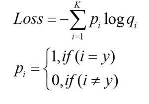
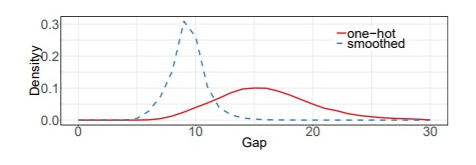
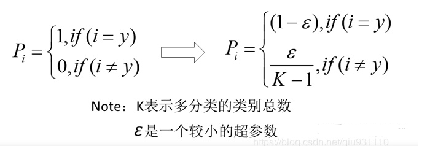

# 【关于 标签平滑法 LabelSmoothing 】那些你不知道的事

> 作者：杨夕
> 
> 论文学习项目地址：https://github.com/km1994/nlp_paper_study
> 
> 《NLP 百面百搭》地址：https://github.com/km1994/NLP-Interview-Notes
> 
> 个人介绍：大佬们好，我叫杨夕，该项目主要是本人在研读顶会论文和复现经典论文过程中，所见、所思、所想、所闻，可能存在一些理解错误，希望大佬们多多指正。
> 


> NLP && 推荐学习群【人数满了，加微信 blqkm601 】


- [【关于 标签平滑法 LabelSmoothing 】那些你不知道的事](#关于-标签平滑法-labelsmoothing-那些你不知道的事)
  - [一、为什么要有 标签平滑法 LabelSmoothing？](#一为什么要有-标签平滑法-labelsmoothing)
  - [二、 标签平滑法 是什么？](#二-标签平滑法-是什么)
  - [三、 标签平滑法 torch 怎么复现？](#三-标签平滑法-torch-怎么复现)
  - [参考](#参考)

## 一、为什么要有 标签平滑法 LabelSmoothing？

- 交叉熵损失函数在多分类任务中存在的问题

多分类任务中，神经网络会输出一个当前数据对应于各个类别的置信度分数，将这些分数通过softmax进行归一化处理，最终会得到当前数据属于每个类别的概率。

然后计算交叉熵损失函数：



训练神经网络时，最小化预测概率和标签真实概率之间的交叉熵，从而得到最优的预测概率分布。最优的预测概率分布是：


**神经网络会促使自身往正确标签和错误标签差值最大的方向学习，在训练数据较少，不足以表征所有的样本特征的情况下，会导致网络过拟合。**

## 二、 标签平滑法 是什么？

label smoothing可以解决上述问题，这是一种正则化策略，主要是通过 soft one-hot 来加入噪声，减少了真实样本标签的类别在计算损失函数时的权重，最终起到抑制过拟合的效果。



增加label smoothing后真实的概率分布有如下改变：



交叉熵损失函数的改变如下：


最优预测概率分布如下：


## 三、 标签平滑法 torch 怎么复现？

```python
import torch.nn as nn
from torch.autograd import Variable
# 标签平滑发
class LabelSmoothing(nn.Module):
    def __init__(self, size, smoothing=0.0):
        super(LabelSmoothing, self).__init__()
        '''
            nn.KLDivLoss : KL 散度
            功能： 计算input和target之间的KL散度( Kullback–Leibler divergence)
        '''
        self.criterion = nn.KLDivLoss(size_average=False)
        #self.padding_idx = padding_idx
        self.confidence = 1.0 - smoothing  #if i=y的公式
        self.smoothing = smoothing
        self.size = size
        self.true_dist = None
    
    def forward(self, x, target):
        """
        input:
            x 表示输入 (N，M)N个样本，M表示总类数，每一个类的概率log P
            target表示label（M，）
        return:
            Loos 
        """
        assert x.size(1) == self.size
        true_dist = x.data.clone()#先深复制过来
        true_dist.fill_(self.smoothing / (self.size - 1))#otherwise的公式
        # 变成one-hot编码，1表示按列填充，
        # target.data.unsqueeze(1)表示索引,confidence表示填充的数字
        true_dist.scatter_(1, target.data.unsqueeze(1), self.confidence)
        self.true_dist = true_dist
        return self.criterion(x, Variable(true_dist, requires_grad=False))
```

## 参考

1. [label smoothing(标签平滑)学习笔记](https://zhuanlan.zhihu.com/p/116466239)
2. [标签平滑&深度学习：Google Brain解释了为什么标签平滑有用以及什么时候使用它](https://zhuanlan.zhihu.com/p/101553787)
