# 01、字符串相关的类

## 1.1、String类的概述

String:字符串，使用一对“”引起来表示。

 * 1.String声明为final的，不可被继承
 * 2.String实现了Serializable接口：表示字符串是支持序列化的。
   * 实现了Comparable接口：表示String可以比较大小
 * 3.String内部定义了final char[] value用于存储字符串数据
 * 4.String:代表不可变的字符序列。简称：不可变性。

## 1.2、理解String的不可变性

 * String:代表不可变的字符序列。简称：不可变性。体现在：
   * 1.当对字符串重新赋值时，需要重写指定内存区域赋值，不能使用原有的value进行赋值。
   * 2.当对现有的字符串进行连接操作时，也需要重新指定内存区域赋值，不能使用原有的value进行赋值。
   * 3.当调用String的replace()方法修改指定字符或字符串时，也需要重新指定内存区域赋值，不能使用原有的value进行赋值。
 * 5.通过字面量的方式（区别于new）给一个字符串赋值，此时的字符串值声明在字符串常量池中。
 * 6.字符串常量池中是不会存储相同内容的字符串的。

```java
import org.junit.Test;
/**
 * String的使用
 */
public class StringTest {
    @Test
    public void Test1(){
        String s1 = "abc";  //字面量的定义方式
        String s2 = "abc";
        s1 = "hello";

        System.out.println(s1 == s2);//比较s1和s2的地址值

        System.out.println(s1);//hello
        System.out.println(s2);//abc

        System.out.println("*********************");

        String s3 = "abc";
        s3 += "def";
        System.out.println(s3);//abcdef

        System.out.println("**********************");

        String s4 = "abc";
        String s5 = s4.replace('a', 'm');
        System.out.println(s4);//abc
        System.out.println(s5);//mbc
    }
}
```


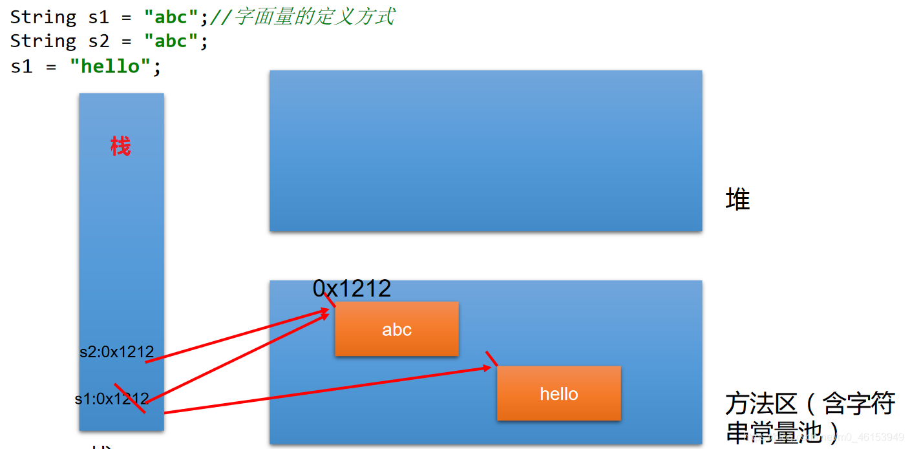

## 1.3、String不同实例化方式的对比

 String的实例化方式

- 方式一：通过字面量定义的方式

- 方式二：通过new + 构造器的方式


```java
String str = "hello";

//本质上this.value = new char[0];
String  s1 = new String(); 

//this.value = original.value;
String  s2 = new String(String original); 

//this.value = Arrays.copyOf(value, value.length);
String  s3 = new String(char[] a);

String  s4 = new String(char[] a,int startIndex,int count);
```

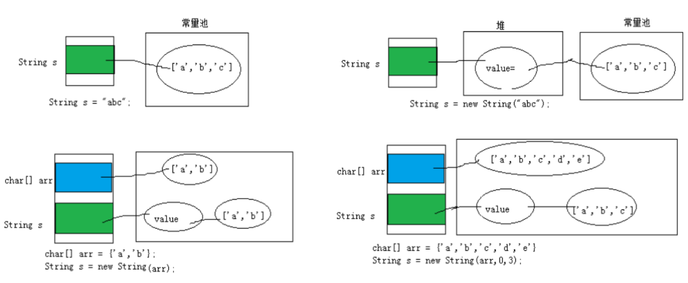  


**2、String str1 = “abc”;与String str2 = new String(“abc”);的区别？**

  * 字符串常量存储在字符串常量池，目的是共享
  * 字符串非常量对象存储在堆中。

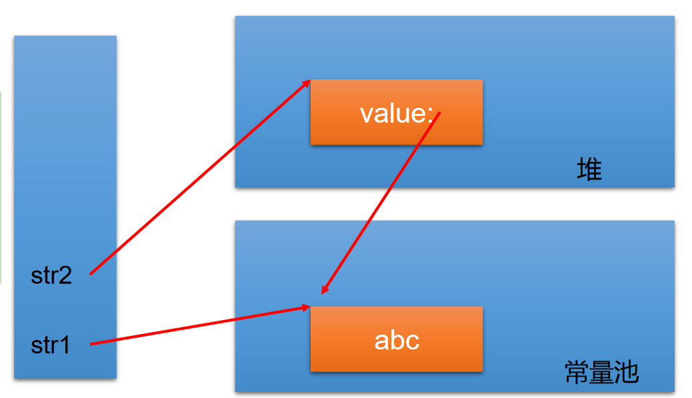

> 3、 **练习**

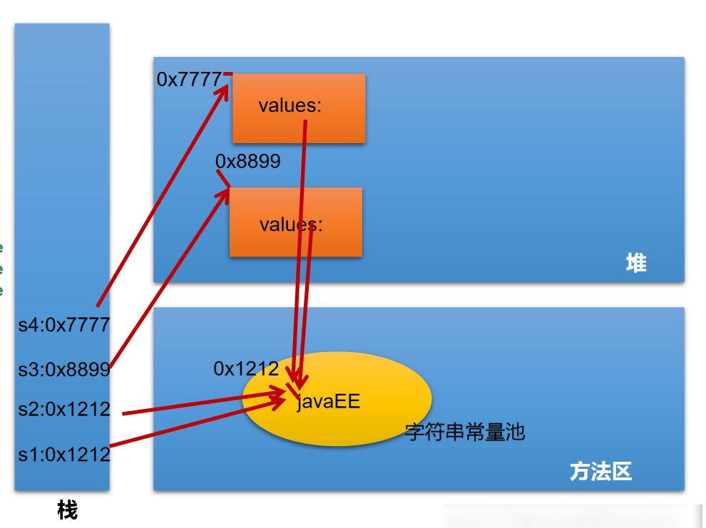

```java
import org.junit.Test;
/**
 * String的使用
 */
public class StringTest {

    /**
     *
     * 面试题：String s = new String("abc");方式创建对象，在内存中创建了几个对象？
     *      两个:一个是堆空间中new结构，另一个是char[]对应的常量池中的数据："abc"
     */
    @Test
    public void test2(){
        //通过字面量定义的方式：此时的s1和s2的数据javaEE声明在方法区中的字符串常量池中。
        String s1 = "javaEE";
        String s2 = "javaEE";

        //通过new + 构造器的方式:此时的s3和s4保存的地址值，是数据在堆空间中开辟空间以后对应的地址值。
        String s3 = new String("javaEE");
        String s4 = new String("javaEE");

        System.out.println(s1 == s2);//true
        System.out.println(s1 == s3);//false
        System.out.println(s1 == s4);//false
        System.out.println(s3 == s4);//false

        System.out.println("***********************");
        Person p1 = new Person("Tom",12);
        Person p2 = new Person("Tom",12);

        System.out.println(p1.name.equals(p2.name));//true
        System.out.println(p1.name == p2.name);//true

        p1.name = "Jerry";
        System.out.println(p2.name);//Tom
    }
}
/**
 * Person类
 */
public class Person {

    String name;
    int age;

    public Person(String name, int age) {
        this.name = name;
        this.age = age;
    }

    public Person() {

    }
}
```


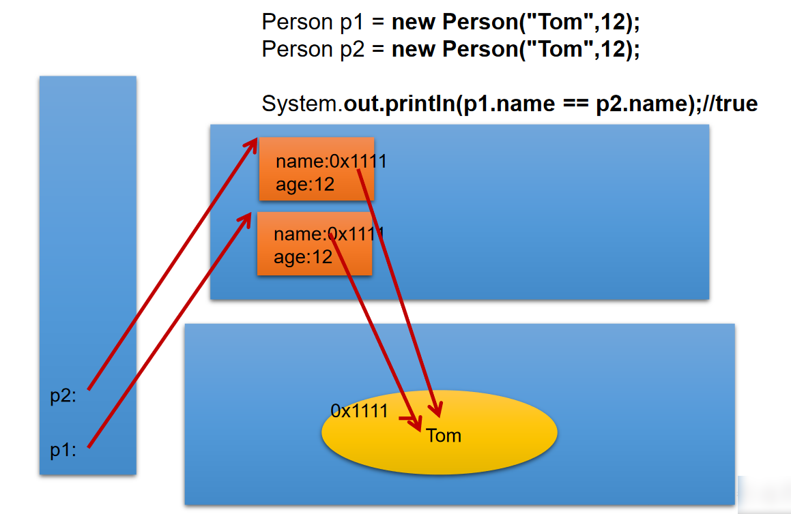

## 1.4、String不同拼接操作的对比

1.常量与常量的拼接结果在常量池。且**常量池中不会存在相同内容的常量**。

2.只要其中有一个是变量，结果就在堆中。

3.如果拼接的结果调用intern()方法，返回值就在常量池中。

```java
 import org.junit.Test;
public class StringTest {

    @Test
    public void test4(){
        String s1 = "javaEEhadoop";
        String s2 = "javaEE";
        String s3 = s2 + "hadoop";
        System.out.println(s1 == s3);//false

        final String s4 = "javaEE";//s4:常量
        String s5 = s4 + "hadoop";
        System.out.println(s1 == s5);//true

    }

    @Test
    public void test3(){
        String s1 = "javaEE";
        String s2 = "hadoop";

        String s3 = "javaEEhadoop";
        String s4 = "javaEE" + "hadoop";
        String s5 = s1 + "hadoop";
        String s6 = "javaEE" + s2;
        String s7 = s1 + s2;

        System.out.println(s3 == s4);//true
        System.out.println(s3 == s5);//false
        System.out.println(s3 == s6);//false
        System.out.println(s5 == s6);//false
        System.out.println(s3 == s7);//false
        System.out.println(s5 == s6);//false
        System.out.println(s5 == s7);//false
        System.out.println(s6 == s7);//false

        String s8 = s5.intern();//返回值得到的s8使用的常量值中已经存在的“javaEEhadoop”
        System.out.println(s3 == s8);//true
    }
}
```


### 1.4.1、String使用陷阱

1、`String s1 = “a”;`

> 说明：在字符串常量池中创建了一个字面量为"a"的字符串。

2、`s1 = s1 + “b”;`

> 说明：实际上原来的“a”字符串对象已经丢弃了，现在在堆空间中产生了一个字符串s1+“b”（也就是"ab")。**如果多次执行这些改变串内容的操作，会导致大量副本字符串对象存留在内存中，降低效率**。如果这样的操作放到循环中，会极大影响程序的性能。

3、`String s2 = “ab”;`

> 说明：直接在字符串常量池中创建一个字面量为"ab"的字符串。

4、`String s3 = “a” + “b”;`

> 说明：s3指向字符串常量池中已经创建的"ab"的字符串。

5、`String s4 = s1.intern();`

> 说明：堆空间的s1对象在调用intern()之后，会将常量池中已经存在的"ab"字符串赋值给s4。

6、练习


## 1.5、String的一道面试题

```java
public class StringTest {
    String str = new String("good");
    char[] ch = { 't', 'e', 's', 't' };
	public void change(String str, char ch[]) {
        str = "test ok";
        ch[0] = 'b';
    }
    public static void main(String[] args) {
        StringTest ex = new StringTest();
        ex.change(ex.str, ex.ch);
        System.out.println(ex.str);//good
        System.out.println(ex.ch);//best
    }
}
```


## 1.6、JVM中涉及字符串的内存结构

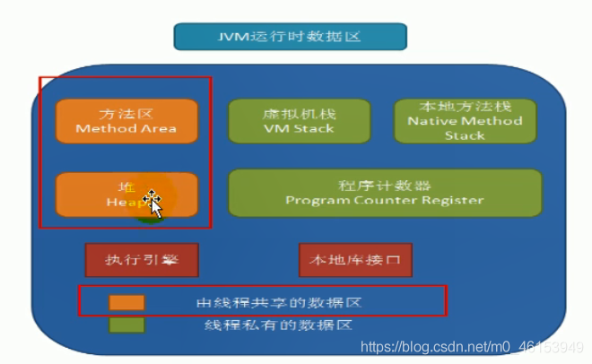  
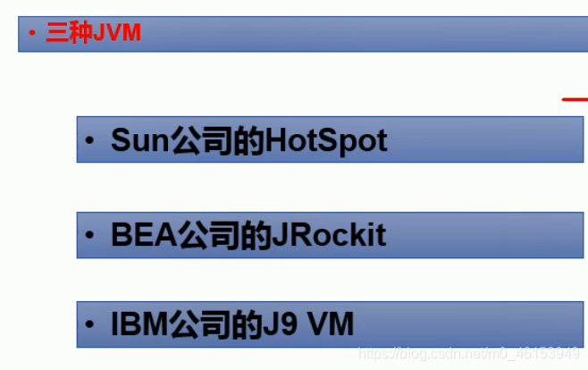  
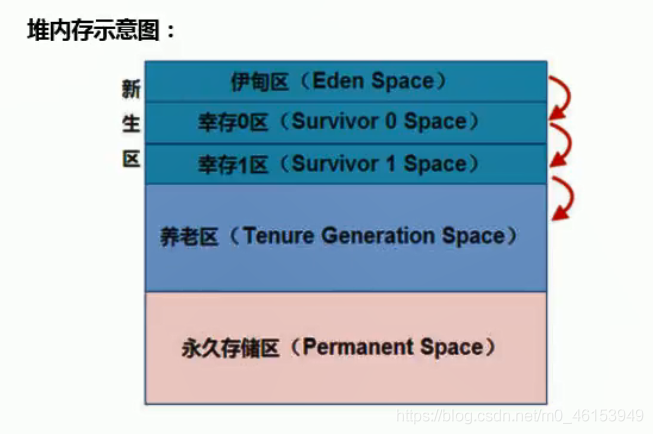  
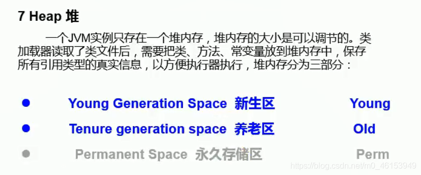  
  
  
  
  
  
  
  


## 1.7、String的常用方法1

 * int length()：返回字符串的长度：return value.length
 * char charAt(int index)：返回某索引处的字符return value[index]
 * boolean isEmpty()：判断是否是空字符串：return value.length==0
 * String toLowerCase()：使用默认语言环境，将String中的所有字符转换为小写
 * String toUpperCase()：使用默认语言环境，将String中的所有字符转换为大写
 * String trim()：返回字符串的副本，忽略前导空白和尾部空白
 * boolean equals(Object obj)：比较字符串的内容是否相同
 * boolean equals IgnoreCase(String anotherString)：与equals方法类似，忽略大小写
 * String concat(String str)：将指定字符串连接到此字符串的结尾。等价于用“+”
 * int compareTo(String anotherString)：比较两个字符串的大小
 * String substring(int beginIndex)：返回一个新的字符串，它是此字符串的从beginIndex开始截取到最后的一个子字符串。
 * String substring(int beginIndex,int endIndex)：返回一个新字符串，它是此字符串从beginIndex开始截取到endIndex(不包含)的一个子字符串。

```java
public class StringMethodTest {
    @Test
    public void test2(){
        String s1 = "HelloWorld";
        String s2 = "helloworld";
        System.out.println(s1.equals(s2));//false
        System.out.println(s1.equalsIgnoreCase(s2));//true
        
        String s3 = "abc";
        String s4 = s3.concat("def");
        System.out.println(s4);//abcdef

        String s5 = "abc";
        String s6 = new String("abe");
        System.out.println(s5.compareTo(s6));//-2   //涉及到字符串的排序

        String s7 = "周围好吵啊";
        String s8 = s7.substring(2);
        System.out.println(s7);
        System.out.println(s8);

        String s9 = s7.substring(0, 2);
        System.out.println(s9);
    }

    @Test
    public void Test1(){
        String s1 = "helloworld";
        System.out.println(s1.length());
        System.out.println(s1.length());
        System.out.println(s1.charAt(0));
        System.out.println(s1.charAt(9));
//        System.out.println(s1.charAt(10));
//        s1 = "";
        System.out.println(s1.isEmpty());

        String s2 = s1.toLowerCase();
        System.out.println(s1);//s1不可变的，仍然为原来的字符串
        System.out.println(s2);//改成小写以后的字符串

        String s3 = "   he  llo   world   ";
        String s4 = s3.trim();
        System.out.println("-----" + s3 + "-----");
        System.out.println("-----" + s4 + "-----");
    }

}
```

## 1.8、String的常用方法2

 * boolean endsWith(String suffix)：测试此字符串是否以指定的后缀结束

 * boolean startsWith(String prefix)：测试此字符串是否以指定的前缀开始

 * boolean startsWith(String prefix, int toffset)：测试此字符串从指定索引开始的子字符串是否以指定前缀开始
 *

 * boolean contains(CharSequence s)：当且仅当此字符串包含指定的 char 值序列时，返回 true

 * int indexOf(String str)：返回指定子字符串在此字符串中第一次出现处的索引

 * int indexOf(String str, int fromIndex)：返回指定子字符串在此字符串中第一次出现处的索引，从指定的索引开始

 * int lastIndexOf(String str)：返回指定子字符串在此字符串中最右边出现处的索引

 * int lastIndexOf(String str, int fromIndex)：返回指定子字符串在此字符串中最后一次出现处的索引，从指定的索引开始反向搜索

    > 注：indexOf和lastIndexOf方法如果未找到都是返回-1

```java
public class StringMethodTest {

    @Test
    public void test3(){
        String str1 = "helloworld";
        boolean b1 = str1.endsWith("rld");
        System.out.println(b1);

        boolean b2 = str1.startsWith("He");
        System.out.println(b2);

        boolean b3 = str1.startsWith("ll",2);
        System.out.println(b3);

        String str2 = "wor";
        System.out.println(str1.contains(str2));

        System.out.println(str1.indexOf("lo"));

        System.out.println(str1.indexOf("lo",5));

        String str3 = "hellorworld";

        System.out.println(str3.lastIndexOf("or"));
        System.out.println(str3.lastIndexOf("or",6));

        //什么情况下，indexOf(str)和lastIndexOf(str)返回值相同？
        //情况一：存在唯一的一个str。情况二：不存在str
    }
}
```

## 1.9、String的常用方法3

替换：

 * String replace(char oldChar, char newChar)：返回一个新的字符串，它是通过用 newChar 替换此字符串中出现的所有 oldChar 得到的。
 * String replace(CharSequence target, CharSequence replacement)：使用指定的**字面值替换序列**替换此字符串所有匹配字面值目标序列的子字符串。
 * String replaceAll(String regex, String replacement)：使用给定的 replacement 替换此字符串所有匹配给定的**正则表达式**的子字符串。
 * String replaceFirst(String regex, String replacement)：使用给定的 replacement 替换此字符串匹配给定的正则表达式的第一个子字符串。

匹配:

 * boolean matches(String regex)：告知此字符串**是否匹配给定的正则表达式**。

切片：

 * String[] split(String regex)：根据给定正则表达式的匹配拆分此字符串。
 * String[] split(String regex, int limit)：根据匹配给定的正则表达式来拆分此字符串，最多不超过limit个，如果超过了，剩下的全部都放到最后一个元素中。

```java
public class StringMethodTest {
    @Test
    public void test4(){
        String str1 = "西藏布达拉宫欢迎您";
        String str2 = str1.replace('西','东');

        System.out.println(str1);
        System.out.println(str2);

        String str3 = str1.replace("北京", "南京");
        System.out.println(str3);

        System.out.println("*************************");
        String str = "12hello34world5java7891mysql456";
        //把字符串中的数字替换成,，如果结果中开头和结尾有，的话去掉
        String string = str.replaceAll("\\d+", ",").replaceAll("^,|,$", "");
        System.out.println(string);

        System.out.println("*************************");
        str = "12345";
        //判断str字符串中是否全部有数字组成，即有1-n个数字组成
        boolean matches = str.matches("\\d+");
        System.out.println(matches);
        String tel = "0571-4534289";
        //判断这是否是一个杭州的固定电话
        boolean result = tel.matches("0571-\\d{7,8}");
        System.out.println(result);

        System.out.println("*************************");
        str = "hello|world|java";
        String[] strs = str.split("\\|");
        for (int i = 0; i < strs.length; i++) {
            System.out.println(strs[i]);
        }
        System.out.println();
        str2 = "hello.world.java";
        String[] strs2 = str2.split("\\.");
        for (int i = 0; i < strs2.length; i++) {
            System.out.println(strs2[i]);
        }
    }
}
```

## 1.10、String与基本数据类型包装类的转换

- String --> 基本数据类型、包装类：调用包装类的静态方法：parseXxx(str)

- 基本数据类型、包装类 --> String:调用String重载的valueOf(xxx)

```java
/**
 * 涉及到String类与其他结构之间的转换
 */
public class StringTest1 {

    @Test
    public void test1(){
        String str1 = "123";
//        int num = (int)str1;//错误的
        int num = Integer.parseInt(str1);

        String str2 = String.valueOf(num);   //"123
        String str3 = num + "";

        System.out.println(str1 == str3);   //false
    }

}
```

## 1.11、String与char[]之间的转换

 String 与 char[]之间的转换 : 

- String --> char[]:调用String的toCharArray()
- char[] --> String:调用String的构造器

```java
public class StringTest1 {

    @Test
    public void test2(){
        String str1 = "abc123"; //题目： a21cb3

        char[] charArray = str1.toCharArray();
        for (int i = 0; i < charArray.length; i++) {
            System.out.println(charArray[i]);
        }

        char[] arr = new char[]{'h','e','l','l','o'};
        String str2 = new String(arr);
        System.out.println(str2);
    }
}
```

## 1.12、String与byte[]之间的转换

String 与 byte[]之间的转换

1. 编码：String --> byte[]:调用String的getBytes()
   解码：byte[] --> String:调用String的构造器

2. 编码：字符串 -->字节  (看得懂 --->看不懂的二进制数据)
   解码：编码的逆过程，字节 --> 字符串 （看不懂的二进制数据 ---> 看得懂）

> 说明：解码时，要求解码使用的字符集必须与编码时使用的字符集一致，否则会出现乱码。

```java
import java.io.UnsupportedEncodingException;
import java.util.Arrays;

public class StringTest1 {
    @Test
    public void test3() throws UnsupportedEncodingException {
        String str1 = "abc123重工";
        byte[] bytes = str1.getBytes();//使用默认的字符编码集,进行转换
        System.out.println(Arrays.toString(bytes));

        byte[] gbks = str1.getBytes("gbk");//使用gbk字符集进行编码。
        System.out.println(Arrays.toString(gbks));

        System.out.println("*****************************");

        String str2 = new String(bytes);//使用默认的字符集，进行解码。
        System.out.println(str2);

        String str3 = new String(gbks);
        System.out.println(str3);//出现乱码。原因：编码集和解码集不一致！

        String str4 = new String(gbks,"gbk");
        System.out.println(str4);//没有出现乱码。原因：编码集和解码集一致！
    }
}
```


## 1.13、面试中String算法考查的说明

### 1、模拟一个trim方法，去除字符串两端的空格。


```java
import org.junit.Test;

public class StringExer {

	public String myTrim(String str) {
		if (str != null) {
			int start = 0;// 用于记录从前往后首次索引位置不是空格的位置的索引
			int end = str.length() - 1;// 用于记录从后往前首次索引位置不是空格的位置的索引

			while (start < end && str.charAt(start) == ' ') {
				start++;
			}

			while (start < end && str.charAt(end) == ' ') {
				end--;
			}
			if (str.charAt(start) == ' ') {
				return "";
			}

			return str.substring(start, end + 1);
		}
		return null;
	}
	
	@Test
	public void testMyTrim() {
		String str = "   a   ";
		// str = " ";
		String newStr = myTrim(str);
		System.out.println("---" + newStr + "---");
	}
}
```

### 2、将一个字符串进行反转

将字符串中指定部分进行反转。比如“abcdefg”反转为”abfedcg”


```java
import org.junit.Test;

public class StringDemo {

    /**
     * 方式一：转换为char[]
     */
    public String reverse(String str,int startIndex,int endIndex){

        if(str != null && str.length() != 0) {
            char[] arr = str.toCharArray();
            for (int x = startIndex, y = endIndex; x < y; x++, y--) {
                char temp = arr[x];
                arr[x] = arr[y];
                arr[y] = temp;
            }
            return new String(arr);
        }
        return null;
    }

    /**
     * 方式二：使用String的拼接
     */
    public String reverse2(String str, int startIndex, int endIndex) {
        if(str != null) {
            // 第一部分
            String reverStr = str.substring(0,startIndex);// ab
            // 第二部分
            for (int i = endIndex; i >= startIndex; i--) {
                reverStr += str.charAt(i);
            } // abfedc
            // 第三部分
            reverStr += str.substring(endIndex + 1);

            return reverStr;
        }
        return null;
    }

    //方式三：使用StringBuffer/StringBuilder替换String
    public String reverse3(String str, int startIndex, int endIndex) {
        StringBuilder builder = new StringBuilder(str.length());

        if(str != null) {
            //第一部分
            builder.append(str.substring(0, startIndex));

            //第二部分
            for (int i = endIndex; i >= startIndex; i--) {

                builder.append(str.charAt(i));
            }
            //第三部分
            builder.append(str.substring(endIndex + 1));

            return builder.toString();
        }
        return null;
    }

    @Test
    public void testReverse() {
        String str = "abcdefg";
        String str1 = reverse3(str, 2, 5);
        System.out.println(str1);// abfedcg

    }
}
```

### 3、获取一个字符串在另一个字符串中出现的次数

比如：获取“ ab”在“abkkcadkabkebfkabkskab” 中出现的次数


```java
import org.junit.Test;

public class StringDemo2 {
    /**
     * 获取subStr在mainStr中出现的次数
     * @param mainStr
     * @param subStr
     */
    public int getCount(String mainStr,String subStr){
        int mainLength = mainStr.length();
        int subLength = subStr.length();
        int count = 0;
        int index = 0;

        if(mainLength >= subLength){

            //方式一：
//            while((index = mainStr.indexOf(subStr)) != -1){
//                count++;
//                mainStr = mainStr.substring(index + subStr.length());
//            }
            //方式二：对方式一的改进
            while((index = mainStr.indexOf(subStr,index)) != -1){
                count++;
                index += subLength;
            }

            return count;
        }else{
            return 0;
        }
    }

    @Test
    public void testGetCount(){
        String mainStr = "abkkcadkabkebfkabkskab";
        String subStr = "ab";
        int count = getCount(mainStr,subStr);
        System.out.println(count);
    }

}
```

### 4、获取两个字符串中最大相同子串

比如：


> `str1 = "abcwerthelloyuiodef“;str2 = “cvhellobnm”`
>
> 提示：将短的那个串进行长度依次递减的子串与较长的串比较。


```java
import org.junit.Test;

import java.util.Arrays;

public class StringDemo3 {
    //前提：两个字符串中只有一个最大相同子串
    public String getMaxSameString(String str1,String str2){
        if(str1 != null && str2 != null){
            String maxStr = (str1.length() >= str2.length())? str1 : str2;
            String minStr = (str1.length() < str2.length())? str1 : str2;
            int length = minStr.length();

            for(int i = 0;i < length;i++){
                for(int x = 0,y = length - i;y <= length;x++,y++){
                    String subStr = minStr.substring(x,y);
                    if(maxStr.contains(subStr)){
                        return subStr;
                    }

                }
            }

        }
        return null;
    }

    // 如果存在多个长度相同的最大相同子串
    // 此时先返回String[]，后面可以用集合中的ArrayList替换，较方便
    public String[] getMaxSameString1(String str1, String str2) {
        if (str1 != null && str2 != null) {
            StringBuffer sBuffer = new StringBuffer();
            String maxString = (str1.length() > str2.length()) ? str1 : str2;
            String minString = (str1.length() > str2.length()) ? str2 : str1;

            int len = minString.length();
            for (int i = 0; i < len; i++) {
                for (int x = 0, y = len - i; y <= len; x++, y++) {
                    String subString = minString.substring(x, y);
                    if (maxString.contains(subString)) {
                        sBuffer.append(subString + ",");
                    }
                }
//                System.out.println(sBuffer);
                if (sBuffer.length() != 0) {
                    break;
                }
            }
            String[] split = sBuffer.toString().replaceAll(",$", "").split("\\,");
            return split;
        }

        return null;
    }

    @Test
    public void testGetMaxSameString(){
        String str1 = "abcwerthello1yuiodefabcdef";
        String str2 = "cvhello1bnmabcdef";
        String[] maxSameStrings = getMaxSameString1(str1, str2);
        System.out.println(Arrays.toString(maxSameStrings));

    }

}
```

### 5、对字符串中字符进行自然顺序排序


> 提示：
>
> 1）字符串变成字符数组。
>
> 2）对数组排序，选择，冒泡，Arrays.sort();
>
> 3）将排序后的数组变成字符串。


```java
import org.junit.Test;
import java.util.Arrays;

public class StringDemo4 {

	// 第5题
	@Test
	public void testSort() {
		String str = "abcwerthelloyuiodef";
		char[] arr = str.toCharArray();
		Arrays.sort(arr);

		String newStr = new String(arr);
		System.out.println(newStr);
	}
}
```


## 1.14、StringBuffer和StringBuilder的介绍

- String、StringBuffer、StringBuilder三者的异同？
- String:不可变的字符序列；底层使用char[]存储

- StringBuffer:可变的字符序列；线程安全的，效率低；底层使用char[]存储

- **StringBuilder**:可变的字符序列；jdk5.0新增的，线程不安全的，效率高；底层使用char[]存储


## 1.15、StringBuffer的源码分析

```java
/**
 * 关于StringBuffer和StringBuilder的使用
 */
public class StringBufferBuilderTest {
    /**
     *
     * 源码分析：
     * String str = new String();//char[] value = new char[0];
     * String str1 = new String("abc");//char[] value = new char[]{'a','b','c'};
     *
     * StringBuffer sb1 = new StringBuffer();//char[] value = new char[16];底层创建了一个长度是16的数组。
     * System.out.println(sb1.length());//
     * sb1.append('a');//value[0] = 'a';
     * sb1.append('b');//value[1] = 'b';
     *
     * StringBuffer sb2 = new StringBuffer("abc");//char[] value = new char["abc".length() + 16];
     *
     * //问题1.System.out.println(sb2.length());//3
     * //问题2.扩容问题:如果要添加的数据底层数组盛不下了，那就需要扩容底层的数组。
     *        默认情况下，扩容为原来容量的2倍 + 2，同时将原有数组中的元素复制到新的数组中。
     *
     * 意义：开发中建议大家使用：StringBuffer(int capacity) 或 StringBuilder(int capacity)
     *
     */
    @Test
    public void test1(){
        StringBuffer sb1 = new StringBuffer("abc");
        sb1.setCharAt(0,'m');
        System.out.println(sb1);

        StringBuffer sb2 = new StringBuffer();
        System.out.println(sb2.length());   //0
    }
}
```

## 1.16、StringBuffer中的常用方法

StringBuffer的常用方法：
* StringBuffer append(xxx)：提供了很多的append()方法，用于进行字符串拼接
* StringBuffer delete(int start,int end)：删除指定位置的内容
* StringBuffer replace(int start, int end, String str)：把[start,end)位置替换为str
* StringBuffer insert(int offset, xxx)：在指定位置插入xxx
* StringBuffer reverse() ：把当前字符序列逆转
* public int indexOf(String str)
* public String substring(int start,int end):返回一个从start开始到end索引结束的左闭右开区间的子字符串
* public int length()
* public char charAt(int n )
* public void setCharAt(int n ,char ch)

```java
public class StringBufferBuilderTest {
    @Test
    public void test2(){
        StringBuffer s1 = new StringBuffer("abc");
        s1.append(1);
        s1.append('1');
        System.out.println(s1);
//        s1.delete(2,4);
//        s1.replace(2,4,"hello");
//        s1.insert(2,false);
//        s1.reverse();
        String s2 = s1.substring(1,3);
        System.out.println(s1);
        System.out.println(s1.length());
        System.out.println(s2);
    }
}
```

总结：
*     增：append(xxx)
*     删：delete(int start,int end)
*     改：setCharAt(int n ,char ch) / replace(int start, int end, String str)
*     查：charAt(int n )
*     插：insert(int offset, xxx)
*     长度：length();
*     遍历：for() + charAt() / toString()

## 1.17、String、StringBuffer、StringBuilder效率对比

从高到低排列：StringBuilder > StringBuffer > String 

```java
public class StringBufferBuilderTest {
    @Test
    public void test3(){
        //初始设置
        long startTime = 0L;
        long endTime = 0L;
        String text = "";
        StringBuffer buffer = new StringBuffer("");
        StringBuilder builder = new StringBuilder("");
        //开始对比
        startTime = System.currentTimeMillis();
        for (int i = 0; i < 20000; i++) {
            buffer.append(String.valueOf(i));
        }
        endTime = System.currentTimeMillis();
        System.out.println("StringBuffer的执行时间：" + (endTime - startTime));

        startTime = System.currentTimeMillis();
        for (int i = 0; i < 20000; i++) {
            builder.append(String.valueOf(i));
        }
        endTime = System.currentTimeMillis();
        System.out.println("StringBuilder的执行时间：" + (endTime - startTime));

        startTime = System.currentTimeMillis();
        for (int i = 0; i < 20000; i++) {
            text = text + i;
        }
        endTime = System.currentTimeMillis();
        System.out.println("String的执行时间：" + (endTime - startTime));

    }
}
```


# 02、JDK8中日期时间API的介绍

1、新日期时间API出现的背景

如果我们可以跟别人说：“我们在1502643933071见面，别晚了！”那么就再简单不过了。但是我们希望时间与昼夜和四季有关，于是事情就变复杂了。JDK
1.0中包含了一个java.util.Date类，但是它的大多数方法已经在JDK
1.1引入Calendar类之后被弃用了。而Calendar并不比Date好多少。它们面临的问题是：

  * 可变性：像日期和时间这样的类应该是不可变的。

  * 偏移性：Date中的年份是从1900开始的，而月份都从0开始。

  * 格式化：格式化只对Date有用，Calendar则不行。

  * 此外，它们也不是线程安全的；不能处理闰秒等。

    ```java
    // 旧版的日期表示方式
    import org.junit.Test;
    import java.util.Date;
    
    public class JDK8DateTimeTest {
       @Test
       public void testDate(){
           //偏移量
          	Date date1 = new Date(2020,9,8);
           	System.out.println(date1);  //Fri Oct 08 00:00:00 CST 3920
    		Date date2 = new Date(2020 - 1900,9 - 1,8);
    		System.out.println(date2); //Tue Sep 08 00:00:00 CST 2020
    	}
      }
    ```

第三次引入的API是成功的，并且Java 8中引入的`java.time` API 已经纠正了过去的缺陷，将来很长一段时间内它都会为我们服务。

Java 8 吸收了Joda-Time 的精华，以一个新的开始为Java 创建优秀的API。新的`java.time` 中包含了所有关于**本地日期（LocalDate）、本地时间（LocalTime）、本地日期时间（LocalDateTime）、时区（ZonedDateTime）和持续时间（Duration）的类**。历史悠久的Date 类新增了`toInstant()`方法，用于把Date 转换成新的表示形式。这些新增的本地化时间日期API大大简化了日期时间和本地化的管理。

- java.time–包含值对象的基础包

- java.time.chrono–提供对不同的日历系统的访问

- java.time.format–格式化和解析时间和日期

- java.time.temporal–包括底层框架和扩展特性

- java.time.zone–包含时区支持的类

  > 说明：大多数开发者只会用到基础包和format包，也可能会用到temporal包。因此，尽管有68个新的公开类型，大多数开发者，大概将只会用到其中的三分之一。


## 2.1、LocalDate、LocalTime、LocalDateTime的使用

* `LocalDate、LocalTime、LocalDateTime`类是其中较重要的几个类，它们的实例是 **不可变的对象** ，分别表示使用ISO-8601日历系统的日期、时间、日期和时间。它们提供了简单的本地日期或时间，并不包含当前的时间信息，也不包含与时区相关的信息。 
* `LocalDate`代表IOS格式（yyyy-MM-dd）的日期,可以存储生日、纪念日等日期。
* `LocalTime`表示一个时间，而不是日期。
* `LocalDateTime`是用来表示日期和时间的， **这是一个最常用的类之一** 。

> 注：ISO-8601日历系统是国际标准化组织制定的现代公民的日期和时间的表示法，也就是公历。

```java
import org.junit.Test;

import java.time.LocalDate;
import java.time.LocalDateTime;
import java.time.LocalTime;

/**

 * jdk 8中日期时间API的测试
   */
   public class JDK8DateTimeTest {

    /**

     * LocalDate、LocalTime、LocalDateTime的使用
       *
       */
       @Test
       public void test1(){
        //now():获取当前的日期、时间、日期+时间
        LocalDate localDate = LocalDate.now();
        LocalTime localTime = LocalTime.now();
        LocalDateTime localDateTime = LocalDateTime.now();

        System.out.println(localDate);
        System.out.println(localTime);
        System.out.println(localDateTime);

        //of():设置指定的年、月、日、时、分、秒。没有偏移量
        LocalDateTime localDateTime1 = LocalDateTime.of(2020, 10, 6, 13, 23, 43);
        System.out.println(localDateTime1);

        //getXxx()：获取相关的属性
        System.out.println(localDateTime.getDayOfMonth());
        System.out.println(localDateTime.getDayOfWeek());
        System.out.println(localDateTime.getMonth());
        System.out.println(localDateTime.getMonthValue());
        System.out.println(localDateTime.getMinute());

        //体现不可变性
        //withXxx():设置相关的属性
        LocalDate localDate1 = localDate.withDayOfMonth(22);
        System.out.println(localDate);
        System.out.println(localDate1);

        LocalDateTime localDateTime2 = localDateTime.withHour(4);
        System.out.println(localDateTime);
        System.out.println(localDateTime2);

        //不可变性
        LocalDateTime localDateTime3 = localDateTime.plusMonths(3);
        System.out.println(localDateTime);
        System.out.println(localDateTime3);

        LocalDateTime localDateTime4 = localDateTime.minusDays(6);
        System.out.println(localDateTime);
        System.out.println(localDateTime4);
    }
}
```

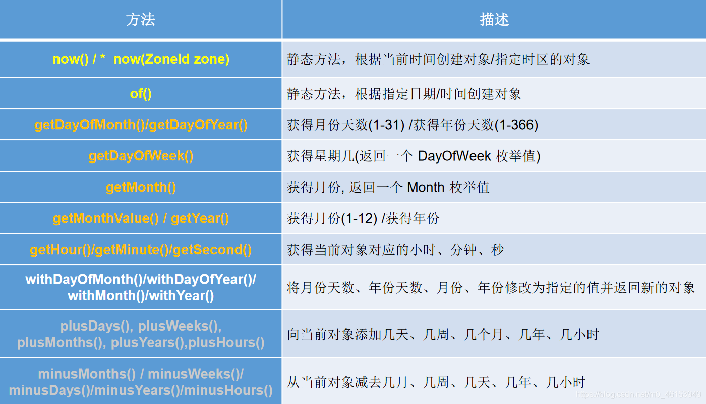

## 2.2、Instant类的使用

  * `Instant`：时间线上的一个瞬时点。这可能被**用来记录应用程序中的事件时间戳**。
  * 在处理时间和日期的时候，我们通常会想到年,月,日,时,分,秒。然而，这只是时间的一个模型，是面向人类的。第二种通用模型是面向机器的，或者说是连续的。在此模型中，时间线中的一个点表示为一个很大的数，这有利于计算机处理。在UNIX中，这个数从1970年开始，以秒为的单位；同样的，在Java中，也是从1970年开始，但以毫秒为单位。
  * `java.time`包通过值类型`Instan`t提供机器视图，不提供处理人类意义上的时间单位。`Instant`表示时间线上的一点，而不需要任何上下文信息，例如，时区。概念上讲，它只是简单的表示自1970年1月1日0时0分0秒（UTC）开始的秒数。因为`java.time`包是基于纳秒计算的，所以`Instant`的精度可以达到纳秒级。

> (1 ns = 10-9s) 1秒= 1000毫秒=106微秒=109纳秒

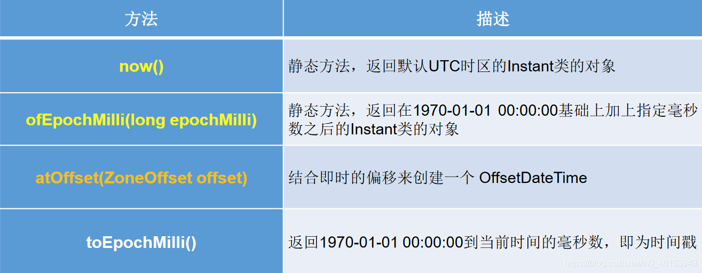

> 时间戳是指格林威治时间1970年01月01日00时00分00秒(北京时间1970年01月01日08时00分00秒)起至现在的总秒数。


```java
import java.time.*;
/**
 * jdk 8中日期时间API的测试
 */
public class JDK8DateTimeTest {

    /**
     * Instant的使用
     */
    @Test
    public void test2(){
        //now():获取本初子午线对应的标准时间
        Instant instant = Instant.now();
        System.out.println(instant);    //2020-05-10T09:55:55.561Z

        //添加时间的偏移量
        OffsetDateTime offsetDateTime = instant.atOffset(ZoneOffset.ofHours(8));//东八区
        System.out.println(offsetDateTime); //2020-05-10T18:00:00.641+08:00

        //toEpochMilli():获取自1970年1月1日0时0分0秒（UTC）开始的毫秒数  ---> Date类的getTime()
        long milli = instant.toEpochMilli();
        System.out.println(milli);  //1589104867591

        //ofEpochMilli():通过给定的毫秒数，获取Instant实例  -->Date(long millis)
        Instant instant1 = Instant.ofEpochMilli(1550475314878L);
        System.out.println(instant1);   //2019-02-18T07:35:14.878Z
    }
}
```


## 2.3、DateTimeFormatter的使用

> `java.time.format.DateTimeFormatter` 类：该类提供了三种格式化方法：

  * 预定义的标准格式。如： **`ISO_LOCAL_DATE_TIME;ISO_LOCAL_DATE;ISO_LOCAL_TIME`**
  * 本地化相关的格式。如：`ofLocalizedDateTime(FormatStyle.LONG)`
  *  **自定义的格式。如：`ofPattern(“yyyy-MM-dd hh:mm:ss”)`**


​    import org.junit.Test;
​    

​    

```java
import java.time.*;
import java.time.format.DateTimeFormatter;
import java.time.format.FormatStyle;
import java.time.temporal.TemporalAccessor;
/**
 * jdk 8中日期时间API的测试
 */
public class JDK8DateTimeTest {

    /**
     * DateTimeFormatter:格式化或解析日期、时间
     *     类似于SimpleDateFormat
     */
    @Test
    public void test3(){
        //方式一：预定义的标准格式。如：ISO_LOCAL_DATE_TIME;ISO_LOCAL_DATE;ISO_LOCAL_TIME
        DateTimeFormatter formatter = DateTimeFormatter.ISO_LOCAL_DATE_TIME;
        //格式化:日期-->字符串
        LocalDateTime localDateTime = LocalDateTime.now();
        String str1 = formatter.format(localDateTime);
        System.out.println(localDateTime);
        System.out.println(str1);//2020-05-10T18:26:40.234

        //解析：字符串 -->日期
        TemporalAccessor parse = formatter.parse("2020-05-10T18:26:40.234");
        System.out.println(parse);

        //方式二：
        //本地化相关的格式。如：ofLocalizedDateTime()
        //FormatStyle.LONG / FormatStyle.MEDIUM / FormatStyle.SHORT :适用于LocalDateTime
        DateTimeFormatter formatter1 = DateTimeFormatter.ofLocalizedDateTime(FormatStyle.LONG);
        //格式化
        String str2 = formatter1.format(localDateTime);
        System.out.println(str2);//2020年5月10日 下午06时26分40秒

        //本地化相关的格式。如：ofLocalizedDate()
        //FormatStyle.FULL / FormatStyle.LONG / FormatStyle.MEDIUM / FormatStyle.SHORT : 适用于LocalDate
        DateTimeFormatter formatter2 = DateTimeFormatter.ofLocalizedDate(FormatStyle.MEDIUM);
        //格式化
        String str3 = formatter2.format(LocalDate.now());
        System.out.println(str3);//2020-5-10
        //重点： 方式三：自定义的格式。如：ofPattern(“yyyy-MM-dd hh:mm:ss”)
        DateTimeFormatter formatter3 = DateTimeFormatter.ofPattern("yyyy-MM-dd hh:mm:ss");
          //格式化
        String str4 = formatter3.format(LocalDateTime.now());
        System.out.println(str4);//2020-05-10 06:26:40
  
        //解析
        TemporalAccessor accessor = formatter3.parse("2020-05-10 06:26:40");
        System.out.println(accessor);
    }
}
```

> 最主要的还是方式三。

## 2.4、其它日期时间相关API的使用

* ZoneId：该类中包含了所有的时区信息，一个时区的ID，如Europe/Paris
* ZonedDateTime：一个在ISO-8601日历系统时区的日期时间，如2007-12-03T10:15:30+01:00Europe/Paris。 

​			其中每个时区都对应着ID，地区ID都为“{区域}/{城市}”的格式，例如：Asia/Shanghai等
​	

* Clock：使用时区提供对当前即时、日期和时间的访问的时钟。
* 持续时间：Duration，用于计算两个“时间”间隔
* 日期间隔：Period，用于计算两个“日期”间隔
* TemporalAdjuster : 时间校正器。有时我们可能需要获取例如：将日期调整到“下一个工作日”等操作。
* TemporalAdjusters : 该类通过静态方法(firstDayOfXxx()/lastDayOfXxx()/nextXxx())提供了大量的常用TemporalAdjuster 的实现。


### 参考：与传统日期处理的转换

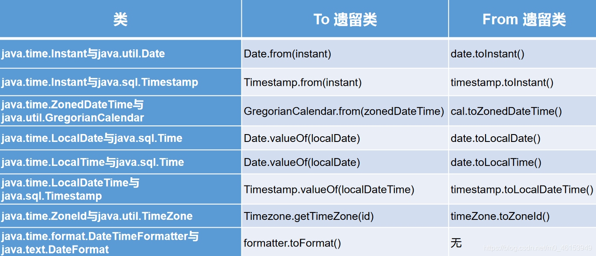

# 03、Java比较器

## 3.1、概述

Java中的对象，正常情况下，只能进行比较：`==`或 `!=` 。不能使用
`>`或`<`的，但是在开发场景中，我们需要对多个对象进行排序，言外之意，就需要比较对象的大小。
如何实现？使用两个接口中的任何一个：`Comparable`或 `Comparator`

  * Java实现对象排序的方式有两种： 
    * 自然排序：`java.lang.Comparable`
    * 定制排序：`java.util.Comparator`

## 3.2、Comparable自然排序举例

Comparable接口的使用举例：  自然排序

1. 像String、包装类等实现了Comparable接口，重写了compareTo(obj)方法，给出了比较两个对象大小的方式。

2. 像String、包装类重写compareTo()方法以后，进行了从小到大的排列

3. 重写compareTo(obj)的规则：
   *    如果当前对象this大于形参对象obj，则返回正整数，
   *    如果当前对象this小于形参对象obj，则返回负整数，
   *    如果当前对象this等于形参对象obj，则返回零。

```java
import org.junit.Test;
import java.util.Arrays;
public class CompareTest {

    @Test
    public void test1(){
        String[] arr = new String[]{"AA","CC","KK","MM","GG","JJ","DD"};

        Arrays.sort(arr);

        System.out.println(Arrays.toString(arr));
    }

}
```

## 3.3、自定义类实现Comparable自然排序

对于自定义类来说，如果需要排序，我们可以让自定义类实现Comparable接口，重写compareTo(obj)方法。**在compareTo(obj)方法中指明如何排序**。然后就可以直接排序。


```java
// 1、测试类
import org.junit.Test;
import java.util.Arrays;

public class CompareTest {
    @Test
    public void test2(){
        Goods[] arr = new Goods[5];
        arr[0] = new Goods("lenovoMouse",34);
        arr[1] = new Goods("dellMouse",43);
        arr[2] = new Goods("xiaomiMouse",12);
        arr[3] = new Goods("huaweiMouse",65);
        arr[4] = new Goods("microsoftMouse",43);
        Arrays.sort(arr);
        System.out.println(Arrays.toString(arr));
    }
}
// 2、Goods类
/**
 * 商品类
 */
public class Goods implements Comparable{

    private String name;
    private double price;

    public Goods() {
    }

    public Goods(String name, double price) {
        this.name = name;
        this.price = price;
    }

    public String getName() {
        return name;
    }

    public void setName(String name) {
        this.name = name;
    }

    public double getPrice() {
        return price;
    }

    public void setPrice(double price) {
        this.price = price;
    }

    @Override
    public String toString() {
        return "Goods{" +
                "name='" + name + '\'' +
                ", price=" + price +
                '}';
    }

    //指明商品比较大小的方式:按照价格从低到高排序,再按照产品名称从高到低排序
    @Override
    public int compareTo(Object o) {
//        System.out.println("**************");
        if(o instanceof Goods){
            Goods goods = (Goods)o;
            //方式一：
            if(this.price > goods.price){
                return 1;
            }else if(this.price < goods.price){
                return -1;
            }else{
//                return 0;
                return -this.name.compareTo(goods.name);
            }
            //方式二：
//           return Double.compare(this.price,goods.price);
        }
//        return 0;
        throw new RuntimeException("传入的数据类型不一致！");
    }
}
```

## 3.4、使用Comparator实现定制排序

一、说明：Java中的对象，正常情况下，只能进行比较：==  或  != 。不能使用 > 或 < 的

 * 但是在开发场景中，我们需要对多个对象进行排序，言外之意，就需要比较对象的大小。
 * 如何实现？使用两个接口中的任何一个：Comparable 或 Comparator

二、Comparable接口与Comparator的使用的对比：

 * Comparable接口的方式一旦一定，保证Comparable接口实现类的对象在任何位置都可以比较大小。
 * **Comparator接口属于临时性的比较**。

三、Comparator接口的使用：**定制排序**

1.背景：

*     当元素的类型没有实现java.lang.Comparable接口而又不方便修改代码，
*     或者实现了java.lang.Comparable接口的排序规则不适合当前的操作，
*     那么可以考虑使用 Comparator 的对象来排序

2.重写compare(Object o1,Object o2)方法，比较o1和o2的大小：

*     如果方法返回正整数，则表示o1大于o2；
*     如果返回0，表示相等；
*     返回负整数，表示o1小于o2。

```java
// 数组中的应用
import org.junit.Test;
import java.util.Arrays;
import java.util.Comparator;

public class CompareTest {
    @Test
    public void test3(){
        String[] arr = new String[]{"AA","CC","KK","MM","GG","JJ","DD"};
        Arrays.sort(arr,new Comparator(){
            //按照字符串从大到小的顺序排列
            @Override
            public int compare(Object o1, Object o2) {
                if(o1 instanceof String && o2 instanceof  String){
                    String s1 = (String) o1;
                    String s2 = (String) o2;
                    return -s1.compareTo(s2);
                }
//                return 0;
                throw new RuntimeException("输入的数据类型不一致");
            }
        });
        System.out.println(Arrays.toString(arr));
    }

    @Test
    public void test4(){
        Goods[] arr = new Goods[6];
        arr[0] = new Goods("lenovoMouse",34);
        arr[1] = new Goods("dellMouse",43);
        arr[2] = new Goods("xiaomiMouse",12);
        arr[3] = new Goods("huaweiMouse",65);
        arr[4] = new Goods("huaweiMouse",224);
        arr[5] = new Goods("microsoftMouse",43);

        Arrays.sort(arr, new Comparator() {
            //指明商品比较大小的方式:按照产品名称从低到高排序,再按照价格从高到低排序
            @Override
            public int compare(Object o1, Object o2) {
                if(o1 instanceof Goods && o2 instanceof Goods){
                    Goods g1 = (Goods)o1;
                    Goods g2 = (Goods)o2;
                    if(g1.getName().equals(g2.getName())){
                        return -Double.compare(g1.getPrice(),g2.getPrice());
                    }else{
                        return g1.getName().compareTo(g2.getName());
                    }
                }
                throw new RuntimeException("输入的数据类型不一致");
            }
        });

        System.out.println(Arrays.toString(arr));
    }
```

```java
// collections中的应用
import java.util.ArrayList;
import java.util.Collections;
import java.util.Comparator;
import java.util.HashMap;
import java.util.LinkedHashMap;
import java.util.List;
import java.util.Map;
import java.util.SortedMap;
import java.util.TreeMap;
public class Test {
	public static void main(String[] args) {
        // 1. ArrayList()
		List list = new ArrayList();
		list.add("1");
		list.add("5");
		list.add("8");
		list.add("6");
		list.add("7");
		System.out.println("list before sort " + list + " ..");
		// 1.1 默认升序排序
		Collections.sort(list);
		System.out.println("list after asc sort " + list + " ..");
		// 1.2 降序排序
		Collections.sort(list, new Comparator(){
			@Override
			public int compare(String arg0, String arg1) {
				return arg1.compareTo(arg0);
			}
		});
		System.out.println("list after desc sort " + list + " ..");
		
        // 2.HashMap
		Map<String,Integer> map = new HashMap<String,Integer>();
		map.put("a", 2);
		map.put("e", 9);
		map.put("b", 5);
		map.put("d", 3);
		map.put("t", 7);
		System.out.println("map before sort " + map + " ..");
		
		// 2.1 map按照key升序排序
		SortedMap<String,Integer> sortedMapByKey = new TreeMap<String,Integer>();
		sortedMapByKey.putAll(map);
		System.out.println("map after sort by key asc.." + sortedMapByKey);
		
		// 2.2 map按照key降序排序
		sortedMapByKey = new TreeMap<String,Integer>(new Comparator() {
			@Override
			public int compare(String arg0, String arg1) {
				return arg1.compareTo(arg0);
			}
		});
		sortedMapByKey.putAll(map);
		System.out.println("map after sort by key desc.." + sortedMapByKey);
		
		// 2.3 map按照value升序排序
		List<Map.Entry<String, Integer>> mapList =
			    new ArrayList<Map.Entry<String, Integer>>(map.entrySet());
		Collections.sort(mapList,new Comparator<Map.Entry<String, Integer>> (){
			@Override
			public int compare(Map.Entry<String, Integer> o1,
					Map.Entry<String, Integer> o2) {
				//根据value升序排序
				return o1.getValue() - o2.getValue();
				//根据value降序排序
				//return o2.getValue() - o1.getValue();
			}
		});
		LinkedHashMap<String,Integer> sortedMapByValue = new LinkedHashMap<String,Integer>();
		for(int i=0;i<mapList.size();i++) {
			
			Map.Entry<String, Integer> x = mapList.get(i);
			sortedMapByValue.put(x.getKey(), x.getValue());
		}
		System.out.println("map after sort by value asc " + sortedMapByValue + " ..");	
	}
}
```


**Comparable接口与Comparator的使用的对比** ：

  * Comparable接口的方式一旦一定，保证Comparable接口实现类的对象在任何位置都可以比较大小。
  * Comparator接口属于临时性的比较。

# 04、System类、Scanner类、Math类、BigInteger与BigDecimal

## 4.1、System类

  * `System`类代表系统，系统级的很多属性和控制方法都放置在该类的内部。该类位于`java.lang`包。

  * 由于该类的构造器是`private`的，所以无法创建该类的对象，也就是无法实例化该类。其内部的成员变量和成员方法都是`static`的，所以也可以很方便的进行调用。

  * 成员变量

    * `System`类内部包含`in、out`和`err`三个成员变量，分别代表标准输入流(键盘输入)，标准输出流(显示器)和标准错误输出流(显示器)。
    
  * 成员方法

    1.`native long currentTimeMillis()`：

> 该方法的作用是返回当前的计算机时间，时间的表达格式为当前计算机时间和GMT时间(格林威治时间)1970年1月1号0时0分0秒所差的毫秒数。

​	2. void exit(int status)`：

> 该方法的作用是退出程序。其中status的值为0代表正常退出，非零代表异常退出。使用该方法可以在图形界面编程中实现程序的退出功能等。

​	3. `void gc()`：

> 该方法的作用是请求系统进行垃圾回收。至于系统是否立刻回收，则取决于系统中垃圾回收算法的实现以及系统执行时的情况。

​	4. String `getProperty(String key)`：

> 该方法的作用是获得系统中属性名为key的属性对应的值。系统中常见的属性名以及属性的作用如下表所示：  
> 

```java
public class OtherClassTest {

    @Test
    public void test1() {
        String javaVersion = System.getProperty("java.version");
        System.out.println("java的version:" + javaVersion);

        String javaHome = System.getProperty("java.home");
        System.out.println("java的home:" + javaHome);

        String osName = System.getProperty("os.name");
        System.out.println("os的name:" + osName);

        String osVersion = System.getProperty("os.version");
        System.out.println("os的version:" + osVersion);

        String userName = System.getProperty("user.name");
        System.out.println("user的name:" + userName);

        String userHome = System.getProperty("user.home");
        System.out.println("user的home:" + userHome);

        String userDir = System.getProperty("user.dir");
        System.out.println("user的dir:" + userDir);

    }
}
```

## 4.2、Scanner类

java.util.Scanner 是 Java5 的新特征，我们可以通过 Scanner 类来获取用户的输入。

下面是创建 Scanner 对象的基本语法：

```java
Scanner s = new Scanner(System.in);
```

### next方法

```java
import java.util.Scanner; 
 
public class ScannerDemo {
    public static void main(String[] args) {
        Scanner scan = new Scanner(System.in);
        // 从键盘接收数据
 
        // next方式接收字符串
        System.out.println("next方式接收：");
        // 判断是否还有输入
        if (scan.hasNext()) {
            String str1 = scan.next();
            System.out.println("输入的数据为：" + str1);
        }
        scan.close();
    }
}
```

### nextLinef方法

```java
import java.util.Scanner;
 
public class ScannerDemo {
    public static void main(String[] args) {
        Scanner scan = new Scanner(System.in);
        // 从键盘接收数据
        // nextLine方式接收字符串
        System.out.println("nextLine方式接收：");
        // 判断是否还有输入
        if (scan.hasNextLine()) {
            String str2 = scan.nextLine();
            System.out.println("输入的数据为：" + str2);
        }
        scan.close();
    }
}
```

### next() 与 nextLine() 区别

#### next()

- 一定要读取到有效字符后才可以结束输入。
- 对输入有效字符之前遇到的空白，next() 方法会自动将其去掉。
- 只有输入有效字符后才将其后面输入的空白作为分隔符或者结束符。
- **next() 不能得到带有空格的字符串**。

#### nextLine()

- 以Enter为结束符,也就是说 nextLine()方法返回的是输入回车之前的所有字符。
- 可以获得空白。

### int 或 float 类型的数据读取

如果要输入 int 或 float 类型的数据，在 Scanner 类中也有支持，但是在输入之前最好先使用 hasNextXxx() 方法进行验证，再使用 nextXxx() 来读取：

```java
import java.util.Scanner;
 
public class ScannerDemo {
    public static void main(String[] args) {
        Scanner scan = new Scanner(System.in);
        // 从键盘接收数据
        int i = 0;
        float f = 0.0f;
        System.out.print("输入整数：");
        if (scan.hasNextInt()) {
            // 判断输入的是否是整数
            i = scan.nextInt();
            // 接收整数
            System.out.println("整数数据：" + i);
        } else {
            // 输入错误的信息
            System.out.println("输入的不是整数！");
        }
        System.out.print("输入小数：");
        if (scan.hasNextFloat()) {
            // 判断输入的是否是小数
            f = scan.nextFloat();
            // 接收小数
            System.out.println("小数数据：" + f);
        } else {
            // 输入错误的信息
            System.out.println("输入的不是小数！");
        }
        scan.close();
    }
}
```


## 4.3、Math类

`java.lang.Math`提供了一系列静态方法用于科学计算。其方法的参数和返回值类型一般为`double`型。

  * abs 绝对值
  * acos,asin,atan,cos,sin,tan 三角函数
  * sqrt 平方根
  * pow(double a,doble b) a的b次幂
  * log 自然对数
  * exp e为底指数
  * max(double a,double b)
  * min(double a,double b)
  * random() 返回0.0到1.0的随机数
  * long round(double a) double型数据a转换为long型（四舍五入）
  * toDegrees(double angrad) 弧度—>角度
  * toRadians(double angdeg) 角度—>弧度

## 4.4、BigInteger与BigDecimal

* `Integer`类作为`int`的包装类，能存储的最大整型值为`2^31 -1`，`Long`类也是有限的，最大为`2^63 -1`。如果要表示再大的整数，不管是基本数据类型还是他们的包装类都无能为力，更不用说进行运算了。
* `java.math`包的`BigInteger`可以表示不可变的任意精度的整数。**`BigInteger`提供所有Java 的基本整数操作符的对应物，并提供`java.lang.Math` 的所有相关方法**。另外，`BigInteger`还提供以下运算：**模算术、GCD 计算、质数测试、素数生成、位操作**以及一些其他操作。
* 构造器 
    * `BigInteger(String val)`：**根据字符串构建`BigInteger`对象**
* 常用方法  
  

* 一般的Float类和Double类可以用来做科学计算或工程计算，但 **在商业计算中，要求数字精度比较高，故用到`java.math.BigDecimal`类**。
* BigDecimal类支持不可变的、任意精度的有符号十进制定点数。
* 构造器 
    * `public BigDecimal(double val)`
    * `public BigDecimal(String val)`
* 常用方法 
    * `public BigDecimal add(BigDecimal augend)`
    * `public BigDecimal subtract(BigDecimal subtrahend)`
    * `public BigDecimal multiply(BigDecimal multiplicand)`
    * `public BigDecimal divide(BigDecimal divisor, int scale, int roundingMode)`


```java
import org.junit.Test;

import java.math.BigDecimal;
import java.math.BigInteger;
public class OtherClassTest {

@Test
public void test2() {
    BigInteger bi = new BigInteger("1243324112234324324325235245346567657653");
    BigDecimal bd = new BigDecimal("12435.351");
    BigDecimal bd2 = new BigDecimal("11");
    System.out.println(bi);
 //         System.out.println(bd.divide(bd2));
    System.out.println(bd.divide(bd2, BigDecimal.ROUND_HALF_UP));
    System.out.println(bd.divide(bd2, 25, BigDecimal.ROUND_HALF_UP));

}
 }
```

# 05、lambda表达式

5.1、为什么用lambda表达式

5.2、lambda表达式的语法

5.3、变量作用域

5.4、方法的引用

5.5、构造器的引用

5.6、处理lambda表达式
