## 从全连接到卷积的理论解释

1. 处理图像数据等网络结构太大
2. 理论基础：

对于图像来说，其具有平移不变性和局部性

- 平移不变性：即图像上的关键信息或特征，不管出现在哪里。神经网络前面几层都应该对出现特征信息的地方具有相似的反应
- 局部性：神经网络要提取特征，都应该只探索图像的某些局部区域，而不应该关注其他较远的地方


## 基本组成部分

### 卷积

卷积操作也就是**互相关运算**

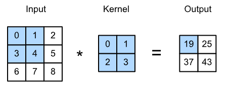

#### 互相关运算

下面定义一个互相关运算的函数

```python
import torch
from torch import nn
from d2l import torch as d2l

def corr2d(X,K): # X是输入，K是卷积核
    h,w = K.shape
    Y = torch.zeros((X.shape[0]-h+1,X.shape[1]-w+1))
    for i in range(Y.shape[1]):
        for j in range(Y.shape[0]):
            Y[i,j] = (X[i:i+h,j:j+k]*K).sum()
    return Y

X = torch.tensor([[0.0, 1.0, 2.0], [3.0, 4.0, 5.0], [6.0, 7.0, 8.0]])
K = torch.tensor([[0.0, 1.0], [2.0, 3.0]])
corr2d(X, K)
```

#### 卷积层

卷积层中的两个被训练的参数是卷积核权重和标量偏置，在训练基于卷积层的模型时，我们也随机初始化卷积核权重

```python
class Conv2D(nn.Module):
    def __init__(self,kernel_size):
        super().__init__()
        self.weight = nn.Parameter(torch.rand(kernel_size)) #rand是从0-1分布生成，randn是从标准正态分布生成数据
        self.bias = nn.Parameter(torch.zeros(1))
    def forword(self,x):
        return corr2d(x,self.weight)+self.bias
```

#### 学习卷积核

**学习由`X`生成`Y`的卷积核**

```python
conv2d = nn.Conv2d(1,1,kernel_size=(1,2),bias=False) #参数为输入通道数、输出通道数、卷积核大小、是否需要偏置

# 这个二维卷积层使用四维输入和输出格式（批量大小、通道、高度、宽度），
# 其中批量大小和通道数都为1
X = X.reshape((1, 1, 6, 8))
Y = Y.reshape((1, 1, 6, 7))

for i in range(10):
    Y_hat = conv2d(X)
    l = (Y_hat - Y)**2
    l.sum().backward()
    conv2d.weight.data -= 3e-2*conv2d.weight.data.grad # 梯度下降
    if(i+1)%2 == 0:
        print(f'batch{i+1},loss{l.sum():.3f}')
```


### 填充和步幅

连续多次卷积操作后会导致输出的大小减少过多，导致原始图像的边界丢失很多信息，这时可以使用**填充**操作，避免输出大小减少过多问题。填充操作可以直接在定义卷积层的时候进行申明。当卷积内核的高度和宽度不同时，我们可以**填充不同的高度和宽度**，例如下面就是在高度和宽度两边分别填充2和1.

```python
conv2d = nn.Conv2d(1, 1, kernel_size=(5, 3), padding=(2, 1))
comp_conv2d(conv2d, X).shape
```


有时我们希望大幅降低输出的大小，例如原始图像的分辨率十分冗余，这是可以调整**步幅**来实现。

```python
conv2d = nn.Conv2d(1, 1, kernel_size=(3, 5), padding=(0, 1), stride=(3, 4))
comp_conv2d(conv2d, X).shape
```


### 多输入多输出通道

例如对于图像识别问题，输入可能是有三个通道的图像（红黄蓝三原色），也就是每个输入数据是三维的。但输出结果我们只需要判断其是否是猫或是狗，也就是输出数据是一维的，这就涉及到了多输入多输出通道的问题。

#### 多输入通道

当输入包含多个通道时，需要构造一个与输入数据具有相同输入通道数目的卷积核，以便与输入数据进行互相关运算。下面是一个多输入通道卷积操作的例子：

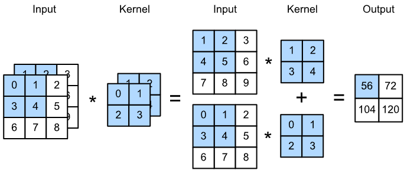

```python
def corr2d_multi_in(X, K):
    # 先遍历 “X” 和 “K” 的第0个维度（通道维度），再把它们加在一起
    return sum(d2l.corr2d(x, k) for x, k in zip(X, K))
```

#### 多输出通道

**思想**：在最流行的神经网络架构中，随着神经网络层数的加深，我们常会增加输出通道的维数，**通过减少空间分辨率以获得更大的通道深度**。直观地说，我们可以将每个通道看作是对不同特征的响应。

**操作**：用 ci 和 co 分别表示输入和输出通道的数目，并让 kh 和 kw 为卷积核的高度和宽度。为了获得多个通道的输出，我们可以**为每个输出通道创建一个形状为 ci×kh×kw 的卷积核张量，这样卷积核的形状是 co×ci×kh×kw**。在互相关运算中，每个输出通道先获取所有输入通道，再以对应该输出通道的卷积核计算出结果。（也就是**要几个输出通道就用几个三维卷积层**）

```python
def corr2d_multi_in_out(X, K):
    # 迭代“K”的第0个维度，每次都对输入“X”执行互相关运算。
    # 最后将所有结果都叠加在一起
    return torch.stack([corr2d_multi_in(X, k) for k in K], 0) # stack（~，0）表示在第0维拼接
```


### 汇聚层(池化层)

 *池化*（pooling）层，它具有双重目的：降低卷积层对位置的敏感性，同时降低对空间降采样表示的敏感性。

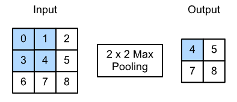

下面定义了一个池化操作

```python
import torch
from torch import nn
from d2l import torch as d2l

def pool2d(X,pool_size,mode='max'):
    p_h, p_w = pool_size
    Y = torch.zeros((X.shape[0] - p_h+1,X.shape[1]-p_w+1))
    for i in range(Y.shape[0]):
        for j in range(Y.shape[1]):
            if mode == 'max':
                Y[i,j] = X[i:i+p_h, j:j+p_w].max()
            else mode == 'avg':
                Y[i, j] = X[i: i + p_h, j: j + p_w].mean()
    return Y

X = torch.tensor([[0.0, 1.0, 2.0], [3.0, 4.0, 5.0], [6.0, 7.0, 8.0]])
pool2d(X, (2, 2))
```

**与卷积层一样，汇聚层也可以改变输出形状。**下面是深度学习框架中的池化层设置步幅和填充的例子：

```python
pool2d = nn.MaxPool2d((2, 3), padding=(1, 1), stride=(2, 3))
pool2d(X)

pool2d = nn.MaxPool2d(3, padding=1, stride=2)
pool2d(X)
```

在处理多通道输入数据时，[**汇聚层在每个输入通道上单独运算**]，而不是像卷积层一样在通道上对输入进行汇总。 


## 卷积神经网络（LeNet）

### 模型介绍与定义

**LeNet（LeNet-5）由两个部分组成：**

- 卷积编码器：由两个卷积层组成（每个卷积块由一个卷积层、一个sigmod激活函数和平均池化层组成）
- 全连接层密集块：由三个全连接层组成。

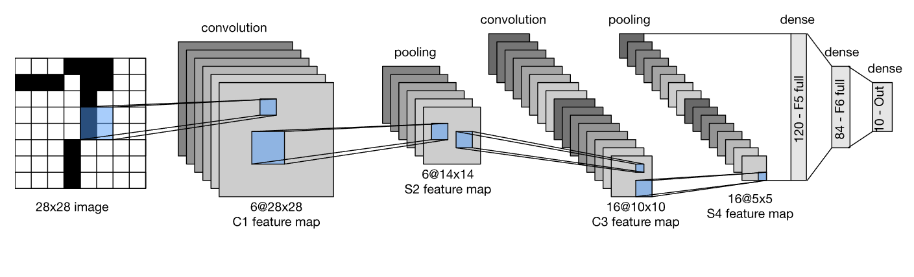

卷积部分：可以看出输入图片是一个通道的，卷积过程需要降低空间分辨率并增加通道数（即多输出通道），上例中，第一次卷积用了（6x1x5x5）的卷积核（生成6个输出通道），第二次卷积用了（16x6x5x5）的卷积核（生成16个输出通道）

全连接部分：从卷积到全连接的过程，需要将这个四维输入转换成全连接层所期望的二维输入。这里的二维表示的第一个维度**索引小批量中的样本**，第二个维度给出**每个样本的平面向量表示**。

下面用深度学习框架来实现该模型：

```python
import torch
from torch import nn
from d2l import torch as d2l

class Reshape(torch.nn.Module):
    def forward(self,x):
        return x.view(-1,1,28,28)
net = torch.nn.Sequential(
	Reshape(),
    nn.Conv2d(1,6,kernel_size=5,padding=2),nn.sigmod(),
    nn.AvgPool2d(kernel_size=2,stride=2),
    nn.Conv2d(6,16,kernel_size=5),nn.sigmod(),
    nn.AvgPool2d(kernel_size=2,stride=2),
    nn.Flatten(),
    nn.Linear(16*5*5,120),nn.sigmod(),
    nn.Linear(120,84),nn.sigmod(),
    nn.Linear(84,10)
)

# 打印查看模型各层的形状
X = torch.rand(size=(1,1,28,28),dtype=torch.float32)
for layer in net:
    X = layer(X)
    print(layer.__class__.__name__,'output shape: \t',X.shape)
```

### 模型评估（测试方法）

```python
def evaluate_accuracy_gpu(net, data_iter, device=None): #@save
    """使用GPU计算模型在数据集上的精度。"""
    if isinstance(net, torch.nn.Module):
        net.eval()  # 设置为评估模式
        if not device:
            device = next(iter(net.parameters())).device
    # 正确预测的数量，总预测的数量
    metric = d2l.Accumulator(2)
    for X, y in data_iter:
        if isinstance(X, list):
            # BERT微调所需的（之后将介绍）
            X = [x.to(device) for x in X]
        else:
            X = X.to(device)
        y = y.to(device)
        metric.add(d2l.accuracy(net(X), y), y.numel())
    return metric[0] / metric[1]
```

### 模型训练

模型参数初始化使用Xavier随机初始化，损失函数使用交叉熵损失函数，优化模型使用小批量随机梯度下降。使用GPU训练，所以需要再训练之前将数据移到GPU上。

```python
def train_ch6(net,train_iter,test_iter,num_epoch,lr,device):
    """用GPU训练模型"""
    def init_weights(m):
        if type(m) == nn.Linear or type(m) == nn.Conv2d:
            nn.init.xavier_uniform_(m.weight)
    net.apply(init_weight)
    print("train on", device)
    net.to(device)
    optimizer = torch.optim.SGD(net.parameter,lr=lr)
    loss = nn.CrossEntropyLoss()
    for epoch in num_epoch:
        metric = d2l.Accumulator(2)
        net.train()
        for i,(X,y) in enumerate(train_iter):
            optimizer.zero_grad()
            X,y = X.to(device), y.to(device)
            # 在同时需要index和value时可以使用enumerate
            l = loss(net(X),y)
            l.backward()
            optimizer.step()
            with torch.no_grad():
                # torch.no_grad()是一个上下文管理器，该语句包围的部分将不会track梯度
                metric.add(l*X.shape[0],d2l.accuracy(y_hat,y),X.shape[0])
            train_l = metric[0] / metric[2]
            train_acc = metric[1] / metric[2]
        test_acc = evaluate_accuracy_gpu(net,test_iter)
    print(f'loss {train_l:.3f}, train acc {train_acc:.3f},' 
          f'test acc {test_Acc:.3f}')

#训练和评估模型
lr, num_epochs = 0.9, 10
train_ch6(net, train_iter, test_iter, num_epochs, lr, d2l.try_gpu())
```

### 问题

模型评估部分需要再看

with torch.no_grad()包围部分

为什么卷积层后面也需要激活函数，具体是怎样操作的


## 深度卷积神经网络(AlexNet)

LeNet和AlexNet的 区别：

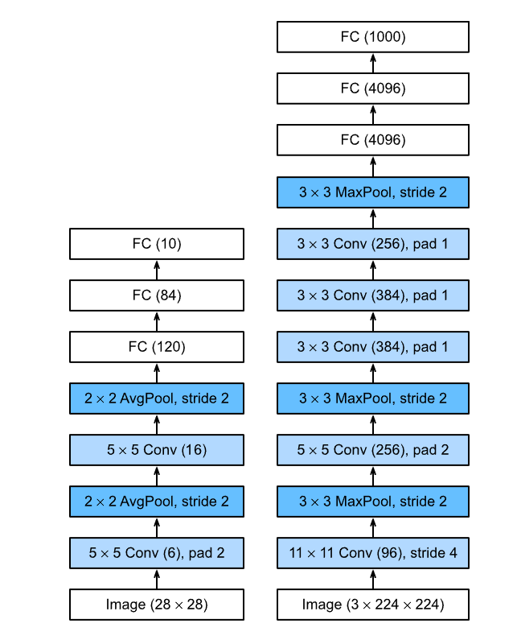

## 使用块的网络（VGG）

VGG块和VGG网络：

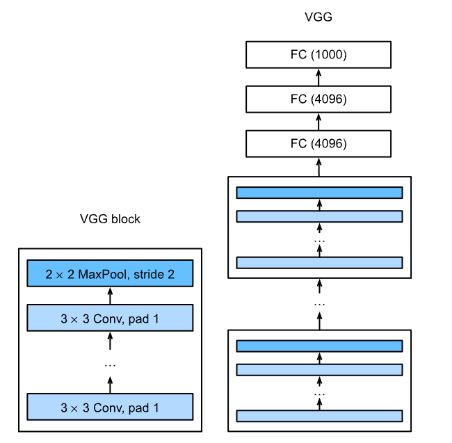

## 网络中的网络（NiN）

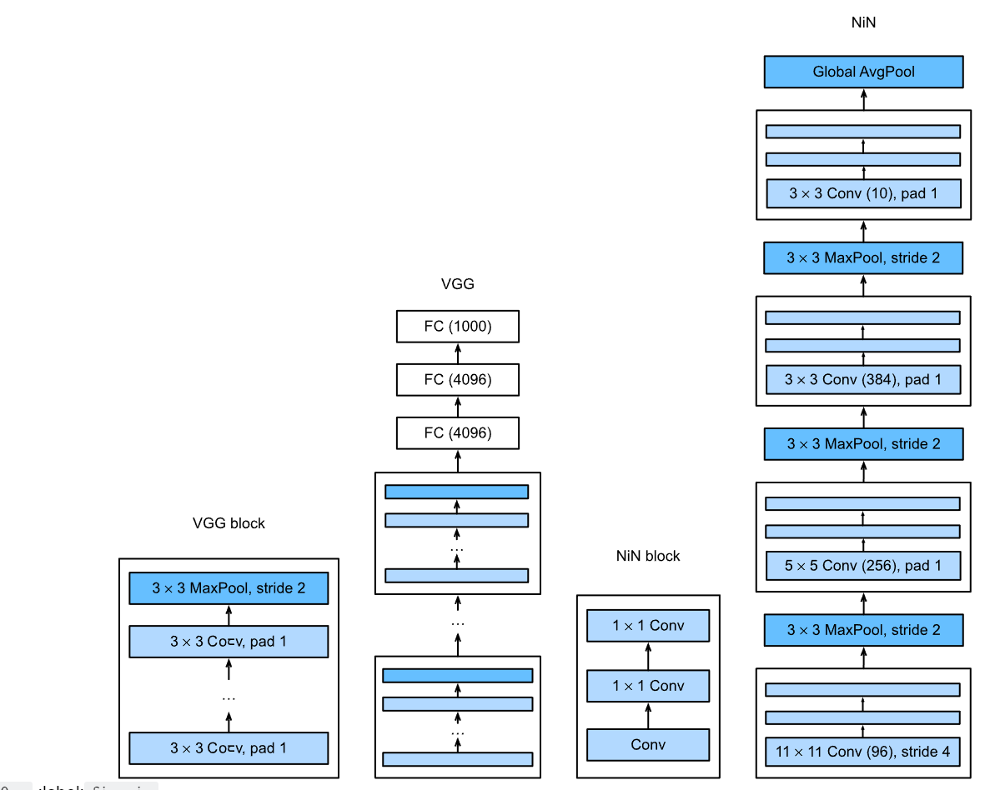

## 含并行连结的网络（GoogLeNet）

在GoogLeNet中，基本的卷积块被称为*Inception块*（Inception block）

**inception块：**

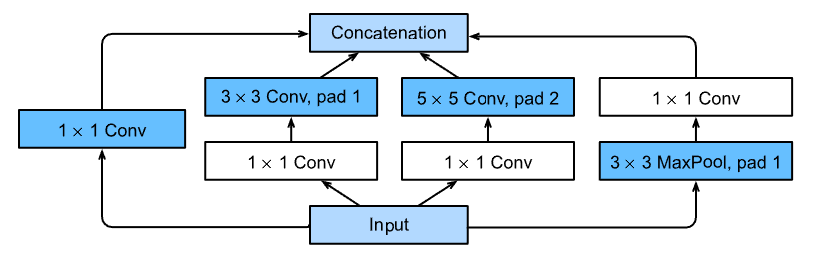

inception块中前三层分别使用1×1、3×3 和 5×5的卷积层，用于从不同的空间中提取信息。中间两条路径执行1×1卷积，用来减少通道数，用以降低模型复杂度（因为后面跟了两个较大的卷积层，模型较复杂）。第四条路径先用一个3×3 的池化层，然后用1×1的卷积层来改变通道数。四条路径都使用合适的填充，来使输入输出的高宽一致，最终将每条路径的输出在通道维度上连接，构成inception块的输出。在Inception块中，通常调整的超参数是每层输出通道的数量。

**GoogLeNet模型**

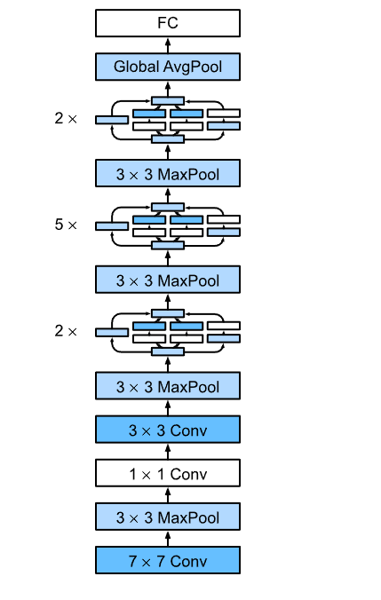


## 残差网络（ResNet）

### 残差块：

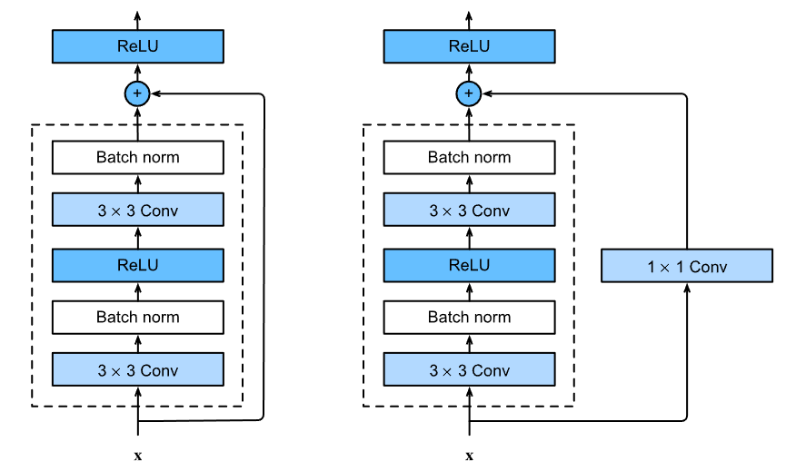

```python
import torch
from torch import nn
from torch.nn import functional as F
from d2l import torch as d2l

class Residual(nn.Module):
    def __init__(self,input_channels,num_channels,use_1x1cov=False,strides=1):
        super().__init__()
        self.conv1 = nn.Conv2d(input_channels,num_channels,kernel_size=3,
                               padding=1,stride=strides)
        self.conv2 = nn.Conv2d(num_channels,num_channels,kernel_size=1,
                              strides=strides)
        if use_1x1cov:  # 是否使用1x1的卷积层
            self.conv3 = nn.Conv2d(input_channels,num_channels,kernel_size=1,
                                  strides=strides)
        else:
            self.conv3 = None
        self.bn1 = nn.BatchNorm2d(num_channels)
        self.bn2 = nn.BatchNorm2d(num_channels)
        self.relu = nn.ReLU(inplace=True) # inplace为true会直接改变输入数据的值，使用原来值所在的地址，减少内存消耗。inplace为true不会改变输入数据的值，只会新创建一个对象，存在内存中的其他地方。
    
    def forward(self,X):
        Y = F.relu(self.bn1(self.conv1(X)))
        Y = self.bn2(self.con2(Y))
        if self.conv3:
            X = self.conv3(X)
        Y += X
        return F.relu(Y)
```

### **resNet模型**：

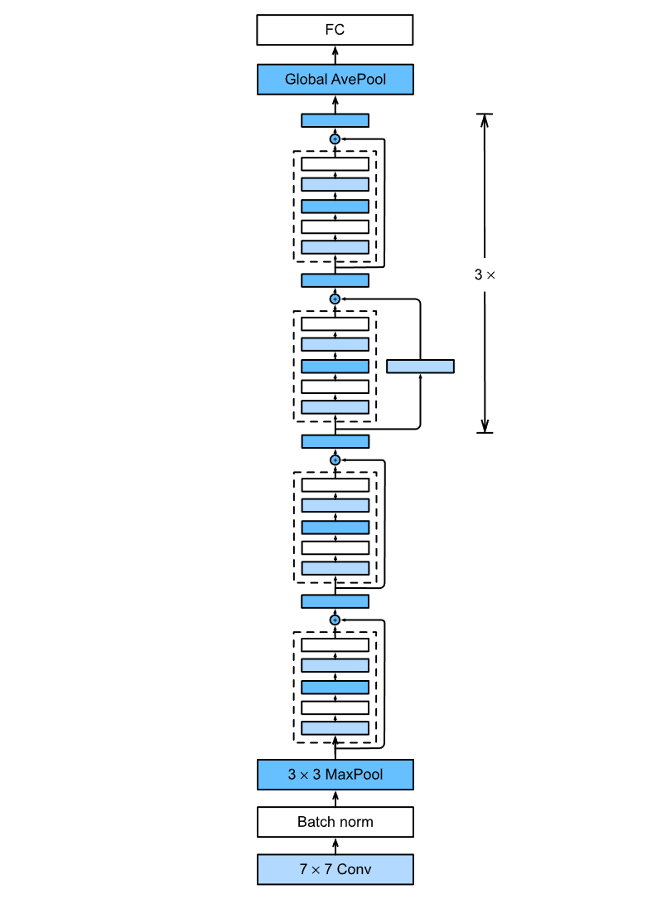

```python
b1 = nn.Sequential(nn.Conv2d(1,64,kernel_size=7,stride=2,padding=3),
                  nn.BatchNorm(64),nn.MaxPool2d(kernel_size=3,stride=2,padding=1))

def resnet_block(input_channels,num_channels,num_residuals,first_block=False):
    blk=[]
    for i in range(num_residuals):
        if i == 0 and not first_residuals:
            blk.append(Residual(input_channels,num_channels,
                                use_1x1conv=True,strides=2))
        else:
            blk.append(Residual(num_channels,num_channels))
    return blk

b2 = nn.Sequential(*resnet_block(64,64,2,first_block=True))
b3 = nn.Sequential(*resnet_block(64,128,2)) # *表示将列表解开然后入参，**表示将字典解开
b4 = nn.Sequential(*resnet_block(128,256,2))
B5 = nn.Sequential(*resnet_block(256,512,2))

net = nn.Sequential(b1, b2, b3, b4, b5,
                    nn.AdaptiveAvgPool2d((1,1)),
                    nn.Flatten(), nn.Linear(512, 10))
```

### 注意

f(x)=x+g(x)，在训练的时候，如果g(x)对loss的降低没有太大影响，也就是g(x)没什么作用，那么，它就不会被分给梯度，它也就不会跟新权值。所以说，残差网络的原理f(x)=x+g(x)，只会出现比X更好的情况，g(x)最差的情况就是没作用，而不会反向影响我们的输入。

对于残差的概念，也就是我们已经有了一个模型训练过的小模型块（也就是X，这个模型与真实数据分布差距较大），然后将它的结果送到另一个模型g(X)中，后面的这个模型就会学习前一个模型X和真实模型之间的差距，然后不断的fitting。也就是每个g(x)都做一点在上一个模型和真实模型上的fitting。这就是残差的理念

为什么resNet可以训练1000层的网络？

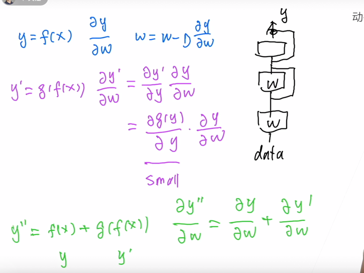

因为如果网路越来越深，反向传播的时候，根据链式法则梯度不断相乘，直到靠近数据层的时候，梯度可能会消失。但是resnet反向传播的时候，将梯度相乘变成了相加，可以保留着最靠近输入数据端的梯度信息，就避免了梯度消失的问题。

## 稠密连接网络（DenseNet）

densNet是resNet的逻辑扩展，resNet相当于一个一阶泰勒展开，denseNet是高阶泰勒展开。

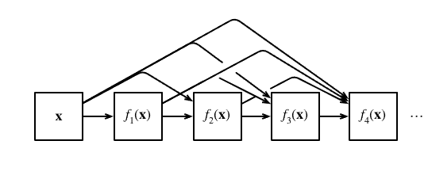

稠密网络主要由 2 部分构成： *稠密块\*（dense block）和 \*过渡层* （transition layer）。 前者定义如何连接输入和输出，而后者则控制通道数量，使其不会太复杂。


## 深度学习硬件

改善运行速度的小tips：

矩阵按行存会比按列存快，

并行使用cpu（写代码的时候注意，减少函数调用次数）