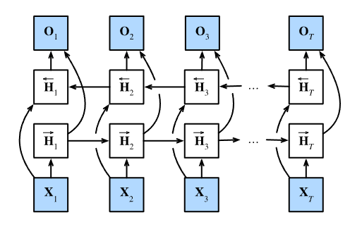

## 序列模型

序列模型就是用来处理在时间上有关系的样本。例如一个序列文本，它的每个样本都不是独立的随机遍历，而是和它前某个时刻的样本有依赖关系。

对于序列模型，它在统计上的描述主要有两个，分别是马尔可夫模型和自回归潜变量模型。马尔可夫模型指出每个时刻的样本都和它前tau个样本有关系。

## 文本预处理

文本是最常见的序列数据，因此此处专门解释文本预处理的方法。**文本预处理就是输入原始文本，输出原始文本的词汇表，并将字符串形式的原始文本转换成词汇表中词元映射的数字序列。**

文本预处理的步骤主要有：

1. 将文本以字符串的形式下载或加载到内存中
2. 将字符串拆分成词元（token），英文中是单词或字母，中文需要专门的分词
3. 根据词元，创建一个词汇表，将每个唯一的词元根据其出现频率（或者其他方法）逐一映射到数字索引（也就是这个词汇表是词元与数字的映射）
4. 将我们的文本转换成数字索引，方便后面的模型操作

```python
import collections
import re
from d2l import torch as d2l
#读取数据集，并对数据做简单的清洗
def read_time_machine():
    with open(d2l.download('time_machine'),'r') as f:
        lines = f.readlines()
    return [re.sub('[^a-zA-Z]+',' ',line).strip().lower() for line in lines]
lines = read_time_machine()

#词元化（将字符串拆分成词元的形式，或者分词）
def tokenize(lines,token='word'):
    if token='word':
        return [line.split() for line in lines]  # split无参则默认以空格作为分隔符
    elif token='char':
        return [list(line) for line in lines]
    else:
        print('错误：未知词元类型：' + token)
tokens = tokenize(lines)

# 构建词汇表:能传入token查出indices，传入indices查出token
def count_corpus(tokens):
    """统计词元频率"""
    if len(tokens)=0 or isinstance(token[0],list):
        # 将词元的一堆列表，展平成一个列表
        tokens = [token for line in tokens for token in line]
    return collections.Counter(tokens) 
# Counter是用来统计可迭代列表中各数据出现的频率,返回一个字典（key为词元，value为出现频率）
class Vocab:
    def __init__(self,tokens=None,min_freq=0,reserved_tokens=None):
        if tokens is None:
            tokens = []
        if reserved_tokens is None:
            reversed_tokens = []
        counter = count_corpus(tokens)
		self.token_freqs = sorted(counter.items(),key=lambda x:x[1],reverse=True)
        # sorted函数中的key就是指定可迭代对象中的一个元素来进行排序，通常用lambda表达式
        self.unk,uniq_tokens = 0,['<unk>']+reserved_tokens
        uniq_tokens += [token for token freq in self.token_freqs 
                        if freq> min_freq and token not in unq_tokens]
        self.idx_to_token, self.token_to_idx=[],dict
        for token in uniq_tokens:
            self.idx_to_token.append(token)
            self.token_to_idx[token] = len(self.idx_to_token) - 1
    
    def __len__(self):
        return len(self.idx_to_token)
    
    def __getitem__(self,tokens):
        if not isinstance(tokens,(list,tuple)):
            return self.token_to_idx.get(tokens,self.unk)
        return [self.__getitem__(token) for token in tokens]
    def to_tokens(self,indices):
        if not isinstance(indices,(list,tuple)):
            return self.idx_to_token[indices] 
        return [self.idx_to_token[index] for index in indices]
   
# 整合函数
def load_corpus_time_machine(max_tokens=-1):
    lines = read_time_machine()
    tokens = tokenize(lines,'char')
    vocab = Vovab(tokens)
    corpus = [vocab[token] for line in tokens for token in line] # 将输入文本列表先展平成一个列表，再将每个词元转换成数字索引
    if max_tokens > 0:
        corpus = corpus[:max_tokens]
    return corpus，vocab
```

## 语言模型与数据集

语言模型就是给定一个文本序列其出现的概率值，因此可以用语言模型来预测给定长度的文本序列时，其下一时刻会出现的词元的概率。

语言模型的基础是词元，上面有定义到以单词作为词元，我们也可以转换成以多个单词作为词元：

```python
bigram_tokens = [pair for pair in zip(corpus[:-1],corpus[1:])] #zip函数是创建一个聚合了各个可迭代对象中元素的迭代器（聚合、迭代）
bigram_vocab = d2l.Vocab(bigram_tokens)
```

### 读取长序列数据

我们不可能将整个文本转化成的数字序列都放到模型中，因此我们应该将原始序列拆分成一系列的小序列，然后将小批量序列放到模型中处理。下面是两种将原始序列分成小批量序列的方法，其中有两个关键参数，num_steps是每个子序列的时间步数（即每个时间步包含几个词元）；batch_size是批量大小，也就是每个batch中有几个子序列。

#### 随机采样

随机采样就是在原始序列上任意捕获子序列。每个相邻的样本在原始序列上不一定相邻。

```python
def seq_data_iter_random(corpus,batch_Size,num_steps):
    corpus = corpus[random.randint[:num_steps-1]:] #这一步是确定采样的偏移量
    num_subseqs = (len(corpus)-1) // num_steps
    initial_indices = list(range(0,num_subseqs*num_steps,num_steps))
    random.shuffle(initial_indices)
    
    def data(pos):
        return corpus[pos:pos+num_steps]
    
    num_batchs = num_subseqs // batch_size
    for i in range(0,batch_size*num_batch,batch_size):
        initial_indices_per_batch = initial_indices[i:i+batch_size]
        X = corpus[data(j) for j in initial_indices_per_batch]
        Y = corpus[data(j+1) for j in initial_indices_per_batch]
    
```

### 顺序分区

顺序分区就是**保证两个相邻的小批量中的子序列在原始序列上也是相邻的**

```python
def seq_data_iter_sequential(corpus, batch_size, num_steps):
    offset = random.randint(0,num_steps)
    num_tokens = ((len(corpus)-offset-1) // batch_size)* batch_size
    Xs = torch.tensor(corpus[offset:offset+num_tokens])
    Ys = torch.tensor(corpus[offset+1:offset+1+num_tokens])
    Xs,Ys = Xs.reshape(batch_size,-1),Ys.reshape(batch_size,-1)
    # reshape成一个二维矩阵，第一维是批量大小
    num_batch = Xs.shape[1] // num_steps
    for i in range(0,num_Steps*num_batchs,num_steps):
        X = Xs[:, i: i + num_steps]
        Y = Ys[:, i: i + num_steps]
        yield X, Y
```

然后将两种采样方法包装到一个类中，然后在定义一个函数，让它同时返回数据迭代器和词汇表

```python
class SeqDataLoader:
    def __init__(self,batch_size,num_steps, use_random_iter, max_tokens):
        if use_random_iter:
            self.data_iter_fn = d2l.seq_Data_iter_random
        else:
            self.data_iter_fn = d2l.seq_data_iter_sequential 
        self.corpus,self.vocab = d2l.load_corpus_time_machine(max_tokens)
        self.batch_size,self.num_steps = batch_size,num_steps
    def __iter__(self):
        return self.data_iter_fn(self.corpus,self.batch_size,self.num_steps)
def load_data_time_machine(batch_size,num_steps,use_random_iter=False,max_tokens=1000):
    data_iter = SeqDataLoader(batch_size,num_steps,use_random_iter,max_tokens)
    return data_iter,data_iter.vocab
```


## 循环神经网络

循环神经网络输入处参数、隐层参数、输出参数都是**各自共享**的，这样就反映了**RNN中每一步都在做相同的事，只是输入不同**，这样大大降低了网络中需要学习的参数。


### 从零实现

**数字索引形式的数据还不足以在模型中训练，我们应当将每个词汇表中的词元都映射成唯一的向量，这里采用独热编码。**

**循环神经网络需要初始化隐层状态，然后初始化模型参数；定义一个rnn模型的类，这个类需要包含rnn 的结构（输入输出层个数、隐层个数）、模型参数（各层间的权重和偏置）、隐层初始化方法、前向传播方法（rnn模型核心部分，数学公式的直接翻译）。**

**rnn因为梯度在时间步上累计，因此需要做梯度剪裁**

**模型训练：模型训练需要数据迭代器、lr、batch_size、num_epoch、device。训练前指定损失函数、优化算法，对参数和隐层状态做初始化，然后开始每个epoch 的训练。（三层嵌套循环：）每个epoch中先按照batch来循环，然后再将数据按照单个时间步来训练（例如每个时间子序列有10个时间步，则是训练10次），每个时间步传入batch_size个数据同时训练，也就是将(batch_size,vocab_size)的数据和隐层状态（第一次是初始隐层，后面都是计算出的前一时刻隐层状态）传到模型中做前向计算（数据要转化成词向量），得到输出和隐层状态。**

```python
%matplotlib inline
import math
import torch
from torch import nn
from torch.nn import functional as F
from d2l import torch as d2l

batch_size, num_steps = 32,35
train_iter,vocab = d2l.load_data_time_machine(batch_size, num_steps)

#初始化模型参数
def get_params(vocab_size,num_hiddens,device):
    num_inputs = num_outputs = vocab_size
    def normal(shape):
        return torch.randn(size=shape,device=device)*0.01
    
    W_xh = normal(num_inputs,num_hiddens)
    W_hh = normal(num_hiddens,num_hiddens)
    b_h = torch.zeros(num_hiddens,device=device)
    W_hq = normal(num_hiddens,num_outputs)
    b_q = torch.zeros(num_outputs,device=device)
    params = [W_xh, W_hh, b_h, W_hq, b_q]
    for param in params:
        param.required_grad_(True)
    return params
#初始化隐藏状态
def init_rnn_state(batch_size,num_hiddens,device):
    return (torch.zeros((batch_size,num_hiddens),device=device),)
#前向传播,rnn单个时间步计算规则
#将rnn模型中的前向传播算法单独提取出来。这个函数需要输入数据、状态和模型参数，返回模型输出和状态
def rnn(inputs,state,params):
    W_xh, W_hh, b_h, W_hq, b_q = params
    H, = state
    outputs = []
    for X in inputs:
        H = torch.tanh(torch.mm(W_xh,X)+torch.mm(H,W_hh)+b_h)
        Y = torch.mm(H,W_hq)+b_q
        outputs.append(Y)
    return torch.cat(outputs,dim=0) (H,)
#rnn模型
#该类定义了rnn的结构（各层大小）和整个模型的参数，以及前向传播方法、隐层初始化方法
# 这里实例化一个rnn实例需要传入隐层单元个数、参数、词向量维度（用于前向计算时将输入索引转变为词向量）
# 调用该模型时执行前向传播，需要传入数据、隐层状态和模型参数，然后按照rnn定义执行计算，返回输出和下一刻隐层状态
class RNNModelScratch:
    def __init__(self,vocab_size,num_hiddens,device,
                 get_params,init_state,forward_fn):
        self.vocab_size,self.num_hiddens = vocab_size,num_hiddens # 模型各层神经元个数
        self.params = get_params(vocab_size,num_hiddens,device) # 模型参数
        self.init_state,self.forward_fn = init_state,dorward_fn #前向方法和隐层初始
    def __call__(self,X,state):
        X = F.one_hot(X.T,self.vocab_size).type(torch.float32)
        return self.forward_fn(X,state,self.params)
    def begin_state(self,batch_size,device):
        return self.init_State(batch_size,self.num_hiddens,device)
        
# 预测
def predic_ch8(prefix.num_preds,net,vocab,device):
    
# 梯度剪裁，在反向传播之后，调用优化算法计算梯度之前使用
#它的思想就是在算梯度的时候，如果总梯度的范数大于给定值，就对网络的所有参数做梯度剪裁
def grad_clipping(net, theta):  #@save
    """裁剪梯度。"""
    if isinstance(net, nn.Module):
        params = [p for p in net.parameters() if p.requires_grad]
    else:
        params = net.params
    norm = torch.sqrt(sum(torch.sum((p.grad ** 2)) for p in params))
    if norm > theta:
        for param in params:
            param.grad[:] *= theta / norm
#一个迭代周期的训练
#每个迭代周期都需要输入模型、数据迭代器、损失函数、优化算法、device
#调用数据迭代器，初始化state，for循环获取每一时间步的输入输出数据，然后把输入放到模型中得到预测值，
#将预测值与真实值都reshape成向量（向量的每个值都是词元的一个数据索引，向量长度是batch_size）方便计算loss，
#然后对loss做反向传播并做梯度剪裁，然后再调用优化算法。
def train_epoch_ch8(net,train_iter,loss,updater,device,use_random_iter):
    state,timer = None,d2l.Timer
    metric = d2l.Accumulator(2)
    for X,Y in train_iter:
        if state is None or use_random_iter:
            state = net.begin_state(batch_size=X.shape[0],device)
        else:
            if isinstance(net,nn.Module) and not isinstance(state,tuple):
                state.detach_()
            else:
                for s in state:
                    s.detach_()
        y = Y.T.reshape(-1)
        X,y = X.to(device),y.to(device)
        y_hat,state = net(X,state)
        l = loss(y_hat,y.long()).mean()
        if isinstance(updater, torch.optim.Optimizer):
            updater.zero_grad()
            l.backward()
            grad_clipping(net, 1)
            updater.step()
        else:
            l.backward()
            grad_clipping(net, 1)
            # 因为已经调用了`mean`函数
            updater(batch_size=1)
        metric.add(l * y.numel(), y.numel())
    return math.exp(metric[0] / metric[1]), metric[1] / timer.stop()
#完整训练模型
# 输入模型、数据迭代器、学习率、epoch、device和所有词向量维度
# 定义损失函数、优化算法，然后对每个epoch进行训练，每个epoch训练部分可以提取出来成一个函数
def train_ch8(net,train_iter,vocab,lr,num_epoch,device
             ,use_random_iter=False):
    loss = nn.CrossEntropyLoss()
    if isinstance(net,nn.Module):
        updater = torch.optim.SGD(net.parameters(),lr)
    else:
        updater = lambda batch_size:d2l.sgd(net.params,lr,batch_size)
    for epoch in range(num_epochs):
        ppl,speed = train_epoch_ch8(net, train_iter, loss, 
                                    updater, device, use_random_iter)
        if (epoch + 1) % 10 == 0:
            print(predict('time traveller'))
            animator.add(epoch + 1, [ppl])
    print(f'困惑度 {ppl:.1f}, {speed:.1f} 词元/秒 {str(device)}')
    print(predict('time traveller'))
    print(predict('traveller'))
        
```

### 调用API实现

调用api实现，不同点只有rnn层定义和模型定义部分。

需要注意的是rnn模型的定义，api中的模型输出没有真正的Y，只有表示各时间步的隐层状态，因此需要自己手动计算出真正的输出Y（比如加个线性层）。

```python
#rnn层调用
rnn_layer = nn.RNN(len(vocab),num_hiddens)
#X = torch.rand(size=(num_steps, batch_size, len(vocab)))
#Y, state_new = rnn_layer(X, state)
#Y.shape, state_new.shape #rnn_layer的输出不涉及输出层计算，它只是每个时间步的隐藏状态
#(torch.Size([35, 32, 256]), torch.Size([1, 32, 256]))

#rnn模型
class RNNModel(nn.Module):
    def __init__(self，rnn_layer,vocab_size,**kwargs):
        super(RNNModel,self).__init__(**kwargs)
        self.rnn = rnn_layer
        self.vocab_size = vocab_size
        self.num_hiddens = self.rnn.hidden_size
        # 如果RNN是双向的（之后将介绍），`num_directions`应该是2，否则应该是1。
        #定义输出层
        if not self.rnn.bidirectional:
            self.num_directions = 1
            self.linear = nn.Linear(self.num_hiddens, self.vocab_size)
        else:
            self.num_directions = 2
            self.linear = nn.Linear(self.num_hiddens * 2, self.vocab_size)
    def forward(self,inputs,state):
        X = F.one_hot(inputs.T.long(), self.vocab_size)
        X = X.to(torch.float32)
        Y, state = self.rnn(X, state)
        # 首先将`Y`的形状改为(`时间步数`*`批量大小`, `隐藏单元数`)。
        # 然后全连接层的输出形状是 (`时间步数`*`批量大小`, `词表大小`)。
        output = self.linear(Y.reshape((-1, Y.shape[-1]))) #Y.reshape((-1, Y.shape[-1]))的形状是torch.Size([1120, 256])
        return output, state
    def begin_state(self,device,batch_size=1):
         # `nn.GRU` 以张量作为隐藏状态
        if not isinstance(self.rnn,nn.LSTM):
            return torch.zeros((self.num_directions*self.rnn.num_layers,
                               batch_size,self.num_hiddens),
                              device=device)
        else:
            # `nn.LSTM` 以张量作为隐藏状态
            return (torch.zeros((
                self.num_directions * self.rnn.num_layers,
                batch_size, self.num_hiddens), device=device),
                    torch.zeros((
                        self.num_directions * self.rnn.num_layers,
                        batch_size, self.num_hiddens), device=device))
            
```


## GRU

**重置门用于控制保留多少过去的状态，重置门接近1相当于实现了普通RNN，重置门接近0相当于只使用当前输入，而忘记过去状态。这样操作得到的结果即为候选隐状态。**

**更新门用来控制新的隐状态多少来自旧状态多少来自候选隐状态。更新门接近1就只保留旧状态，更新门接近0就选择新的候选隐状态作为新状态。**


```python
num_inputs = vocab_size
gru_layer = nn.GRU(num_inputs, num_hiddens)
model = d2l.RNNModel(gru_layer, len(vocab))
model = model.to(device)
d2l.train_ch8(model, train_iter, vocab, lr, num_epochs, device)
```


## LSTM

**遗忘门用来控制保留多少过去的记忆元，输入门用来控制采用多少来自当前时间的新数据，两者的综合计算组成了当前的记忆元用于传输到下一时刻。**

**输出门用来控制将多少记忆信息（记忆元）传递给预测部分（即当前的隐层）。如果输出门为1就将记忆信息传给隐层状态，用以更新隐层状态；如果输出门为0，就不更新隐层状态（保留为上一时刻的隐层状态）**


```python
num_inputs = vocab_size
lstm_layer = nn.LSTM(num_inputs, num_hiddens)
model = d2l.RNNModel(lstm_layer, len(vocab))
model = model.to(device)
d2l.train_ch8(model, train_iter, vocab, lr, num_epochs, device)
```


## 深度循环神经网络

**深度rnn的下一时刻隐层状态和传给下一层的隐层状态相同。用框架实现的RNN会有两个输出，第一个输出就是最后一层的所有时间步的隐层状态，第二个输出是最后一个时刻的所有层的隐层输出**


```python
vocab_size, num_hiddens, num_layers = len(vocab), 256, 2
num_inputs = vocab_size
device = d2l.try_gpu()
lstm_layer = nn.LSTM(num_inputs, num_hiddens, num_layers)
model = d2l.RNNModel(lstm_layer, len(vocab))
model = model.to(device)

num_epochs, lr = 500, 2
d2l.train_ch8(model, train_iter, vocab, lr, num_epochs, device)
```


## 双向循环神经网络

双向rnn在代码层面实现较简单，就是正向是一个正常的rnn，反向是先将输入数据做个反转，然后再用一个同样结构（不同参数）的rnn，得到另一个输出，再将这个输出做反转，然后两个输出concat起来即可



> 注：双向rnn不能用来做预测，因为该网络每次训练都需要当前时间步前面和后面的数据，如果缺失了一边的数据就会出现严重缺陷

