## 注意力机制统计学基础

问题引入：cnn中的卷积层是用来提取特征的，但这属于被动提取特征，就是什么特征更明显就提取什么，网络本身是不知道自己i想要什么的。所以统计学上认为应该将自身需要考虑进去，也就是选择最合适的，而不是选择最明显的。

### Nadaraya-Watson 核回归

**非参数注意力汇聚**

该方法会对与自己最相近的样本给较高的权值，而较远的样本给尽可能低的权值

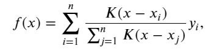

**带参数注意力汇聚**

核函数选择高斯核函数

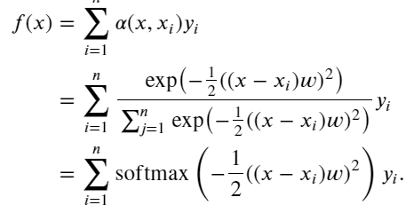


### 批量矩阵乘法

**假定两个张量的形状分别是 (𝑛,𝑎,𝑏) 和 (𝑛,𝑏,𝑐) ，它们的批量矩阵乘法输出的形状为 (𝑛,𝑎,𝑐)**

```python
X = torch.ones((2, 1, 4))
Y = torch.ones((2, 4, 6))
torch.bmm(X, Y).shape
#torch.Size([2, 1, 6])
```

在注意力机制的背景中，我们可以[**使用小批量矩阵乘法来计算小批量数据中的加权平均值**]。

```python
weights = torch.ones((2, 10)) * 0.1
values = torch.arange(20.0).reshape((2, 10))
#下面这一步升维的操作：weights从(2，10)->(2,1,10)  values从(2,10) -> (2,10,1)
#批量矩阵计算后变成(2,1,1)
torch.bmm(weights.unsqueeze(1), values.unsqueeze(-1))
#tensor([[[ 4.5000]],
#        [[14.5000]]])
```


## 注意力分数

注意力分数也就是下面注意力汇聚层中的a，现在考虑成向量

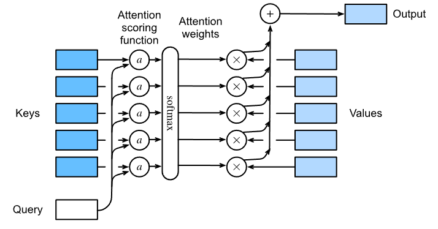

其中：

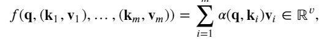

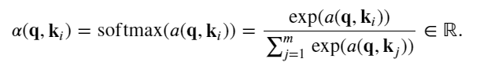

### 遮蔽softmax操作

前面的softmax操作是query对所有的key都操作一遍，但很多时候有些key是不需要计算权重的，就比如说前面的为了保证每个样本的时间步一样，对句子做了填充和裁剪。那么这些填充部分的时间步就是那些不需要算权重的key。因此要把他们给mask了

```python
def masked_softmax(X,valid_len):
    # 这里X的形状是（batch_size,query_num,key_num） valid_len是一维或二维
    if valid_len is None:
        return nn.functional.softmax(X,dim=-1)
    else:
        shape = X.shape
        if valid_len.dim() == 1:
            valid_len = torch.repeat_interleave(valid_len,shape[1])
        else:
            valid_len = valid_len.reshape(-1)
        #sequence_mask中的输入是二维的，样本数X时间步长度
        X = d2l.sequence_mask(X.reshape(-1,shape[-1]),valid_len,value=-1e6)
        return nn.functional.softmax(X.reshape(shape,dim=-1)
```


### 加性注意力

加性注意力就相当于将Q和K拼接起来放到一个隐藏层大小为h、输出层为1的MLP中，隐藏层激活函数使用tanh，Q到隐层的权重就是Wq（大小为h,q），K到隐层的权重就是Wk（大小为h,k），隐层到输出层的权重为Wv (大小为h)


```python
class AdditiveAttention(nn.Module):
    def __init__(self,key_Size,query_size,num_hiddens,dorpout,**kwargs):
        super().__init__(**kwargs)
        self.W_q = nn.Linear(query_size,num_hiddens,bias=False)
        self.W_k = nn.Linear(key_Size,num_hiddens,bias=False)
        self.W_v = nn.Linear(num_hiddens,1,bias=False)
    def forward(self,query,key,values,valid_lens):
        # querys的形状：(batch_size,query_num,num_hiddens)
        # keys的形状：(batch_size,key_num,num_hiddens)
        querys,keys = self.W_q(query),self.W_k(key)
        #features的形状：(batch_size,query_num，key_num,num_hiddens)
        features = querys.unsqueeze(2)+keys.unsqueeze(1)
        features = torch.tanh(features)
        #scores：(batch_size,query_num，key_num),每个数都是一个score
        scores = self.W_v(features).squeeze(-1)
        self.attention_weight = d2l.masked_softmax(score,valid_lens)
        #value形状为(batch_size,value_num,embedding_size)
        #该函数输出形状为：(batch_size,query_num,embedding_size)
        return torch.bmm(self.attention_weight,values)
```

### 缩放点积注意力

使用点积可以得到计算效率更高的评分函数。但是点积操作要求查询和键具有相同的长度 𝑑

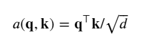

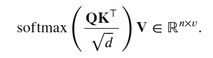

```python
class DotProductAttention(nn.Module):
    """缩放点积注意力"""
    def __init__(self, dropout, **kwargs):
        super(DotProductAttention, self).__init__(**kwargs)
        self.dropout = nn.Dropout(dropout)
    def forward(self, queries, keys, values, valid_lens=None):
        d = queries.shape[-1]
        # 设置 `transpose_b=True` 为了交换 `keys` 的最后两个维度
        scores = torch.bmm(queries, keys.transpose(1,2)) / math.sqrt(d)
        self.attention_weights = masked_softmax(scores, valid_lens)
        return torch.bmm(self.dropout(self.attention_weights), values)
```


## attention操作


## 在seq2seq模型上使用注意力机制

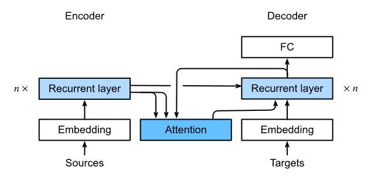

### Bahdanau 注意力

将注意力机制用到seq2seq模型叫做Bahdanau 注意力。这个模型只需要修改seq2seq的解码器。

**带有注意力机制的解码器基本接口**

```python
class AttentionDecoder(d2l.Decoder):
    """带有注意力机制的解码器基本接口"""
    def __init__(self, **kwargs):
        super(AttentionDecoder, self).__init__(**kwargs)
    @property
    def attention_weights(self):
        raise NotImplementedError
```

**实现带有Bahdanau注意力的循环神经网络解码器**

```python
class Seq2SeqAttentionDecoder(AttentionDecoder):
    def __init__(self,vocab_size,embedding_size,num_hiddens,
                 num_layers,dropout,**kwargs):
        super().__init__(**kwargs)
        self.attention=d2l.AdditiveAttention(num_hiddens,num_hiddens,
                                             num_hiddens,dropout)
        self.embedding=nn.Embedding(vocab_size,embedding_size)
        self.rnn=nn.GRU(embedding_size+num_hiddens,num_hiddens,num_layers,
                        dropout=dropout)
        self.dense=nn.Linear(num_hiddens,vocab_size)
        
    def init_state(self,enc_outputs,enc_valid_len,*args):
        outputs,hidden_state = enc_outputs
        return (outputs.permute(1,0,2),hidden_state,enc_valid_len)
    def forward(self,X,state):
        #enc_outputs形状为：batch_size,num_steps,num_hiddens
        #hidden_state形状为：batch_size,num_layers,num_hiddens
        #enc_valid_len形状为：batch_size
        enc_outputs,hidden_state,enc_valid_len = state
        X = self.embedding(X).permite(1,0,2)
        outputs,self._attention_weights = [],[]
        # X的形状 (`num_steps`, `batch_size`, `embed_size`)
        for x in X:
            query = torch.unsqueeze(hidden_state[-1],dim=-1)
            context = self.attention(query,enc_outputs,enc_outputs,enc_valid_len)
            x = torch.cat((context,torch.unsqueeze(x,dim=1)),dim=-1)
            out,hidden_state = self.rnn(x.permute(1,0,2),hidden_state)
            outputs.append(out)
            self._attention_weights.append(self.attention.attention_weights)
        outputs = self.dense(torch.cat(outputs),dim=0)
        return outputs.permute(1,0,2),[enc_outputs,hidden_state,enc_valid_len]
            
    @property 
    def attention_weight(self):
        return self._attention_weights
```

**训练**

```python
embed_size, num_hiddens, num_layers, dropout = 32, 32, 2, 0.1
batch_size, num_steps = 64, 10
lr, num_epochs, device = 0.005, 250, d2l.try_gpu()

train_iter,src_vocab,tgt_vocab = d2l.load_data_nmt(batch_size,num_steps)
encoder = d2l.Seq2SeqEncoder(
    len(src_vocab), embed_size, num_hiddens, num_layers, dropout)
decoder = Seq2SeqAttentionDecoder(
    len(tgt_vocab), embed_size, num_hiddens, num_layers, dropout)
net = d2l.EncoderDecoder(encoder, decoder)
d2l.train_seq2seq(net,train_iter,num_epoch,tgt_vocab,device)
```


## 多头注意力

多头就相当于CNN中的多通道（每个通道提取特点的模式），这里每个头都在文本全局中提取特定的信息（模式）。操作方法就是每个头都将输入数据通过全连接层线性变换投影到特定维度的空间中，然后提取在该特征空间中的信息。

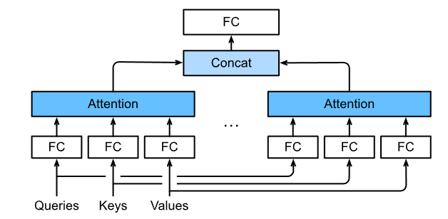

```python
#@save
class MultiHeadAttention(nn.Module):
    def __init__(self, key_size, query_size, value_size, num_hiddens,
                 num_heads, dropout, bias=False, **kwargs):
        super(MultiHeadAttention, self).__init__(**kwargs)
        self.num_heads = num_heads
        self.attention = d2l.DotProductAttention(dropout)
        self.W_q = nn.Linear(query_size, num_hiddens, bias=bias)
        self.W_k = nn.Linear(key_size, num_hiddens, bias=bias)
        self.W_v = nn.Linear(value_size, num_hiddens, bias=bias)
        self.W_o = nn.Linear(num_hiddens, num_hiddens, bias=bias)

    def forward(self, queries, keys, values, valid_lens):
        queries = transpose_qkv(self.W_q(queries), self.num_heads)
        keys = transpose_qkv(self.W_k(keys), self.num_heads)
        values = transpose_qkv(self.W_v(values), self.num_heads)

        if valid_lens is not None:
            valid_lens = torch.repeat_interleave(
                valid_lens, repeats=self.num_heads, dim=0)

        output = self.attention(queries, keys, values, valid_lens)

        output_concat = transpose_output(output, self.num_heads)
        return self.W_o(output_concat)
```


## 自注意力和位置编码

### 自注意力

自注意力就是对于一个给定的词元序列，其任意一个词元作为query，其余每个词元都作为key和value。

输出为：

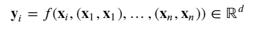

```python
num_hiddens, num_heads = 100, 5
attention = d2l.MultiHeadAttention(num_hiddens, num_hiddens, num_hiddens,
                                   num_hiddens, num_heads, 0.5)

batch_size, num_queries, valid_lens = 2, 4, torch.tensor([3, 2])
X = torch.ones((batch_size, num_queries, num_hiddens))
attention(X,X,X,valid_lens) #query,key,value全是X本身
```

### 位置编码

在处理词元序列时，循环神经网络是逐个的重复地处理词元的，而自注意力则因为并行计算而放弃了顺序操作。为了使用序列的顺序信息，我们通过在输入表示中添加 *位置编码*（positional encoding）来注入绝对的或相对的位置信息。

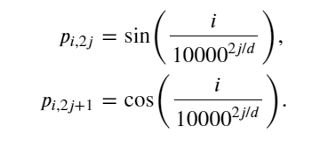

```python
class PositionalEncoding(nn.Module):
    def __init__(self, num_hiddens, dropout, max_len=1000):
        super(PositionalEncoding, self).__init__()
        self.dropout = nn.Dropout(dropout)
        # 创建一个足够长的 `P`
        self.P = torch.zeros((1, max_len, num_hiddens))
        # 下面这里先生成一个形状为（max_len，1）的张量，然后对张量中的每个元素都
        #除以下面生成的num_hiddens/2个数，最后X的形状为(max_len,num_hiddens/2)
        X = torch.arange(max_len, dtype=torch.float32).reshape(
            -1, 1) / torch.pow(10000, torch.arange(
            0, num_hiddens, 2, dtype=torch.float32) / num_hiddens)
        self.P[:, :, 0::2] = torch.sin(X)
        self.P[:, :, 1::2] = torch.cos(X)

    def forward(self, X):
        X = X + self.P[:, :X.shape[1], :].to(X.device)
        return self.dropout(X)
```

## 批量归一化与层归一化 batch normalization and layer normalization

### 二维


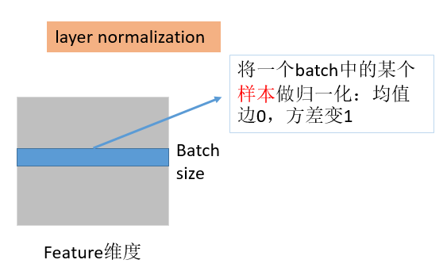

### 三维

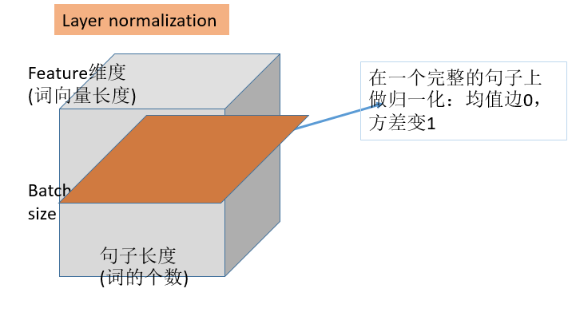

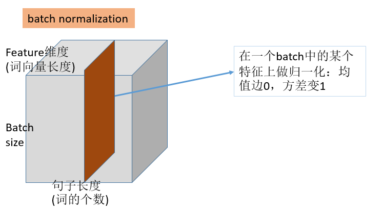

**在文本中layer norm比batch norm用的多**

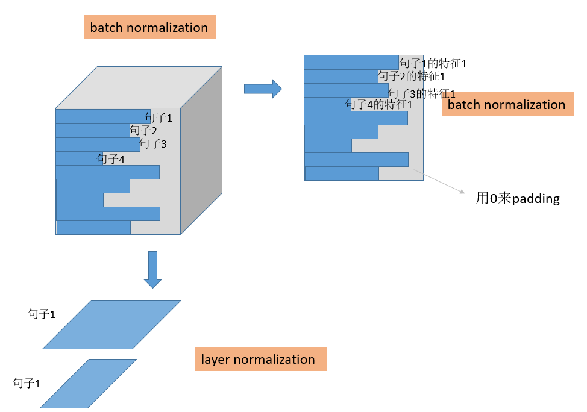

## transformer

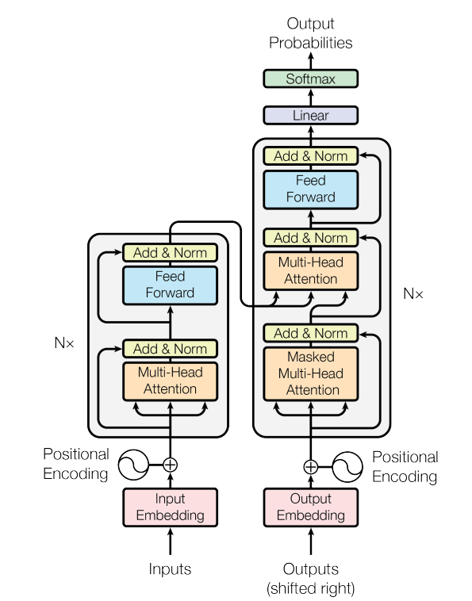

### 基于位置的前馈网络

基于位置的前馈网络对序列中的所有位置（这个位置指的是输入X的第一维和第二维所代表的东西）的表示进行变换时使用的是同一个多层感知机（MLP）。输入 `X` 的形状（批量大小、时间步数或序列长度、隐单元数或特征维度）将被一个两层的感知机转换成形状为（批量大小、时间步数、`ffn_num_outputs`）的输出张量。**作用是对所有的序列位置的表示进行转换。**

```python
class PositionWiseFFN(nn.Module):
    def __init__(self, ffn_num_input, ffn_num_hiddens, ffn_num_outputs,
                 **kwargs):
        super(PositionWiseFFN, self).__init__(**kwargs)
        self.dense1 = nn.Linear(ffn_num_input, ffn_num_hiddens)
        self.relu = nn.ReLU()
        self.dense2 = nn.Linear(ffn_num_hiddens, ffn_num_outputs)

    def forward(self, X):
        return self.dense2(self.relu(self.dense1(X)))
```

### 残差连接与层归一化

批量归一化是在通道维进行归一化（即对每个通道进行归一化），层归一化是在特征维进行归一化（即对每个样本进行归一化）

残差连接要求两个输入的形状相同，以便[**加法操作后输出张量的形状相同**]。

```python
class AddNorm(nn.Module):
    def __init__(self, normalized_shape, dropout, **kwargs):
        super(AddNorm, self).__init__(**kwargs)
        self.dropout = nn.Dropout(dropout)
        self.ln = nn.LayerNorm(normalized_shape)

    def forward(self, X, Y):
        return self.ln(self.dropout(Y) + X)

add_norm = AddNorm([3, 4], 0.5) # Normalized_shape is input.size()[1:]
add_norm.eval()
add_norm(torch.ones((2, 3, 4)), torch.ones((2, 3, 4))).shape
#torch.Size([2, 3, 4])
```


### 编码器

编码器中的transformer块：

```python
class EncoderBlock(nn.Module):
    def __init__(self,key_size,query_size,value_size, 
                 num_hiddens,norm_shape,num_heads, dropout,
                 ffn_num_input,ffn_num_hiddens,use_bias=False, **kwargs):
        super().__init__(**kwargs)
        self.attention = d2l.MultiHeadAttention(
            key_size,query_size,value_size, num_hiddens,num_heads, dropout)
        self.ffn = d2l.PositionWiseFFN(ffn_num_input, 
                                       ffn_num_hiddens, num_hidden)
        self.layerNorm1 = d2l.AddNorm(norm_shape,dorpout)
        self.layerNorm2 = d2l.AddNorm(norm_shape,dorpout)
    def forward(self,X,valid_len):
        Y = self.layerNorm1(X,self.attention(X,X,X,valid_len))
        return self.layerNorm2(Y,self.ffn(Y))
```

编码器部分：

```python
class TransformerEncoder(nn.Module):
    def __init__(self,vocab_size,num_hiddens,key_size,query_size,
                 value_size,norm_shape,num_heads, dropout,ffn_num_input,
                 ffn_num_hiddens,num_layers,use_bias=False,**kwargs):
        super().__init__(**kwargs)
        self.num_hiddens = num_hiddens
        self.embedding = nn.Eembedding(vocab_size,num_hiddens)
        self.positionEncoder = d2l.PositionalEncoding(num_hiddens,dropout)
        self.blks = nn.Sequential()
        for i in range(num_layers):
            self.blks.add_module("block"+str(i),
                                EncoderBlock(key_size,query_size,value_size, 
                 num_hiddens,norm_shape,num_heads, dropout,
                 ffn_num_input,ffn_num_hiddens,use_bias))
    def forward(self,X,valid_len):
        X = self.positionEncoder(self.embedding(X)*math.sqrt(self.num_hiddens))
        for i,blk in enumerate(self.blks):
            X = blk(X,valid_len)
        return X
```


### 解码器

解码器中的transformer块：

```python
class DecoderBlock(nn.Module):
    def __init__(self,key_size,query_size,value_size,num_hiddens,
                 num_heads,norm_shape,dropout,ffn_num_input,
                 ffn_num_hiddens,i,**kwargs):
        super().__init__(**kwargs)
        self.i = i
        self.attention1 = d2l.MultiHeadAttention(
        key_size,query_size,value_size,num_hiddens,num_heads,dropout)
        self.addNorm1 = d2l.AddNorm(norm_shape,dropout)
        self.attention = d2l.MultiHeadAttention(
        key_size,query_size,value_size,num_hiddens,num_heads,dropout)
        self.addNorm2 = d2l.AddNorm(norm_shape,dropout)
        self.ffn = d2l.PositionWiseFFN(ffn_num_input,
                                       ffn_num_hiddens,num_hiddens)
        self.addNorm3 = d2l.AddNorm(norm_shape,dropout)
    def forward(self,X,state):
        #state第一个是encoder的隐层输出，第二个是encoder的valid_len，
        #第三个是decoder的当前块的当前时间步的前面所有时间步的输出
        enc_output,enc_valid_lens = state[0],state[1]
        if state[2][self.i] is None:
            #如果是第一个时间步，state就初始化为decoder的输入
            key_values = X
        else:
            key_values = torch.concat((state[2][self.i],X),axis=1)
        state[2][self.i] = key_values
        # 如果是训练模式，解码器的valid_len每行就应该是递增的数组，
        # 其形状为(batch_size,num_Steps)
        if self.train:
            batch_size,num_steps = X.shape
            dec_valid_len = torch.range(1,num_step+1,device=X.device)
            .repeat(batch_size,1)
        else:
            dec_valid_len = None
        X2 = self.attention1(X,key_values,key_values,dec_valid_len)
        Y = self.addNorm(X,X2)
        Y2 = self.attention2(Y,enc_output,enc_output,enc_valid_len)
        Z = self.addNorm(Y,Y2)
        return self.addNorm(Z,self.ffn(Z))
```

完整的transformer解码器：

```python
class TransformerDecoder(nn.Module):
    def __init__(self,dec_vocab_size,key_size,query_size,value_size,num_hiddens,
                    num_heads,norm_shape,dropout,ffn_num_input,
                 ffn_num_hiddens,num_layers,**kwargs):
        super().__init(**kwargs)
        self.num_hiddens = num_hiddens
        self.embedding = nn.Embedding(dec_vocab_size,num_hiddens)
        self.positionEncoder = d2l.PositionalEncoding(num_hiddens,dropout)
        self.blks = nn.Sequential()
        for i in range(num_layers):
            self.blks.add_module("blk"+str(i),
                    DecoderBlock(key_size,query_size,value_size,num_hiddens,
                    num_heads,norm_shape,dropout,ffn_num_input,
                 ffn_num_hiddens,i))
        self.dense = nn.Linear(num_hiddens,dec_vocab_size)
        
    def init_state(self,enc_outputs,enc_valid_lens,*args):
        return [enc_outputs,enc_valid_lens,[None]*self.num_layers]
    def forward(self,X,state):
        X = self.positionEncoder(self.embedding(X)*math.sqrt(self.num_hiddens))
        for i,blk in enumerate(self.blks):
            X,state = blk(X,state)
        return self.dense(X),state
```

### 训练

dec_vocab_size,key_size,query_size,value_size,num_hiddens,
                    num_heads,norm_shape,dropout,ffn_num_input,
                 ffn_num_hiddens,num_layers

```python
num_hiddens, num_layers, dropout, batch_size, num_steps = 32, 2, 0.1, 64, 10
lr, num_epochs, device = 0.005, 200, d2l.try_gpu()
ffn_num_input, ffn_num_hiddens, num_heads = 32, 64, 4
key_size, query_size, value_size = 32, 32, 32
norm_shape = [32]

train_iter,src_vocab,tgt_vocab = d2l.load_data_nmt(batch_size,num_steps)

encoder = TransformerEncoder(len(src_vocab),num_hiddens,key_size, 
                             query_size, value_size,norm_shape,num_heads,
                            dropout,ffn_num_input,ffn_num_hiddens,num_layers)
decoder = TransformerDecoder(len(tgt_vocab),key_size, query_size, value_size,
                            num_hiddens,num_heads,norm_shape,dropout,
                            ffn_num_input,ffn_num_hiddens,num_layers)
net = d2l.EncoderDecoder(encoder,decoder)
d2l.train_seq2seq(net,train_iter,lr,num_epochs,tgt_vocab,device)
```

