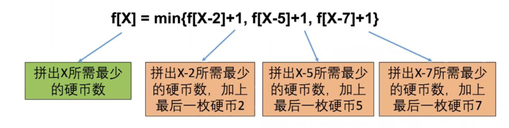
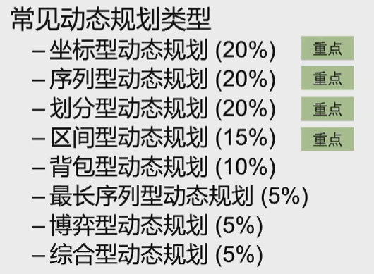

# 动态规划入门

## DP题目特点

1.计数题

- 有多少种方式

2.求最大最小值

3.求存在性

## DP解题步骤

### 一、确定状态

首先解DP问题的时候都会开一个数组，这个数组的每个元素都会代表个什么。

然后确定状态需要两步：

#### 1.最后一步

最优策略总有最后一步，把问题分成最后一步和前k-1步

#### 2.子问题

去掉上面的最后一步，那么前k-1步任然是应该是最优的，就可以把问题变成了求前k-1步这个最优问题

### 二、转移方程

有了最后一步和子问题，就可以写出转移方程，转移方程即为子问题加上最后一步

### 三、初始条件和边界情况

初始条件是转移方程算不出来的，就需要手动定义的部分

边界情况是保证不越界

### 四、计算顺序

要保证计算当前表达式时，其子表达式已经计算出了。通常情况下都是从小到大的顺序步计算

## 例题：求最大最小值

题目：有三种硬币，面值2，5，7，买一本书需要27元，如何用最少的硬币整好付清。

### 一、确定状态

虽然不知到最优策略是什么，但可以肯定的是，最优策略一定是k枚硬币a1,a2…ak加起来等于27。所以一定有一枚最后的硬币：ak。除掉这枚硬币，前面的面值加起来就是27-ak


所以最后一步即为ak，子问题即为用多少枚硬币可以拼出27-ak

### 二、转移方程

设状态f[X]=最少用多少枚硬币拼出X

转移方程：



### 三、初始条件和边界情况

边界条件X-2，X-5，X-7小于0时，应该进行处理，这种情况其实就是拼不出来的情况，定义为正无穷

初始条件一般就是根据转移方程计算不出来的值，从转移方程变量为0或1来选，根据题目进行分析，这个题目的初始条件就是f[0]=1，代入公式的话应该f[0]为正无穷，显然错误，所以自己定义f[0]=0。

### 四、计算顺序

这个题目应该是正序的，当我们计算到f[X]时，f[X-2],f[X-5],f[X-7]都已经得到结果了

### 代码实现

```java
// A表示所有面值硬币的数组（即2，5，7），M表示商品价格（此处为27）
public static int coinChange(int[] A,int M){
    int[] f = new int[M+1];
    f[0] = 0;
    
    for(itn i=1; i < M; i++){
        f[i] = Integer.MAX_VALUE;
        for(int j=0; j < A.length; j++){
            //第一个条件是防止数组越界；第二个条件是防止MAX_VALUE+1越界
            if((i - A[j])>0 && f[i - A[j]] != Integer.MAX_VALUE){
                f[i] = Math.min(f[i-A[j]]+1,f[i]);
            }
        }
    }
	if(f[M] == Integer.MAX_VALUE){
        f[M] = -1;
    }
    return f[M]
}
```


## 动态规划题型

