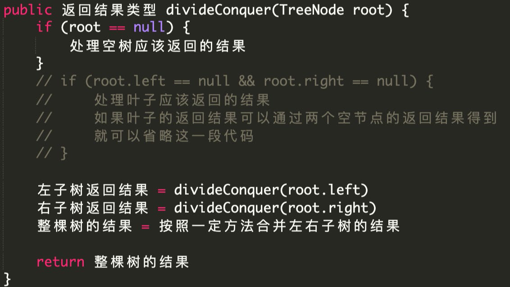
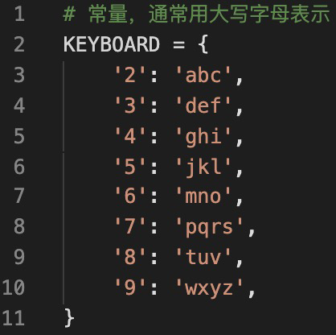
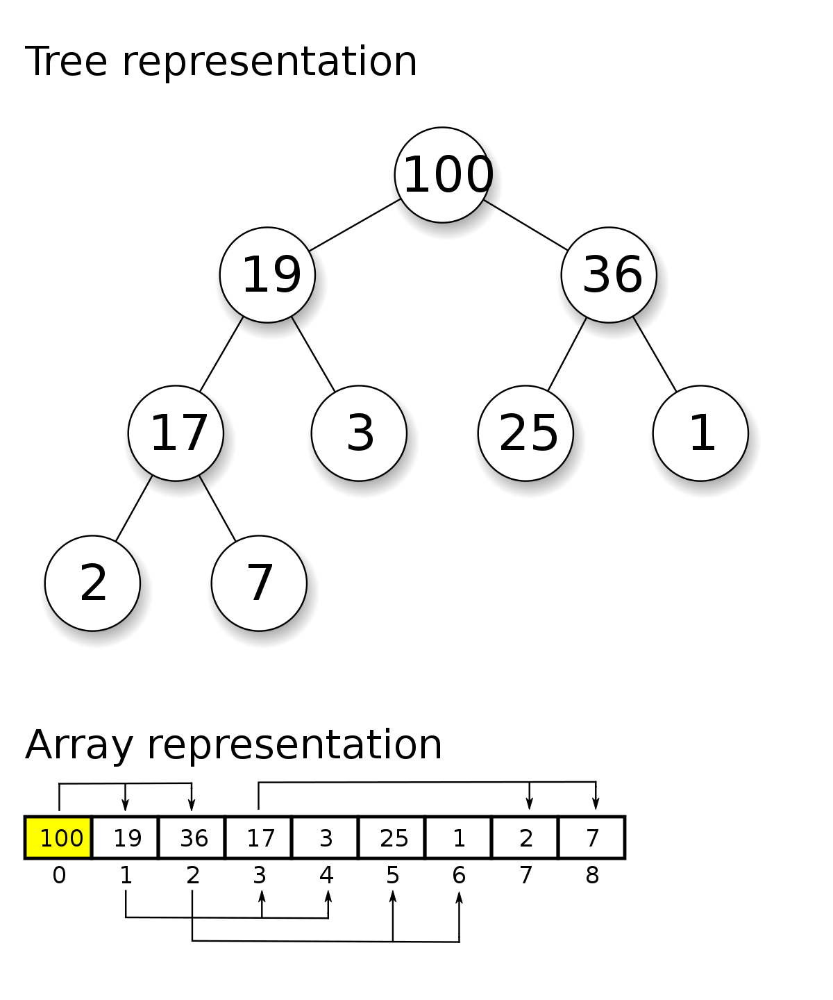
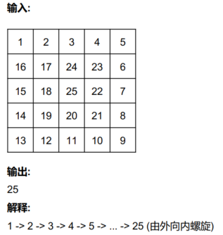
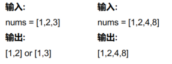

## 提高coding quality十二则

#### coding style相关

- 二元运算符两边加空格；单元运算符不加空格
- 花括号和for、if之间要加空格；圆括号与if之间要加空格
- 用空行分隔开不同的逻辑块
- 逗号后面加空格

#### readability相关

- 函数名变量名用1-2个单词作为名称
- 确保一个函数内部不超过三层缩进
- 多用子函数来减少入口函数的代码量
- 多用continue；少用if

#### bug free相关

- 入口函数的参数需要进行异常检测
- 访问下标时确保下标不越界
- 访问对象的属性或方法时确保对象不为空
- 不用全局变量


### 引子：最长回文子串

一个字符串abcd，先介绍两个概念

- 子序列：非连续的字符，有2^n种
- 子串：连续字符，有n^2种

回文子串：形如aba、abba这种就是回文子串

怎样检测一个字符串是否含有回文子串，可以用双指针

> 解决回文子串的最优算法就是Manacher algorithm算法，但面试中一般不会适合用这个，背诵题

#### 基于中心点枚举的方法求解

基本思想是：从一个子字符串的中心开始遍历，如果中心不是回文的，那以这个为中心的所有字符串都不可能是回文子串。这样就可以减少判断开销，直接跳到下一个中心继续寻找，算法时间复杂度 O(n^2)。

```java
public class Solution {
    public static void main(String[] args) {
        String str = longestPalindrome("abccbaaaq");
        System.out.println(str);
    }

    public static String longestPalindrome(String str) {
        if (str == null || str.length() == 0) {
            return "";
        }
        int start = 0, len = 0, longest = 0;
        for (int i = 0; i < str.length(); i++) {
            len = findLongestPalindromeFrom(str, i, i);
            if (len > longest) {
                longest = len;
                start = i - len / 2;
            }
            len = findLongestPalindromeFrom(str, i, i+1);
            if (len > longest) {
                longest = len;
                start = i - (len / 2) + 1;
            }
        }
        return str.substring(start, start + longest);
    }
    
    public static int findLongestPalindromeFrom(String s, int left, int right) {
        int len = 0;
        while (left >= 0 && right < s.length()) {
            if (s.charAt(left) != s.charAt(right)) {
                break;
            }
            len += left == right ? 1 : 2;
            left--;
            right++;
        }
        return len;
    }
}
```


#### 基于区间型动态规划的方法求解

区间型动态规划的思想：对于一个回文串，它的左右各减一个字符的子串任然是回文串。

确定状态：构建一个n*n的boolean数组，用来表示i到j是否为回文子串。

转移方程：i到j为回文串 = (i+1到j-1为回文串) && (字符i==字符j)

初始条件：任何一个字符都是长度为1的回文串，此外还需找到长度为2的回文串，这两种情况就是初始条件

```java
public class Solution {
    public static void main(String[] args) {
        String str = longestPalindrome("abccbaaaq");
        System.out.println(str);
    }

    public static String longestPalindrome(String str) {
        if (str == null || str.length() == 0) {
            return "";
        }
        int n = str.length();
        boolean[][] isPalindrome = new boolean[n][n];

        // 设定初始值
        int longest = 1, start = 0;
        for (int i = 0; i < n; i++) {
            isPalindrome[i][i] = true;
        }
        for (int i = 0; i < n - 1; i++) {
            isPalindrome[i][i + 1] = str.charAt(i) == str.charAt(i + 1);
            if (isPalindrome[i][i + 1]) {
                start = i;
                longest = 2;
            }
        }
		
        // 之所以这里从后往前，是因为初始化结束后，start是指向最后一个二回文子串
        for (int i = n - 1; i >= 0; i--) {
            for (int j = i + 2; j < n; j++) {
                // 转移方程
                isPalindrome[i][j] = isPalindrome[i + 1][j - 1] &&
                        str.charAt(i) == str.charAt(j);
                if (isPalindrome[i][j] && j - i + 1 > longest) {
                    longest = j - i + 1;
                    start = i;
                }
            }
        }
        return str.substring(start, start + longest);
    }
}
```


### 引子2：字符串查找

#### 方法一：暴力匹配

常规方法，时间复杂度为O(n^2)

```java
public class Solution {
    public static void main(String[] args) {
        int i = strStr("abcdbcdadd", "cda");
        System.out.println(i);
    }

    public static int strStr(String source, String target) {
        if (target == null || target.length() == 0){
            return 0;
        }

        for (int i = 0; i < source.length() - target.length() + 1; i++) {
            boolean notEqual = false;
            for (int j = 0; j < target.length(); j++) {
                if (source.charAt(i + j) != target.charAt(j)) {
                    notEqual = true;
                    break;
                }
            }
            if (!notEqual) {
                return i;
            }
        }
        return -1;
    }
}
```

#### 方法二：rabin-karp

#### 方法三：KMP


## 复杂度理论

### 四个复杂度

**时间复杂度 -> 核心考察点**

空间复杂度 - > 次要考察点

编程复杂度 - > 能看得懂

思维复杂度 - > 能想得出

### 时间复杂度

#### 时间复杂度总结


• O(logN) 二分法比较多
• O( N) 分解质因数（极少）
• O(N) 双指针，单调栈，枚举法
• O(NlogN) 排序, O(N * logN 的数据结构上的操作)
• O(N²), O(N³)，动态规划等
• O(2^N)，组合类(combination)的搜索问题
• O(N!) 排列类(permutation)的搜索问题

> 排列和组合的区别就是有序无序。
> 例如：5个数中取三个，无序，称作组合。比如（1,2,3）和（2,1,3）以及（3,1,2）都一样，没有区别。5个数中取三个，排成一排，有序，称作排列。


#### P问题

O(n), O(n^2), O(n^3)
O(n + m), O(√n), O(1)
O(logn), O(nlogn)

#### NP问题

O(2^n), O(n^n), O(n!)


O(n+m) 和 O(max(n,m)) 谁更大？ ->一样大

时间复杂度为O(N)的算法有哪些？

- **双指针算法**、打擂台算法（枚举法）、单调栈算法、单调队列算法


## 快速排序与归并排序

### 快速排序


```java
public class Solution {
    public void sortInteger(int[] A) {
        quickSort(A, 0, A.length - 1);
    }
    public void quickSort(int[] arr, int start, int end) {
        // 递归的出口
        if (start >= end) {
            return;
        }
        int left = start, right = end;
        int pivot = arr[(left + right) / 2];
        while (left <= right) {
            while (left <= right && arr[left] < pivot) {
                left+;
            }
            while (left <= right && arr[right] > pivot) {
                // 这里的arr[right] > pivot，而不用>=，虽然这样做当出现相等时，还将两个数交换的操作，略显麻烦。但这样保证两边数的个数处于一个平均的情况，而不是极端的一边很多一边几乎没有
                right--;
            }
            if (left <= right) {
            	int temp = arr[left];
            	arr[left] = arr[right];
            	arr[right] = temp;
            	left++;
            	right--;
            }
        }
        quickSort(arr, start, right);
        quickSort(arr, left, end);
    }
}
```

### 归并排序


```java
public class MergeSort {

    public static void main(String[] args) {
        int[] arr = new int[]{8, 4, 5, 7, 1, 3, 6 ,2};
        sortInteger(arr);
    }
    public static void sortInteger(int[] arr) {
        if (arr == null || arr.length == 0){
            return;
        }
        int[] temp = new int[arr.length];
        mergeSort(arr, 0, arr.length - 1, temp);
        System.out.println(Arrays.toString(arr));
    }

    public static void mergeSort(int[] arr, int start, int end, int[] temp) {
        if (start >= end) {
            return;
        }
        mergeSort(arr, start, (end + start) / 2, temp);
        mergeSort(arr, (end + start) / 2 + 1, end, temp);
        merge(arr, start, end, temp);
    }
    public static void merge(int[] arr, int start, int end, int[] temp){
        int middle = (start + end) / 2;
        int leftIndex = start, rightIndex = middle + 1;
        int index = leftIndex;
        while (leftIndex <= middle && rightIndex <= end) {
            if (arr[leftIndex] <= arr[rightIndex]) {
                temp[index++] = arr[leftIndex++];
            }else {
                temp[index++] = arr[rightIndex++];
            }
        }
        while (leftIndex <= middle) {
            temp[index++] = arr[leftIndex++];
        }
        while (rightIndex <= end) {
            temp[index++] = arr[rightIndex++];
        }
        for (int i = start; i <= end; i++) {
            arr[i] = temp[i];
        }
    }
}
```

### 对比

快排先整体有序，后局部有序

归并先局部有序，再整体有序

快排不稳定，归并稳定

时间复杂度都是nlogn

空间复杂度，快排为O(1)，归并是O(n)


### 快速选择算法

快速选择算法用了快排的思想。例如找一个数组种第k大的数。快速选择算法的时间复杂度是O(n)

```java
    public static void main(String[] args) {
        int[] arr = new int[]{8, 4, 5, 7, 3, 6 ,2};
        System.out.println(quickSelect(arr,0, arr.length-1, 2));
    }
    public static int quickSelect(int[] arr, int start, int end, int k) {
        int pivot = arr[(start + end) / 2];
        int left = start, right = end, middle = (start + end) / 2;
        while (left <= right) {
            while (left <= right && arr[left] > pivot){
                left++;
            }
            while (right >= left && arr[right] < pivot) {
                right--;
            }
            if (left <= right) {
                int temp = arr[left];
                arr[left] = arr[right];
                arr[right] = temp;
                left++;
                right--;
            }
        }
        if ( start + k - 1 <= right) {
            return quickSelect(arr, start, right, k);
        }else if (start + k - 1 >= left) {
            return quickSelect(arr,left,end,k - (left - start));
        }
        else {
            return arr[right + 1];
        }
    }
```

## 递归三要素

- 递归的定义：函数接收什么样的参数，返回什么样的值，代表什么意思
- 递归的拆解：通过怎样的处理，让参数逐渐变小
- 递归的出口


## 双指针算法

### 双指针算法入门

#### 三种双指针算法

- 相向双指针
  - reverse型
    - 翻转字符串
    - 判断回文串
  - two sum型
    - 两数之和
    - 三数之和
  - partition型（给一个数组，分成两部分，左边满足条件，右边不满足）
    - 快速排序
    - 颜色排序
- 背向双指针(最长回文串)
- 同向双指针

#### 例题1：相向双指针reverse型

判断一个字符串忽略大小写和非法字符之后是否是一个回文串

- race a car 不是回文
- A man, a plan, a canal: Panama 是回文


#### 例题2：相向双指针reverse型

判断一个字符串是否可以在去掉一个字符的情况下是一个回文串

- abca 可以，去掉b或者c
- abc 无法做到

```java
public class Solution {

    public boolean validPalindrome(String str) {
        if (str == null) {
            return false;
        }
        Pair pair = different(str,0,str.length()-1);
        if (pair.left >= pair.right) {
            return true;
        }
        return isPalindrome(str, pair.left +1, pair.right) ||
                isPalindrome(str, pair.left, pair.right - 1);
        
    }
    
    public Pair different(String s, int left, int right) {
        while (left < right && s.charAt(left) == s.charAt(right)) {
            left++;
            right--;
        }
        return new Pair(left,right);
    }   
    
    public boolean isPalindrome(String s, int left, int right) {
        Pair pair = different(s, left, right);
        return pair.left >= pair.right;
    }
}

class Pair{
    int left, right;
    public Pair(int left, int right) {
        this.left = left;
        this.right = right;
    }
}
```


#### 例题3：two sum

##### 哈希表解法

```java
public class Solution {
    public static void main(String[] args) {
        int[] arr = new int[]{2, 7, 11, 15};
        int[] ints = twoSum(arr, 13);
        System.out.println(Arrays.toString(ints));
    }
    public static int[] twoSum(int[] arr, int target) {
        Map<Integer, Integer> map = new HashMap<>();
        for (int i = 0; i < arr.length; i++) {
            int complement = target - arr[i];
            if (map.containsKey(complement)) {
                return new int[] {map.get(complement), i};
            }
            map.put(arr[i], i);
        }
        return null;
    }
}
```

##### 双指针解法

python版本：

```python
def twoSum(self, numbers, target):
    numbers.sort()
    left, right = 0, len(numbers) - 1
    while (left < right):
        if numbers[left] + number[right] > target:
            right--
        elif numbers[left] + numbers[right] < target:
            left++
        else:	
            return numbers[left], numbers[right]
    return [-1,-1]
```

java版本：

```java
class Solution {
    public int[] twoSum(int[] nums, int target) {
        if (nums == null) {
            return null;
        }
        // 用双指针的方法
        Pair[] numbers = getSortedPairs(nums);
        int left = 0, right = nums.length - 1;
        while (left < right) {
            if (numbers[left].number + numbers[right].number == target) {
                return new int[]{numbers[left].index, numbers[right].index};
            }
            if (numbers[left].number + numbers[right].number < target) {
                left++;
            }else {
                right--;
            }
        }
        return null;
    }
     class Pair implements Comparable<Pair> {
        int number, index;
        
        public Pair(int number, int index) {
            this.number = number;
            this.index = index;
        }
        
        public int compareTo(Pair other) {
            return number - other.number;
        }
    }
    private Pair[] getSortedPairs(int[] numbers) {
        Pair[] pairs = new Pair[numbers.length];
        for (int i = 0; i < numbers.length; i++) {
            pairs[i] = new Pair(numbers[i], i);
        }
        Arrays.sort(pairs);
        return pairs;
    }
}
```


### 相向双指针

时间复杂度O(n)

#### 基本题：两数之和

[两数之和 · Two Sum - 九章算法 (jiuzhang.com)](https://www.jiuzhang.com/solution/two-sum)

#### 变种题：两数之和-数据结构设计

设计并实现一个两数之和的类，它支持添加和查找操作：

- 添加：将一个数字添加到数据结构内部

- 查找：找到存在的两个数使其和等于一个给定值


这是一个组合题，选择什么方法来解需要综合考虑。

##### 方法1：hashmap

hashmap方法中添加操作是O(1)的，查找操作是O(N)的

|            | add  | find |
| ---------- | ---- | ---- |
| 时间复杂度 | O(1) | O(N) |
| 空间复杂度 | O(N) | O(N) |

方法2：排序数组加双指针

|            | add  | find |
| ---------- | ---- | ---- |
| 时间复杂度 | O(N) | O(N) |
| 空间复杂度 | O(N) | O(N) |


#### 三数之和

给出一个有n个整数的数组S，在S中找到三个整数a, b, c，找到所有使得a + b + c = 0的三元组。在三元组(a, b, c)，要求a <= b <= c。结果**不能包含重复的三元组**。

暴力可行解：三层for循环，找到所有满足条件的三元组，并去重。时间复杂度O(N^3)，空间复杂度O(1)
优化解：如果选定一个点A，那么另外两个点的目标和为-A，**转化为two sum问题**。

用降维的思想

```java
class Solution {
    public List<List<Integer>> threeSum(int[] nums) {
        if (nums == null || nums.length < 3) {
            return new ArrayList<>();
        }
        List<List<Integer>> result = new ArrayList<>();
        // 先对数组排序
        Arrays.sort(nums);
        int tempTarget = Integer.MAX_VALUE;
        for (int i = nums.length - 1; i >= 0; i--) {
            if (i != nums.length - 1 && nums[i] == nums[i+1]) {
                continue;
            }
            int target = nums[i];
            int right = i - 1;
            int left = 0;
            while (left < right) {
                if (nums[left] + nums[right] > - target) {
                    right--;
                } else if (nums[left] + nums[right] < - target) {
                    left++;
                } else {
                    tempTarget = target;
                    List<Integer> list = new ArrayList<>();
                    list.add(nums[left]);
                    list.add(nums[right]);
                    list.add(target);
                    result.add(list);
                    left++;
                    right--;
                    while (left < right && nums[left] == nums[left - 1]) {
                        left++;
                    }
                }
            }
        }
        return result;
    }
}
```


#### 三角形个数

给定一个整数数组，在该数组中，寻找三个数，分别代表三角形三条边的长度，问，可以寻找到多少组这样的三个数来组成三角形？

变形：求所有方案数、求去重后的方案-》这两种都是O(n^3)

```java
class Solution {
    public int triangleNumber(int[] nums) {
        Arrays.sort(nums);
        int result = 0;
        for (int i = nums.length - 1; i > 1; i--) {
            int left = 0;
            int right = i - 1;
            while (left < right) {
                if (nums[left] + nums[right] <= nums[i]) {
                    left++;
                }else {
                    result += right - left;
                    right--;
                }
            }
        }
        return result;
    }
}
```

#### 四数之和

给一个包含n个数的整数数组S，在S中找到所有使得和为给定整数target的四元组(a, b, c, d)。
四元组(a, b, c, d)中，需要满足a <= b <= c <= d。答案中**不可以包含重复的四元组**。

来自同一个数组：降两维，即用两个for循环，最后两个用双指针或者hash表。最后时间复杂度为O(n^3)

```
class Solution {
    public List<List<Integer>> fourSum(int[] nums, int target) {
        Arrays.sort(nums);
        List<List<Integer>> result = new ArrayList<>();
        int first, last;
        for (first = 0; first < nums.length - 3; first++) {
            if (first != 0 && nums[first] == nums[first - 1]) {
                    continue;
                }
            int temp1Target = target - nums[first];
            for(last = nums.length - 1; last >= first + 3; last--) {
                if (last != nums.length - 1 && nums[last] == nums[last + 1]) {
                    continue;
                }
                int left = first + 1;
                int right = last - 1;
                while (left < right) {
                    int total = nums[first] + nums[last] + nums[left] + nums[right];
                    if (total > target) {
                        right--;
                    } else if (total < target) {
                        left++;
                    }else {
                        List<Integer> list = new ArrayList<>();
                        list.add(nums[first]);
                        list.add(nums[last]);
                        list.add(nums[left]);
                        list.add(nums[right]);
                        result.add(list);
                        left++;
                        right--;
                        while (left < right && nums[left] == nums[left - 1]) {
                            left++;
                        }
                    }
                }
            }
        }
        return result;
    }
}
```

#### 来自四个不同数组的四数之和

题目给你四个整数数组 nums1、nums2、nums3 和 nums4 ，数组长度都是 n ，请你计算有多少个元组 (i, j, k, l) 能满足：

- 0 <= i, j, k, l < n
- nums1[i] + nums2[j] + nums3[k] + nums4[l] == 0

>  [4数和 II · 4Sum II - 九章算法 (jiuzhang.com)](https://www.jiuzhang.com/solutions/4sum-ii)

解题思路：**使用hashMap**

将四个数组分成两组，每组都两两相加生成n^2个数。将第一组的数设置为hashmap的key，如果有重复，就将对应的value加1。然后遍历第二组中的数，判断其是否在hashMap中。

```java
class Solution {
    public int fourSumCount(int[] nums1, int[] nums2, int[] nums3, int[] nums4) {
        Map<Integer, Integer> map = new HashMap<>();
        int ans = 0;
        for (int i = 0; i < nums1.length; i++) {
            for( int j = 0; j < nums2.length; j++) {
                int element1 = nums1[i] + nums2[j];
                if (map.containsKey(element1)) {
                    map.put(element1, map.get(element1) + 1);
                }else {
                    map.put(element1, 1);
                }
            }
        }
        for (int i = 0; i < nums3.length; i++) {
            for( int j = 0; j < nums4.length; j++) {
                int result = -(nums3[i] + nums4[j]);
                if (map.containsKey(result)) {
                    ans += map.get(result);
                }
            }
        }
        return ans;
    }
}
```


#### k数之和

求具体方案：用深度优先

求方案总数：用动态规划

### partition 分区算法

#### 分区数组

给出一个整数数组nums 和一个整数k。划分数组（即移动数组nums 中的元素），使得：所有小于k的元素移到左边，所有大于等于k的元素移到右边。返回数组划分的位置，即数组中第一个位置i，满足nums[i] 大于等于k。

数组分区算法和快排有相似的思想：


> **分区数组与快排的区别？** 
>
> 与快速排序很相似，只有一个符号的区别，即第二层while中，nums[right]与k的关系。这是因为，分区数组的分割线是介于两个数之间的（**无论如何只需要分成两区，非坐即右**）。而**快排是将数分在pivot两边，分割线就是pivot，如果快排中加个等号，出现极端的情况，然后退化成O(N^2)**【例如全1的数组，快排第一次后，就会左边变成空，1全到右边，在递归中完全变成O(N^2)】。而**没有等号时，可能会进行一些相等值左右交换的傻瓜操作，但这样保证了两边数量均匀。**

#### 快速排序的分区**算法模板**：

```java
while(left <= right) {
    while (left <= right && num[left] 应该在左侧的条件){
        left += 1;
    }
    while (left <= right && num[right] 应该在右侧的条件){
        right -= 1;
    }
    if (left <= right) {
        int temp = nums[left];
        nums[left] = nums[right];
        nums[right] = temp;
        left++;
        right--;
    }
}
```

> 为什么用left<=right 而不是left<right ?
>
> 如果用left < right, while 循环就会出现结束在left == right的情况，此时**left处的值还没有被处理，就还需要多一个判断left处的值到底是属于左侧还是右侧**。而使用left <= right 可以省去这个判断。

> **时间复杂度是要看循环最里面的部分执行了多少次，而不是看嵌套了多少次循环**，就比如上图两个while循环嵌套，但left+=1行和right+=1行代码是不可能执行了n^2次的，只可能执行n+n次，所以是O(N)的

#### 交替正负数

题目：给出一个含有正整数和负整数的数组，重新排列成一个正负数交错的数组。**不需要保持正整数或者负整数原来的顺序。**且不消耗额外的空间。

```java
class Solution{
    public void rerange(int[] nums) {
        // 先将数组排序：注意不用完全排序，只用将负数放前，正数放后，即花O(N)的时间
        int negCnt = partition(nums);
        int posCnt = nums.length - negCnt;
        int left = negCnt > posCnt ? 1 : 0; 
        int right = nums.length - 1;
        while (left < right) {
            int temp = nums[left];
            nums[left] = nums[right];
            nums[right] = temp;
            left += 2;
            right -= 2;
        }
        
    }
    
    public int partition(int[] nums) {
        int left = 0, right = nums.length - 1;
        while (left <= right) {
            // 在左边找一个正数
            while (left <= right && nums[left] < 0) {
                left++;
            }
            while (left <= right && nums[right] > 0) {
                right++
            }
            if (left <= right) {
                int temp = nums[left];
                nums[left] = nums[right];
                nums[right] = temp;
                left++;
                right--;
            }
        }
        return left;
    }
}
```

> 这题的关键点就是在排序的时候不需要花费O(NlogN)的时间来将数组完全排序，只需要**采用快排的思想，来将数组分成大于零和小于零的两半**就可以。

#### Sort Colors

给定一个包含红，白，蓝且长度为n 的数组，将数组元素进行分类使相同颜色的元素相邻，并按照红、白、蓝的顺序进行排序。我们可以使用整数0，1 和2 分别代表红，白，蓝。

方法一：用两个partition

```java
class Solution {
    public void sortColors(int[] nums) {
        // 两个partition的方法
        if (nums == null && nums.length < 2) {
            return;
        }
        int left = sort(nums, 0, nums.length - 1, 0);
        sort(nums, left, nums.length - 1, 1);
    }
    public int sort(int[] nums, int left, int right, int num) {
        while (left <= right) {
            while (left <= right && nums[left] == num) {
                left++;
            }
            while (left <= right && nums[right] > num) {
                right--;
            }
            if (left <= right) {
                int temp = nums[left];
                nums[left] = nums[right];
                nums[right] = temp;
                left++;
                right--;
            }
        }
        return left;
    }
}
```

方法二：用一个partition和三个指针

```java
class Solution {
    public void sortColors(int[] nums) {
        // 三指针法
        if (nums == null || nums.length <= 1) {
            return;
        }

        int left = 0;
        int right = nums.length - 1;
        for (int i = 0; i < nums.length; i++) {
            if (i <= right && i >= left && nums[i] == 0) {
                int temp = nums[left];
                nums[left] = nums[i];
                nums[i] = temp;
                left++;
                i--;
            } else if (i <= right && i >= left && nums[i] == 2) {
                int temp = nums[right];
                nums[right] = nums[i];
                nums[i] = temp;
                right--;
                i--;
            } else {
                continue;
            }
        }
    }
}
```

#### 彩虹排序：根据时间复杂度反推算法

> [颜色分类 II · Sort Colors II - 九章算法 (jiuzhang.com)](https://www.jiuzhang.com/solutions/sort-colors-ii)

**题目**：给定一个有n个对象（包括k种不同的颜色，并按照1到k进行编号）的数组，将对象进行分类使相同颜色的对象相邻，并按照1,2，...k的顺序进行排序。可直接使用计数排序算法扫描两遍，但这样会花费O(k)的额外空间。你能否在O(logk)的额外空间的情况下完成？

##### **时间复杂度分析**

题中共有n和k两个参数，可能的时间复杂度有以下集中情况：

- O(n*k)
- O(n^k)
- O(nlogk)
- O(klogn)
- O(nlogn)

首先排除第一二种，如果是这两种，那还不如直接当成快速排序，即O(nlogn)的情况。同时也可以排除nlogn，不用快排。那么就只剩下O(nlogk)和O(klogn)，带入k=1，k=2...的情况：k=1时，不需要排序，此时为O(1)；k=2时，直接用双指针，此时为O(n)。因此可知，**彩虹排序的时间复杂度应该为O(nlogk)**。

##### 算法分析

nlogk要么是n次logk，要么 是logk次n。涉及到log的主要是堆和红黑树，但这题需要排序，所以肯定不会用。除此之外二分法、欧几里得基数、快速幂等也是log的，但这也都不符合。

所以更可能是logk次n的操作，归并排序的时间复杂度（需要好好分析一下）是nlogn，它一共分了logn层，每层的时间耗费都是n。所以我们可以去想这题可以分成logk层

##### 代码实现

```java
    public void sortColors(int[] colors, int k) {
        if (colors == null || colors.length == 0) {
            return;;
        }
        rainbowSort(colors, 0, colors.length - 1, 1, k);
    }
    public void rainbowSort(int[] colors,int left, int right, int colorFrom, int colorTo) {
        if (colorFrom == colorTo) {
            return;
        }
        if (left >= right) {
            return;
        }
        int colorMid = (colorFrom + colorTo) / 2;
        int l = left, r = right;
        while (l <= r) {
            while (l <= r && colors[l] <= colorMid) {
                l++;
            }
            while (l <= r && colors[r] > colorMid) {
                r--;
            }
            if (l <= r) {
                int temp = colors[l];
                colors[l] = colors[r];
                colors[r] = temp;
                l++;
                r--;
            }
        }
        rainbowSort(colors, left, r, colorFrom, colorMid);
        rainbowSort(colors, l, right, colorMid + 1, colorTo);
    }
```

##### 总结

这题算是快排与归并的结合，**整体实现上是按照快排的逻辑，思想上是按照归并的思路**：**归并是假设成n个不同的数，然后将这n个数拆分到只有两两比较为止，这一共拆分了logn层（每层都做了n次操作）**。而**这题是n个数，其中有k类，我们只用将其拆分到两两比较（即两类两类的比较）就可以，最终拆分成logk层。**然后让分类的中位线作为快排的中界限，整个数组的左右拆分是顺带完成的。

> **根据时间复杂度反推可能使用的算法（还可以根据数据范围来推时间复杂度）**

#### 移动零

给一个数组nums 写一个函数将0 移动到数组的最后面，非零元素保持原数组的顺序
1. 必须在原数组上操作
2. 最小化操作数

方法一：常规的交换操作

```java
class Solution {
    public void moveZeroes(int[] nums) {
        if (nums == null || nums.length < 2) {
            return;
        }
        int slow = 0, fast = 0;
        while (fast < nums.length) {
            if (nums[fast] != 0) {
                int temp = nums[slow];
                nums[slow] = nums[fast];
                nums[fast] = temp;
                slow++;
            }
            fast++;
        }
    }
}
```

> 注意里面的条件。带入[1,2],[1,0,2]这些条件进去理解。**slow指针和fast指针只会在遇到零的时候才逐渐拉开距离（也就是slow指向零，fast往前走）**，所以不会出现slow和fast之间有零的情况

方法二：先覆盖，最后再填零，比上面的方法操作步更少。

```java
class Solution {
    public void moveZeroes(int[] nums) {
        if (nums == null || nums.length < 2) {
            return;
        }
        // 方法二：遇到非零元素就赋给slow，遇到零就跳过
        int slow = 0, fast = 0;
        while (fast < nums.length) {
            if (nums[fast] != 0) {
                if (slow != fast) {
                    nums[slow] = nums[fast];
                }
                slow++;// 只要是非零，两个就应该一起走，所以这行代码在这
            }
            fast++;
        }
        while (slow < nums.length) {
            nums[slow] = 0;
            slow++;
        }
    }
}
```

## 二分法

二分法又叫二分查找，折半查找。二分法利用了减治（Decrease and Conquer）的算法思想（Algorithmic Paradigm），不属于分治（Divide and Conquer）算法思想。


### 二分法入门

[Binary Search · Binary Search - 九章算法 (jiuzhang.com)](https://www.jiuzhang.com/solutions/binary-search)

用二分法查找一个数**第一次出现的位置**、或者一个数**最后一次出现的位置**，或者一个数**第一次遇到大于等于它的位置**。

下面是一个非递归二分法的模板，可以在这个基础上简单修改即可完成多种类型的查找要求。

```java
    public static int position(int[] num, int target) {
        if (num == null || num.length == 0) {
            return -1;
        }
        int start = 0, end = num.length - 1;
        while (start + 1 < end) { // 避免在找lastPosition或firstPosition问题上出现死循环
            int mid = start + (end - start) / 2;
            if (num[mid] == target) {
                end = mid; // 如果是找最后一个值，遇到等于时，就要往右边找(start=mid)。如果是找第一次出现，遇到等于时，就往左边找(end=mid)
            }else if (num[mid] > target) {
                end = mid;
            }else {
                start = mid;
            }
        }

        if (num[start] == target) {
            return start;  // 找最后一个值的出口
        }
        if (num[end] == target) {
            return end;	// 找第一个值的出口
        }
        if (target < num[end] && target > num[start]) {
            return end;	// 应对找第一次遇到大于它的位置（数组种没有与他相等的情况）
        }
        return -1;
    }
```

### 二分法模板

```java
    public int binarySearch(int[] nums, int target) {
        if (nums == null || nums.length == 0) {
            return -1;
        }
        int start = 0, end = nums.length - 1;
        // 1. start + 1 < end而不用start < end是为了避免死循环：
        // 在first position of target的情况下不会出现死循环，
        // 但是在last position of target情况下会出现死循环，例如：nums=[1,1],target=1
        // 所以为了统一，就使用start+1<end
        while (start + 1 < end) {
            // 为了防止Java中溢出的情况，使用下面这种形式
            int mid = start + (end - start) / 2;
            // <, =, >的逻辑先分开写，然后看看=的情况是否能合并到其他分支里
            if (nums[mid] < target) {
                start = end;
            } else if (nums[mid] == target) {
                // 2. 如果target有多个值，要找第一次出现还是最后一次出现的值，
                // 就看==情况时，mid赋给end的话就是找第一次出现的，赋给start就是最后一次出现
                end = mid;
            } else {
                // 这地方写mid+1或mid-1也是可以的，但不加减1也不会错，对时间复杂度没影响
                end = mid;
            }
        }

        // 3. 因为上面退出条件是start + 1 < end，所以退出时，start与end是相邻的
        // 上面虽然做了初筛（即target第一次出现或者最后一次出现），
        // 但还是存在start和end相等的情况（即nums中全为target的值）
        // 还需要再单独判断start和end这两个数谁是我们要的答案，
        // 如果是找first position of target，就先看start，否则先看end
        // 4. 如果就是找目标值就用==，如果找小于target的就用<,反之用>
        if (nums[start] == target) {
            return start;
        }
        // target无重复值的情况下，先看start还是end都可以
        if (nums[end] == target) {
            return end;
        }
        return -1;
    }
```

> 代码中的四点注释就是需要注意的地方

### 第二境界 OOXX 在排序的数据集上进行二分

#### 有序数组上用二分法的六类情况


> 图中的六类情况就是六类考题，结合各类出现的情况修改模板。

**case 1** 找小于5的最大index(即数值4的index)：

```java
public int binarySearch(int[] nums, int target) {
        if (nums == null || nums.length == 0) {
            return -1;
        }
        int start = 0, end = nums.length - 1;
        while (start + 1 < end) {
            int mid = start + (end - start) / 2;
            if (nums[mid] < target) {
                start = end;
            } else {
                end = mid;
            }
        }
        if (nums[start] < target) {
            return start;
        }
        return -1;
    }
```

**case 2** 找大于5的最小index(即数值7的最小index)：

```java
public int binarySearch(int[] nums, int target) {
        if (nums == null || nums.length == 0) {
            return -1;
        }
        int start = 0, end = nums.length - 1;
        while (start + 1 < end) {
            int mid = start + (end - start) / 2;
            if (nums[mid] <= target) {
                start = end;
            } else {
                end = mid;
            }
        }
        if (nums[end] > target) {
            return start;
        }
        return -1;
    }
```

> 如果要找第一个5，或者最后一个5，就将相应的最后一个if中<或>换成==，但注意还需要加上另一个值的判断。

**case 3** 找5出现的次数

```java
// 得出5出现的次数，时间复杂度是O(logN)的
int numberOfTarget = findLast(arr, target) - findFirst(arr, target) + 1
// 找第一次5出现
public int findFirst(int[] nums, int target) {
        if (nums == null || nums.length == 0) {
            return -1;
        }
        int start = 0, end = nums.length - 1;
        while (start + 1 < end) {
            int mid = start + (end - start) / 2;
            if (nums[mid] < target) {
                start = end;
            } else {
                end = mid;
            }
        }
        if (nums[start] == target) {
            return start;
        }
    	if (nums[end] == target) {
            return start;
        }
        return -1;
    }
// 找最后一次5出现
public int findlast(int[] nums, int target) {
        if (nums == null || nums.length == 0) {
            return -1;
        }
        int start = 0, end = nums.length - 1;
        while (start + 1 < end) {
            int mid = start + (end - start) / 2;
            if (nums[mid] <= target) {
                start = end;
            } else {
                end = mid;
            }
        }
    	if (nums[end] == target) {
            return start;
        }
        if (nums[start] == target) {
            return start;
        }
        return -1;
    }
```


#### 题目1：Search in a Big Sorted Array

问题：给一个按照升序排序的非负整数数组。这个数组很大以至于你只能通过固定的接口ArrayReader.get(k) 来访问第k个数(k从0开始)，并且你也没有办法得知这个数组有多大。
找到给出的整数target第一次出现的位置。你的算法需要在O(logk)的时间复杂度内完成，k为target第一次出现的位置的下标。如果找不到target，返回-1。如果你访问了一个不可访问的下标（比如越界）ArrayReader 会返回2,147,483,647。


方法：倍增法Exponential Backoff


#### 题目2：Find K Closest Elements在排序数组中找最接近的K个数

给一个目标数target, 一个非负整数k, 一个按照升序排列的数组A。在A中找与target最接近的k个整数。返回这k个数并按照与target的接近程度从小到大排序，如果接近程度相当，那么小的数排在前面。

思想：Merge Sorted Array、背向双指针

题解：该题首先需要找到数组中的索引最大且小于等于x的值，然后以此作为双指针起始点，来做背向双指针

```java
class Solution {
    public List<Integer> findClosestElements(int[] arr, int k, int x) {
        // 1.先做空值处理
        if (arr == null || arr.length == 0 || k > arr.length) {
            return new ArrayList<Integer>();
        }
        // 2.找到小于target中的最大值（这样可以完美应对数组中有target或没target两种情况）
        // 然后用背向双指针
        int left = findLowerClosest(arr, x);
        int right = left + 1;
        List<Integer> result = new ArrayList<Integer>();
        for (int i = 0; i < k; i++) {
            // 3.这里的条件细分下来是left < 0 || x - arr[left] > arr[right] - x，但很明显
            // 当left<0时会报索引异常，所以可以考虑将它封装成一个函数
            if (isLeftCloser(arr, x, left, right)) {
                result.add(arr[left]);
                left--;
            }
            else {
                result.add(arr[right]);
                right++;
            }
        }
        Collections.sort(result);
        return result;

    }

    public boolean isLeftCloser(int[] arr, int x, int left, int right) {
        // 因为最开始做了异常保证，所以不可能出现left<0和right>arr.length的情况，
        // 可以直接下面这样操作
        if (left < 0) {
            return false;
        }
        if (right >= arr.length) {
            return true;
        }
        return x - arr[left] <= arr[right] - x;
    }
    // 这是二分法的其中一个应用点（找小于target的最大值），可以直接套用模板。
    public int findLowerClosest(int[] arr, int x) {
        int start = 0, end = arr.length - 1;
        while (start + 1 < end) { 
            int mid = start + (end - start) / 2;
            if (arr[mid] < x) {
                start = mid;
            }
            else {
                end = mid;
            }
        }
        if (arr[end] < x) {
            return end;
        }
        if (arr[start] < x) {
            return start;
        }
        return -1;
    }
}
```

> **双指针使用tips：当用双指针的时候，外面已经有一层循环（此时为O(N)），里面如果没必要，就不要多此一举用while来做多步操作，这样更容易出错。里面就只用if-else做一轮判断，让外层循环自己来逐步走。**

#### 题目3：Maximum Number in Mountain Sequence 山脉序列中的最大值

给n 个整数的山脉数组，即先增后减的序列（没有相等），找到山顶（最大值）。


>相比常规的二分法，这些就是减治的条件变了一下

#### 题目4：Find Minimum in Rotated Sorted Array 寻找旋转排序数组中的最小值

假设一个按升序排好序的数组在其某一未知点发生了旋转（比如0 1 2 4 5 6 7 可能变成4 5 6 7 0 1 2）。你需要找到其中最小的元素。你可以假设数组中不存在重复元素。


#### 题目5：Search in Rotated Sorted Array 搜索旋转排序数组

给定一个有序数组，但是数组以某个元素作为支点进行了旋转(比如，0 1 2 4 5 6 7 可能成为4 5 6 7 0 1 2)。给定一个目标值target进行搜索，如果在数组中找到目标值返回数组中的索引位置，否则返回-1。你可以假设数组中不存在重复的元素。


#### 小结——在有序的输入集合中的二分查找

##### 本质

在有序的数组中寻找一个跟Target有关的Index或值

##### 时间复杂度

一次二分法是O(logN)

##### 关键词

array, target, sorted，equal or close to target的词（e.g.，小于n的最大值），O(NlogN)

##### 套路

如果**求两个数和的target**，固定一个值，另一个值二分查找。如果没有排序，可以先排序再求解。

### 第三境界 在未排序的数据集上进行二分

#### 题目6：Find Peak Element 寻找峰值

给定一个整数数组(size为n)，其具有以下特点：

- 相邻位置的数字是不同的
- A[0] < A[1] 并且A[n - 2] > A[n - 1]

假定P是峰值的位置则满足A[P] > A[P-1]且A[P] > A[P+1]，返回数组中任意一个峰值的位置。


### 第四境界 在答案集上进行二分

#### 题目7：Wood Cut 木材加工

有一些原木，现在想把这些木头切割成一些长度相同的小段木头，需要得到的小段的数目至少为k。给定L和k，你需要计算能够得到的小段木头的最大长度。木头长度的单位是厘米。原木的长度都是正整数，我们要求切割得到的小段木头的长度也要求是整数。无法切出要求至少k 段的,则返回0 即可。


#### 小结—— 在答案集上进行二分

##### 本质：

1.求满足某条件的最大值或者最小值
2.最终结果是个有限的集合
3.每个结果有一个对应的映射
4.结果集合跟映射集合正相关或着负相关
5.可以通过在映射集合上进行二分，从而实现对结果集合的二分

##### 关键词：

Array, 有限可能解, 映射，正负相关, O(NlogN)


抽象类和抽象方法：

例如车类是没有存在的意义的，不可能实现一辆车的实例（只可能是奔驰、奥迪等具体的子类才能实现），所以car类就定义成一个抽象类

面向对象的代码结构不断优化，按照设计模式来优化


抽象类与接口的区别


interface语法


## BFS与图论入门

### BFS的适用场景

- 分层遍历
  - 一层一层的遍历一个图、树、矩阵
  - 简单图最短路径
    - 简单图的定义是，图中所有的边长都一样
- 连通块问题
  - 通过图中一个点找到其他所有连通的点
  - 找到所有方案问题的一种非递归实现方式

- 拓扑排序
  - 实现容易度远超过DFS

### BFS的三种实现方法

https://www.lintcode.com/problem/binary-tree-level-order-traversal

单队列


双队列


DummyNode


## 用递归实现遍历法和分治法

### 递归、DFS和回溯法的区别

#### 递归

递归函数：程序的一种实现方式，即函数进行了自我调用

递归算法：即大问题的结果依赖于小问题的结果，于是先用递归函数求解小问题

一般我们说递归的时候，大部分时候都在说递归函数而不是递归算法

#### DFS

可以使用递归函数来实现

也可以不用递归函数来实现，如自己通过一个手动创建的栈Stack 进行操作

深度优先搜索通常是指在搜索的过程中优先搜索深度更深的点而不是按照宽度搜索同层节点

#### 回溯

回溯法：就是深度优先搜索算法

回溯操作：递归函数在回到上一层递归调用处的时候，一些参数需要改回到调用前的值，这个操作就是回溯，即让状态参数回到之前的值，递归调用前做了什么改动，递归调用之后都改回来


#### 找点vs找路径：是否需要手动“回溯”的判断标准

https://www.lintcode.com/problem/binary-tree-paths


#### 遍历法VS分治法

遍历法= 一个小人拿着一个记事本走遍所有的节点

分治法= 分配小弟去做子任务，自己进行结果汇总


##### 二叉树上的分治法模板



遍历法：通常会用到一个全局变量或者是共享参数

分治法：通常将利用return value 记录子问题结果

二叉树上的分治法本质上也是在做遍历---->后序遍历

#### 题目：判断二叉树是否是平衡的

https://www.lintcode.com/problem/balanced-binary-tree/
给定一棵二叉树，判断是否是平衡的。平衡二叉树定义：任意节点左右子树高度之差不超过1


## 使用非递归实现二叉树的遍历


## 宽度优先搜索


### 解决最短路径的算法


什么是简单图
• 没有方向（undirected）
• 没有权重（unweighted）
• 两点之间最多只有一条边（no multiple edges）
• 一个点没有一条边直接连着自己（no graph loops，这里的graph loop指的是自己直接指向自己的loop）

### 最简洁的BFS 算法的通用模板

#### Java版本

Java 队列建议使用✅ ArrayDeque，不建议使用❌ new LinkedList（链表比数组慢）

```java
public void BFS (Node node) {
        // java队列建议使用arrayDeque，而不建议使用linklist，因为链表比数组慢
        Queue<Node> queue = new ArrayDeque<>();
        HashMap<Node, Integer> distance = new HashMap<>();
        // 1. 初始化 先将初始节点放到queue中，并标记初始节点二点距离为0，记录着hashmap中 
        // distance有两个作用：判断节点是否访问过；记录离起点的记录
        queue.offer(node);
        distance.put(node, 0);
        // 2. 不断访问队列：while循环+每次pop队列中的一个点出来
        while (!queue.isEmpty()) {
            Node node1 = queue.poll();
            // 3. 拓展相邻的节点
            // pop出的节点的相邻节点，加入队列并在distance中存储距离
            for (Node neighbor : node1.getNeighbors()) {
                if (distance.containsKey(neighbor)) {
                    continue;
                }
                distance.put(neighbor, distance.get(node) + 1);
                queue.offer(neighbor);
            }
        }
    }
```

> BFS可以用在树、图、二维数组中。他们的不同点就是**如何根据当前节点，获取其下一层节点**。树和图都有直接定义，二维矩阵中，需要自己定义当前节点与后继节点的规则，可以看连通块的例题。

#### python版本

Python 队列建议使用✅ deque，不建议使用❌ Queue（涉及多线程加锁会更慢）


#### 复杂度分析

N个点，M条边，图上BFS时间复杂度= O(N + M)，说是O(M)问题也不大，因为M一般都比N大
M最大是O(N^2) 的级别（任意两个点之间都有边）， 所以最坏情况可能是O(N^2)

#### 注意点

##### 1.已访问标记的位置

**已访问标记必须和添加到队列在一起执行，而不能在从队列中取出节点时，再标记已访问**。后者这种方法会导致元素重复入队列：即当一个节点作为上一节点的neighbor入了队列，但还没出队列（即还没用到它），此时如果该节点又作为其他节点的neighbor被扫描时，就会再次入队列。

##### 2.BFS分层vs不分层

在遍历neighbor之前再加一层for循环。有时需要层的信息，例如找最短路径


### 例题

#### 例题1： Clone Graph 克隆图

##### 题目

克隆一张无向图. 无向图的每个节点包含一个label 和一个列表neighbors. 保证每个节点的label 互不相同.
你的程序需要返回一个经过深度拷贝的新图. 新图和原图具有同样的结构, 并且对新图的任何改动不会对原图造成任何影响.
你需要返回与给定节点具有相同label 的那个节点.

##### 分析：

将整个算法分解为三个步骤：
1. 找到所有点
2. 复制所有点
3. 复制所有边


##### 代码实现

```java
/*
// Definition for a Node.
class Node {
    public int val;
    public List<Node> neighbors;
    public Node() {
        val = 0;
        neighbors = new ArrayList<Node>();
    }
    public Node(int _val) {
        val = _val;
        neighbors = new ArrayList<Node>();
    }
    public Node(int _val, ArrayList<Node> _neighbors) {
        val = _val;
        neighbors = _neighbors;
    }
}
*/

class Solution {
    public Node cloneGraph(Node node) {
        // 1.先做空值判断
        if (node == null) {
            return null;
        }
        if (node.neighbors.size() == 0) {
            return new Node(node.val);
        }
		// 2.找到所有节点
        Set<Node> nodeList = findNodeByDfs(node);
        // 3.复制所有的节点
        Map<Node, Node> cloneNode = cloneNodeList(nodeList);
        // 4.复制所有的边
        cloneNeighbors(nodeList, cloneNode);
        Node NewloneNode = cloneNode.get(node);
        return NewloneNode;
    }

    // 使用bfs找到所有的点，存到list中并返回
    public Set<Node> findNodeByDfs (Node node) {
        Queue<Node> queue = new ArrayDeque<>();
        Set<Node> set = new HashSet<>();
        queue.offer(node);
        while (!queue.isEmpty()) {
            Node node1 = queue.poll();
            for (Node neighbor : node1.neighbors) {
                if (set.contains(neighbor)) {
                    continue;
                }
                set.add(neighbor);
                queue.offer(neighbor);
            }
        }
        return set;
    }
	// 根据找到的node，用其val创建新的节点，存到一个以原节点为key的map中
    public Map<Node, Node> cloneNodeList (Set<Node> nodeList) {
        Map<Node, Node> cloneNode = new HashMap<>();
        for (Node node2 : nodeList) {
            cloneNode.put(node2, new Node(node2.val));
        }
        return cloneNode;
    }
	 // 根据原节点的list和新旧节点的映射map，先找到遍历原节点，
     // 并对每个源节点遍历其neighbor，然后在map中找到该新创建的节点（neighbor的映射）
     // 然后把这个neighbor的映射添加到新的节点的新neighbor中
    public void cloneNeighbors(Set<Node> nodeList, Map<Node, Node> cloneNodeList) {
        for (Node node : nodeList) {
            Node newNode = cloneNodeList.get(node);
            for (Node nodeNeighbor : node.neighbors) {
                Node newNeighbor1 = cloneNodeList.get(nodeNeighbor);
                // neighbors是一个list，所以用add方法来添加
                newNode.neighbors.add(newNeighbor1);
            }
        }
    }
}
```

#### 例题2：单词接龙

##### 题目

给出两个单词（start和end）和一个字典，找出从start到end的最短转换序列，输出最短序列的长度。
变换规则如下：
每次只能改变一个字母。
变换过程中的中间单词必须在字典中出现。(起始单词和结束单词可以不出现在字典中)

> 如果不存在这样的转换序列，返回0。
> 所有单词具有相同的长度。
> 所有单词只由小写字母组成。
> 字典中不存在重复的单词。
> 你可以假设beginWord和endWord是非空的，且二者不相同。


##### 分析

使用广度优先搜索加优化建图

##### 代码实现

```java
class Solution {
    Map<String, Integer> wordId = new HashMap<String, Integer>();
    List<List<Integer>> edge = new ArrayList<List<Integer>>();
    int nodeNum = 0;

    public int ladderLength(String beginWord, String endWord, List<String> wordList) {
        for (String word : wordList) {
            addEdge(word);
        }
        addEdge(beginWord);
        if (!wordId.containsKey(endWord)) {
            return 0;
        }
        int[] dis = new int[nodeNum];
        Arrays.fill(dis, Integer.MAX_VALUE);
        int beginId = wordId.get(beginWord), endId = wordId.get(endWord);
        dis[beginId] = 0;

        Queue<Integer> que = new LinkedList<Integer>();
        que.offer(beginId);
        while (!que.isEmpty()) {
            int x = que.poll();
            if (x == endId) {
                return dis[endId] / 2 + 1;
            }
            for (int it : edge.get(x)) {
                if (dis[it] == Integer.MAX_VALUE) {
                    dis[it] = dis[x] + 1;
                    que.offer(it);
                }
            }
        }
        return 0;
    }

    public void addEdge(String word) {
        addWord(word);
        int id1 = wordId.get(word);
        char[] array = word.toCharArray();
        int length = array.length;
        for (int i = 0; i < length; ++i) {
            char tmp = array[i];
            array[i] = '*';
            String newWord = new String(array);
            addWord(newWord);
            int id2 = wordId.get(newWord);
            edge.get(id1).add(id2);
            edge.get(id2).add(id1);
            array[i] = tmp;
        }
    }

    public void addWord(String word) {
        if (!wordId.containsKey(word)) {
            wordId.put(word, nodeNum++);
            edge.add(new ArrayList<Integer>());
        }
    }
}
```

下面这个方法有些案例会超出时间限制，但感觉更简单一些：

```
class Solution {
    public int ladderLength(String beginWord, String endWord, List<String> wordList) {
        // 先做空值判断
        if (wordList == null || wordList.size() == 0 || !wordList.contains(endWord)) {
            return 0;
        }
        // endWord不在字典中

        Queue<String> queue = new ArrayDeque<>();
        Set<String> set = new HashSet<>();
        queue.offer(beginWord);
        set.add(beginWord);
        int length = 1;
        while (!queue.isEmpty()) {
            length++;
            int queSize = queue.size();
            for (int i = 0; i < queSize; i++) {
                String word = queue.poll();
                for (String nextWord : getNextWord(wordList, word)) {
                    if (set.contains(nextWord)) {
                        continue;
                    }
                    if (nextWord.equals(endWord)) {
                        return length;
                    }
                    queue.offer(nextWord);
                    set.add(nextWord);
                }
            }
        }
        return 0;
    }

    public List<String> getNextWord(List<String> wordList, String word) {
        List<String> nextWord = new ArrayList<>();
        for (char ch = 'a'; ch <= 'z'; ch++) {
            for (int i = 0; i < word.length(); i++) {
                if (ch == word.charAt(i)) {
                    continue;
                }
                String tempWord = replace(word, i, ch);
                if (wordList.contains(tempWord)) {
                    nextWord.add(tempWord);
                }
            }
        }
        return nextWord;
    }

    public String replace(String word, int i, char ch) {
        char[] str = word.toCharArray();
        str[i] = ch;
        return new String(str);
    }
}
```

### 求连通块的个数

#### 例题：Number of Islands

给一个01 矩阵，求不同的岛屿的个数。
0 代表海，1 代表岛，如果两个1 相邻，那么这两个1 属于同一个岛。我们只考虑上下左右为相邻。


##### 代码实现

经典题

```java
class Solution {
    // 定义偏移量
    int[] directionX = new int[]{1, 0, -1, 0};
    int[] directionY = new int[]{0, 1, 0, -1};
    int[][] visited;

    public int numIslands(char[][] grid) {
        if (grid == null || grid.length == 0) {
            return 0;
        }
        int m = grid.length;
        int n = grid[0].length;
        visited = new int[m][n];
        int islandNums = 0;
        
        for (int i = 0; i < m; i++) {
            for (int j = 0; j < n; j++) {
                // 如果该点是岛且未被访问，则调用bfs遍历，并且islandNum加一
                if (grid[i][j] == '1' && visited[i][j] == 0) {
                    BFS(grid, i, j);
                    islandNums++;
                }
            }
        }
        return islandNums;
    }
    // bfs遍历，给定grid和一个x,y坐标，以此为初始点，按照directionX和directionY两个方向遍历
        public void BFS(char[][] grid, int x, int y) {
            Queue<Coordinate> queue = new ArrayDeque<>();
            queue.offer(new Coordinate(x, y));
            while (!queue.isEmpty()) {
                Coordinate coor = queue.poll();
                for (int direction = 0; direction < directionX.length; direction++) {
                    int x1 = coor.x + directionX[direction];
                    int y1 = coor.y + directionY[direction];
                    // 判断这个点是否存在，并且是否未被访问过
                    if (isValid(x1, y1, grid)) {
                        queue.offer(new Coordinate(x1, y1));
                        visited[x1][y1] = 1;
                    }
                }
            }
        }
        public boolean isValid(int x, int y, char[][] grid) {
            if (x < 0 || y <0 || x >= grid.length || y >= grid[0].length) {
                return false;
            }
            if (grid[x][y] == '0') {
                return false;
            }
            return visited[x][y] == 1 ? false : true;
        }
}
// 因为需要传递两个参数，所以新构建一个类
class Coordinate {
    int x;
    int y;
    Coordinate(int x, int y) {
        this.x = x;
        this.y = y;
    }
}
```

#### 例题：<u>Knight Shortest Path</u>

给定骑士在棋盘上的初始位置(一个2进制矩阵0 表示空1 表示有障碍物)，找到到达终点的最短路线，返回路线的长度。如果骑士不能到达则返回-1 。


### 拓扑排序

#### 介绍

入度（In-degree）：有向图（Directed Graph）中指向当前节点的点的个数（或指向当前节点的边的条数）

##### 算法描述

1. 统计每个点的入度
2. 将每个入度为0 的点放入队列（Queue）中作为起始节点
3. 不断从队列中拿出一个点，去掉这个点的所有连边（指向其他点的边），其他点的相应的入度- 1
4. 一旦发现新的入度为0 的点，丢回队列中

拓扑排序并不是传统的排序算法
一个图可能存在多个拓扑序（Topological Order），也可能不存在任何拓扑序

##### 拓扑排序的四种不同问法

求任意一个拓扑排序

问是否存在拓扑排序

求是否存在且仅存在一个拓扑排序

求字典序最小的拓扑排序

#### <u>例题1：Course Schedule II （问是否存在拓扑排序）</u>

题目：你需要去上n门九章的课才能获得offer，这些课被标号为0 到n-1 。
有一些课程需要“前置课程”，比如如果你要上课程0，你需要先学课程1，我们用一个匹配来表示他们： [0,1]
给你课程的总数量和一些前置课程的需求，返回你为了学完所有课程所安排的学习顺序。
可能会有多个正确的顺序，你只要返回一种就可以了。如果不可能完成所有课程，返回一个空数组。


> 有拓扑排序的一定没有环。

#### <u>例题2：Topological Sorting 拓扑排序（求任意一个拓扑排序）</u>

题目：给定一个有向图，图节点的拓扑排序定义如下:
对于图中的每一条有向边A -> B , 在拓扑排序中A一定在B之前.
拓扑排序中的第一个节点可以是图中的任何一个没有其他节点指向它的节点.
针对给定的有向图找到任意一种拓扑排序的顺序.


#### <u>例题3：Sequence Reconstruction （问拓扑排序是否唯一）</u>

判断是否序列org 能唯一地由seqs重构得出. org是一个由从1到n的正整数排列而成的序列。重构表示组合成seqs的一个最短的父序列(意思是，一个最短的序列使得所有seqs里的序列都是它的子序列).
判断是否有且仅有一个能从seqs重构出来的序列，并且这个序列是org。


#### <u>例题4：Alien Dictionary 外星人字典（求字典序最小的拓扑排）</u>

题目：有一种新的使用拉丁字母的外来语言。但是，你不知道字母之间的顺序。你会从词典中收到一个非空的单词列表，其中的单词在这种新语言的规则下按字典顺序排序。请推导出这种语言的字母顺序。

你可以假设所有的字母都是小写。
如果a是b的前缀且b出现在a之前，那么这个顺序是无效的。如果顺序是无效的，则返回空字符串。
这里可能有多个有效的字母顺序，返回以正常字典顺序看来最小的。


#### 相关例题

图上的BFS
• 判断一个图是否是一棵树
• http://www.lintcode.com/problem/graph-valid-tree/
• 搜索图中最近值为target的点
• http://www.lintcode.com/problem/search-graph-nodes/
• 无向图连通块
• http://www.lintcode.com/problem/connected-component-in-undirected-graph/

 矩阵上的BFS
• 僵尸多少天吃掉所有人
• http://www.lintcode.com/problem/zombie-in-matrix/
• 建邮局问题Build Post Office II
• http://www.lintcode.com/problem/build-post-office-ii/

### BFS总结

#### 能用BFS 的一定不要用DFS（除非面试官特别要求）

#### BFS 的三个使用场景

- 连通块问题
- 层级遍历问题
- 拓扑排序问题

#### 是否需要层级遍历

- 需要多一重循环（例如求最短路径时，需要直到是在第几层）

#### 矩阵坐标变换数组

有时需要先转换并构建图，有时需要定义节点的关系，例如连通块中的例题

- **deltaX, deltaY**：偏移量（获取节点与节点的关系）
- 是否在界内：isInBound / isValid（封装成子函数）

## 分治法

### 基本介绍

#### 分治法Divide & Conquer

将大规模问题**拆分为若干个小规模的同类型问题**去处理的算法思想。
把一个复杂的问题分成两个或更多的相同或相似的子问题，再把子问题分成更小的子问题……直到最后子问题可以简单的直接求解，原问题的解即子问题的解的合并。通常通过递归的方式来实现

#### 什么样的数据结构适合分治法？

##### 二叉树

整棵树的左子树和右子树都是二叉树。二叉树的大部分题都可以使用分治法解决
遇到二叉树的问题，就想想**整棵树在该问题上的结果和左右孩子在该问题上的结果之间有什么联系**

##### 数组

一个大数组可以拆分为若干个不相交的子数组
归并排序，快速排序，都是基于数组的分治法

#### 二叉树考点剖析

考察形态：二叉树上求值，求路径
代表例题：http://www.lintcode.com/problem/subtree-with-maximum-average/
考点本质：深度优先搜索（Depth First Search）

考察形态：二叉树结构变化
代表例题：http://www.lintcode.com/problem/invert-binary-tree/
考点本质：深度优先搜索（Depth First Search）

考察形态：二叉查找树（Binary Search Tree）
代表例题：http://www.lintcode.com/problem/validate-binary-search-tree/
考点本质：深度优先搜索（Depth First Search）

> **不管二叉树的题型如何变化，很多考点都是基于树的深度优先搜索**
>
> 二叉树DFS的三种方式—— 前序（根），中序（根） ，后序（根）

#### 递归、DFS、回溯、遍历、分治、迭代的关系


### 第一类考察形态：：二叉树上求值(Maximum / Minimum / Average / Sum)，求路径(Paths)

#### 模板

在二叉树上找目标值、最值等题目的模板：

```java
public TreeNode lowestCommonAncestor(TreeNode root, TreeNode p, TreeNode q) {
    if (root == null) {
        return null;
    }
    // 1. 递归前处理：在进入一个新的层或节点的时候，先按题目要求做处理：
    // 比如要找目标节点，就做值对比；要获取节点的深度，就将层加一
    if (root.val == p.val || root.val == q.val) {
        return root;
    }
    // 2.1 左递归：向左递归找值
    TreeNode left = lowestCommonAncestor(root.left, p, q);
    // 2.2 右递归：向右递归找值
    TreeNode right = lowestCommonAncestor(root.right, p, q);
    // 3.1 左右递归都有返回值，一般都是返回当前节点，或者对当前节点做处理后返回
    if (left != null && right != null) {
        return root;
    }
    // 3.2 左递归有值，直接返回该值
    if (left != null) {
        return left;
    }
    // 3.3 右递归有值，直接返回该值
    if (right != null) {
        return right;
    }
    // 3.4 左右递归都没有返回值，说明直到一个叶子节点都没找到目标值，
    // 根据题目要求返回空或当前节点
    return null;

}
```


#### 例题1：Minimum Subtree 最小子树

题目：给一棵二叉树, 找到和为最小的子树, 返回其根节点（不是根节点的和）。输入输出数据范围都在int内。保证只有一棵和最小的子树，并且给出的二叉树不是一棵空树


#### <u>例题2：Lowest Common Ancestor II 最近公共祖先II</u>

给一棵二叉树和二叉树中的两个节点，找到这两个节点的最近公共祖先LCA。
两个节点的最近公共祖先，是指两个节点的所有父亲节点中（包括这两个节点），离这两个节点最近的公共的节点。每个节点除了左右儿子指针以外，还包含一个**父亲指针parent，指向自己的父亲**。


#### 例题3：Lowest Common Ancestor of a Binary Tree 最近公共祖先

##### 题目

给定二叉树的根节点和两个子节点，找到两个节点的最近公共父节点(LCA)。最近公共祖先是两个节点的公共的祖先节点且具有最大深度。假设给出的两个节点一定都在树中存在。


##### 分析

这题只有两种情况：**两个节点位于不同的左右子树**和**两个节点有父子关系**，前者就返回最近的公共父节点，后者就返回为父节点本身。因此可以用分治法，递归考虑左右子树的情况，当递归到任何一个目标节点时就将其返回（递归之前），递归之后分三种情况：1.左右两个递归都有值，那就直接返回当前的节点（递归可以保证，这样返回的永远是离目标节点最近的）；2.左右两个递归只有一个有值，那就返回有值的那个；3.左右递归都没值，说明是递归到了叶子节点，直接返回null。

##### 代码实现

```java
/**
 * Definition for a binary tree node.
 * public class TreeNode {
 *     int val;
 *     TreeNode left;
 *     TreeNode right;
 *     TreeNode(int x) { val = x; }
 * }
 */
class Solution {
    public TreeNode lowestCommonAncestor(TreeNode root, TreeNode p, TreeNode q) {
        if (root == null) {
            return null;
        }
        if (root.val == p.val || root.val == q.val) {
            return root;
        }
        TreeNode left = lowestCommonAncestor(root.left, p, q);
        TreeNode right = lowestCommonAncestor(root.right, p, q);
        if (left != null && right != null) {
            return root;
        }
        if (left != null) {
            return left;
        }
        if (right != null) {
            return right;
        }
        return null;

    }
}
```


#### <u>例题4：Lowest Common Ancestor III 最近公共祖先III</u>

给一棵二叉树和二叉树中的两个节点，找到这两个节点的最近公共祖先LCA。
两个节点的最近公共祖先，是指两个节点的所有父亲节点中（包括这两个节点），离这两个节点最近的公共的节点。返回null 如果两个节点在这棵树上不存在最近公共祖先的话。


#### 例题5：[具有所有最深节点的最小子树](https://leetcode-cn.com/problems/smallest-subtree-with-all-the-deepest-nodes/)

题目：给定一个根为 root 的二叉树，每个节点的深度是 **该节点到根的最短距离** 。如果一个节点在 **整个树** 的任意节点之间具有最大的深度，则该节点是 **最深的** 。一个节点的 **子树** 是该节点加上它的所有后代的集合。返回能满足 以该节点为根的子树中包含所有最深的节点 这一条件的具有最大深度的节点。


##### 代码实现

```java
/**
 * Definition for a binary tree node.
 * public class TreeNode {
 *     int val;
 *     TreeNode left;
 *     TreeNode right;
 *     TreeNode() {}
 *     TreeNode(int val) { this.val = val; }
 *     TreeNode(int val, TreeNode left, TreeNode right) {
 *         this.val = val;
 *         this.left = left;
 *         this.right = right;
 *     }
 * }
 */
class Solution {
    public TreeNode subtreeWithAllDeepest(TreeNode root) {
        TreeNodeAndLevel treeNodeAndLevel = recucionTreeNode(new TreeNodeAndLevel(root, 0));
        return treeNodeAndLevel.treeNode;
    }

    public TreeNodeAndLevel recucionTreeNode(TreeNodeAndLevel treeNodeAndLevel) {
        if (treeNodeAndLevel.treeNode == null) {
            return null;
        }
        treeNodeAndLevel.level += 1; // 只要当前节点不为空，深度就加一
        // 向左子树递归
        TreeNodeAndLevel left = recucionTreeNode(new TreeNodeAndLevel(treeNodeAndLevel.treeNode.left, treeNodeAndLevel.level ));
        // 向右子树递归
        TreeNodeAndLevel right = recucionTreeNode(new TreeNodeAndLevel(treeNodeAndLevel.treeNode.right, treeNodeAndLevel.level));
        // 1. 当一个节点同时有左右子节点时，就要判断
        if (left != null && right != null) {
            // 1.1 如果左右子节点深度一样，就返回当前节点，但是要把当前节点的深度
            // 修改为其左右子节点的深度
            if (left.level == right.level) {
                return new TreeNodeAndLevel(treeNodeAndLevel.treeNode, left.level);
            }
            // 1.2 左右子节点深度不一样，就返回深的那个
            return left.level > right.level ? left : right;
        }
        // 2.一个节点有任意一个左右子节点，就返回有的那个
        if (left != null) {
            return left;
        }
        if (right != null) {
            return right;
        }
        // 3.一个节点没有左右子节点，就返回它本身（节点和深度）
        return treeNodeAndLevel;
    }
}
// 因为要知道树的深度，所以定义了一个类来存储节点及其深度
class TreeNodeAndLevel {
    TreeNode treeNode;
    int level;
    TreeNodeAndLevel(TreeNode treeNode, int level) {
        this.treeNode = treeNode;
        this.level = level;
    }
}
```


### 第二类考察形态：二叉树结构变化

#### 例题1：Flatten Binary Tree to Linked List 将二叉树拆成链表

题目：将一棵二叉树按照前序遍历拆解成为一个假链表。所谓的假链表是说，用二叉树的right 指针，来表示链表中的next 指针。


```java
/**
 * Definition for a binary tree node.
 * public class TreeNode {
 *     int val;
 *     TreeNode left;
 *     TreeNode right;
 *     TreeNode() {}
 *     TreeNode(int val) { this.val = val; }
 *     TreeNode(int val, TreeNode left, TreeNode right) {
 *         this.val = val;
 *         this.left = left;
 *         this.right = right;
 *     }
 * }
 */
class Solution {
    public void flatten(TreeNode root) {
        if (root == null) {
            return;
        }
        flatten(root.left);
        flatten(root.right);
        if (root.left == null) {
            return;
        }
        if (root.left != null && root.right == null) {
            root.right = root.left;
            root.left = null;
        }
        if (root.right != null && root.left != null){
            TreeNode tempRightNode = root.right;
            TreeNode tempLeftNode = root.left;
            while (tempLeftNode.right != null) {
                tempLeftNode = tempLeftNode.right;
            }
            tempLeftNode.right = root.right;
            root.right = root.left;
            root.left = null;
        }
    }
}
```

### 第三类考察形态：二叉查找树Binary Search Tree

#### 例题1：Kth Smallest Element in a BST, BST中第K小的元素

给一棵二叉搜索树，写一个KthSmallest 函数来找到其中第K 小的元素。


##### 代码实现

使用递归的方法：需要遍历整棵树

```java
/**
 * Definition for a binary tree node.
 * public class TreeNode {
 *     int val;
 *     TreeNode left;
 *     TreeNode right;
 *     TreeNode() {}
 *     TreeNode(int val) { this.val = val; }
 *     TreeNode(int val, TreeNode left, TreeNode right) {
 *         this.val = val;
 *         this.left = left;
 *         this.right = right;
 *     }
 * }
 */
class Solution {
    ArrayList<Integer> arrayList;
    public int kthSmallest(TreeNode root, int k) {
        arrayList = new ArrayList<>();
        infixOrder(root);
        return arrayList.get(k - 1);
    }

    public void infixOrder(TreeNode node) {
        if (node == null) {
            return;
        }
        infixOrder(node.left);
        arrayList.add(node.val);
        infixOrder(node.right);
    }
}
```

使用**非递归的中序遍历**方法：

```java
class Solution {
    public int kthSmallest(TreeNode root, int k) {
        Stack<TreeNode> stack = new Stack<>();
        while (root != null || !stack.isEmpty()){
            while (root != null ) {
                stack.push(root);
                root = root.left;
            }
            root = stack.pop();
            --k;
            if (k == 0) {
                break;
            }
            root = root.right;
        }
        return root.val;
    }
}
```


#### <u>例题2：Closest Binary Search Tree Value 二叉搜索树中最接近的值</u>

给一棵非空二叉搜索树以及一个target值，找到在BST中最接近给定值的节点值

给出的目标值为浮点数
我们可以保证只有唯一1个最接近给定值的节点


非递归


递归


#### <u>例题3：Closest Binary Search Tree Value II 二叉搜索树中最接近的值II</u>

##### 题目

给定一棵非空二叉搜索树以及一个target值，找到BST 中最接近给定值的k 个数。
给出的target值为浮点数
你可以假设k总是合理的，即k ≤ 总节点数
我们可以保证给出的BST 中只有唯一一个最接近给定值的k 个值的集合


##### 思路分析

1. 用inorder traversal 求出中序遍历
2. 用二分法找到第一个>= target 的位置index
3. 从index-1 和index 出发，设置两根指针一左一右，获得最近的k 个整数

##### 代码实现


#### Related Questions

• Search Range in Binary Search Tree
• http://www.lintcode.com/problem/search-range-in-binary-search-tree/
• Insert Node in a Binary Search Tree
• http://www.lintcode.com/problem/insert-node-in-a-binary-search-tree/
• Remove Node in a Binary Search Tree
• http://www.lintcode.com/problem/remove-node-in-binary-search-tree/
• http://www.mathcs.emory.edu/~cheung/Courses/171/Syllabus/9-BinTree/BST-delete.html


## 深度优先搜索

### 递归三要素

- 递归的定义：函数接收什么样的参数，返回什么样的值，代表什么意思
- 递归的拆解：通过怎样的处理，让参数逐渐变小
- 递归的出口

### 什么时候使用DFS

二叉树（Binary Tree）的问题大部分都可以用DFS求解。

除了二叉树以外的90% DFS 的题，要么是组合（combination），要么是排列（permutation）

碰到让**找所有方案的题**，基本可以确定是DFS。

如果题目给了一个树或者图，可以在上面进行DFS。**如果题目没有直接给一个树或图，可以把题目的解空间看成一个树或图，然后在上面进行DFS。找到树或图中的所有满足条件的路径。**

> **路径= 方案= 图中节点的排列组合**

### DFS基础模板

求所有可行方案时，使用DFS的基础模板：

```java
public ArrayList<ArrayList<Integer>> solution(int[] nums) {
    // results是用来存所有可行方案集
    ArrayList<ArrayList<Integer>> results = new ArrayList<>();
    
    if (nums == null) { return results; } // 注意这里直接返回result
    if (nums.length == 0) { // 这个可以根据题目要求来处理
        return result.add(new ArrayList<>());
    } 
    
    // scheme是用来存一个可行方案的
    ArrayList<Integer> scheme = new ArrayList<>();
    dfs(nums, 0, scheme, results);
}

// 递归的定义：nums、scheme、results一般是固定的参数，
// 另一个参数根据题目要求来定：如startIndex、isVisited等
public void dfs(int[] nums, int index, 
                ArrayList<Integer> scheme, ArrayList<ArrayList<Integer>> results) {
    
    // 将一个方案深度拷贝到结果集中，一般还需要根据题目要求来写选择方案的判断条件
    results.add(new ArrayList<Integer>(scheme));
    
    for (int i = index; i < nums.length; i++) {
        // 下面是一个对称的结果，先添加元素，然后递归处理，
        // 处理完需要删除这个元素，删除过程就是回溯
        // (如果有需要isVisited判断，也是一样需要对称处理)
        scheme.add(nums[i]);
        dfs(nums, i + 1, scheme, results);
        scheme.remove(scheme.size() - 1); // dfs中的回溯过程
    }
}
```


### 组合Combination

#### 组合基础要点

##### 组合案例

[a, b, c]的所有组合为：
0个元素： []
1个元素：[a], [b], [c]
2个元素：[a, b], [a, c], [b, c]
3个元素：[a, b, c]

##### 问题模型

求出所有满足条件的**组合**。

##### 判断条件

组合中的元素是顺序无关的。

##### 时间复杂度

与2^n 相关（比如，[a, b, c]的所有组合有2^3 = 8种）
O(方案个数* 构造每个方案的时间) = O(2^n * n)

### 组合类例题

#### 例题1：Letter Combinations of a Phone Number

给一个不包含0和1的数字字符串，每个数字代表一个字母，请返回其所有可能的字母组合。下图的手机按键图，就表示了每个数字可以代表的字母。


```java
class Solution {
    public static final String[] dictionary = {
        "",
        "",
        "abc",
        "def",
        "ghi",
        "jkl",
        "mno",
        "pqrs",
        "tuv",
        "wxyz",
    };

    public List<String> letterCombinations(String digits) {
        List<String> results = new ArrayList<>();
        if (digits.length() == 0) {
            return results;
        }
        // char[] digitsChar = digits.toCharArray();
        dfs(digits, 0, "", results);
        return results;
    }

    public void dfs(String digits, int index, String scheme, List<String> results) {
        if (scheme.length() == digits.length()) {
            results.add(scheme);
            return;
        }

        for (int i = 0; i < dictionary[(int) digits.charAt(index) - '0'].length(); i++) {
            dfs(digits, index + 1, scheme + dictionary[(int) digits.charAt(index) - '0'].charAt(i), results);
        }
    }
}
```





#### 例题2：k Sum II, k数和II

给定n个不同的正整数，整数k以及一个目标数字。
在这n个数里面找出K个数，使得这K个数的和等于目标数字，你需要找出所有满足要求的方案。


```java
public List<List<Integer>> kSumII(int[] arr, int k, int target) {
    // 排序的意义：可以按字母序得到想要的结果；相同的字母在一起方便去重
    Arrays.sort(arr);
    List<List<Integer>> results = new ArrayList<>();
    List<Integer> scheme = new ArrayLst<>();
    dfs(int[] arr, 0, k, target, scheme, results);
    return results;
}
// 递归三要素之一：递归的定义，arr,index,scheme,results都是dfs必要的参数，k和target是该题需要用到的参数
public void dfs(int[] arr,int index, int k, int target, 
                List<Integer> scheme, List<List<Integer>> results){
    // 递归三要素之二：递归的出口，如果用了k个数，且结果就是target，就加到results中
    if (k == 0 && target == 0) {
        results.add(new List<Integer>(scheme));// 注意需要把数据传到构造器中然后添加
        return;
    }
    // 也是递归的出口，如果数用完了，或者target已经开始不为正数了，说明不是需要的组合
    if (k == 0 || target <= 0) {
        return;
    }
    // 递归三要素之三：递归的拆解
    for (int i = index; i < arr.length; i++) {
        scheme.add(arr[i]);
        dfs(arr,i + 1, k - 1, target - arr[i], scheme, results);
        scheme.remove(scheme.length - 1);
    }
}
```


#### <u>例题3：Combination Sum 数字组合</u>

给定一个候选数字的集合candidates 和一个目标值target。找到candidates 中所有的和为target 的组合。
在同一个组合中, candidates 中的**某个数字出现次数不限**。

所有数值(包括target ) 都是正整数.
返回的每一个组合内的数字必须是非降序的.
返回的所有组合之间可以是任意顺序.
解集不能包含重复的组合.


### 排列Permutation

#### 排列要点

[a, b, c]的所有排列（全排列）为：[a, b, c], [a, c, b], [b, a, c], [b, c, a], [c, a, b], [c, b, a]

##### 问题模型

求出所有满足条件的“排列”。

##### 判断条件

排列中的元素是顺序“相关”的

##### 时间复杂度

与n! 相关（比如，[a, b, c]的所有排列有3! = 3*2*1 = 6种）
O(方案个数* 构造每个方案的时间) = O(n! * n)


#### 排列图解（求出N 个数组成的全排列）


### 排列问题例题

#### <u>例题1：String Permutation II 字符串的不同排列</u>


### 在已知的图或树上遍历

#### <u>例题1：Word Search II 单词搜索II 字母矩阵（Character Matrix）</u>

给出一个由小写字母组成的矩阵和一个字典。找出所有同时在字典和矩阵中出现的单词。一个单词可以从矩阵中的任意位置开始，可以向左/右/上/下四个相邻方向移动。一个字母在一个单词中只能被使用一次。且字典中不存在重复单词。


##### 思路分析


##### 代码实现


#### <u>例题2：Word Ladder II 单词接龙II 词语接龙（Word Ladder）</u>

给出两个单词（start和end）和一个字典，找出所有从start到end的最短转换序列。
变换规则如下：
每次只能改变一个字母。
变换过程中的中间单词必须在字典中出现。


##### BFS分析

从起点开始，逐层向外扩张，不走回头路。如何记录到达某一点的路径？如何知道某一点已经在路径上出现过？


##### BFS方法实现


> BFS的缺点是什么？
> 每一层遍历，点的数量成倍增长
> 每个点都需要用一个ArrayList记录路径，用一个HashSet记录到过的点
> 所以，浪费了大量的memory！！！

##### DFS分析


##### DFS方法实现


> DFS的缺点是什么？
> 一步步走到最深处，明明已经绕远了，不可能是最短路径了，还是要走下去
> 所以，浪费了大量的时间和Memory！！！

##### BFS+DFS方法实现

BFS逐层遍历的方式天然具有**寻找最短路的属性**。利用这个属性，我们可以找到从一点出发，可以到达的不绕远的下一个点.

DFS一直向深度纵深的方式天然具有**记录当前路径的属性**。我们不需要在BFS中用大量的空间记录每一个点的路径。有了BFS的预处理，DFS每次纵深的下一步，都是不绕远的下一个点


### 组合类DFS

一般来说，求所有方案的可以考虑用dfs来做

#### 例题：找出集合所有子集


#### 例题2：带重复元素的子集


### 排列式DFS

#### 什么是排列式搜索

求出一个集合中所有元素的满足某个条件的排列

排列和组合的区别是排列是有顺序的

[1,2,3] 和[3,2,1] 是同一个组合但不是同一个排列

#### 排列的搜索树

#### 全排列问题

求出给定没有重复的输入集的所有排列
[1,2,3] 有6 个排列

#### 著名的NP问题：TSP问题

##### 5种解法

暴力DFS
暴力DFS + 最优性剪枝(prunning)
状态压缩动态规划
随机化算法-使用交换调整策略
随机化算法-使用反转调整策略
一个题掌握四种算法：
1.
排列式搜索Permutaition Style DFS
2.
最优性剪枝算法Optimal Prunning Algorithm
3.
状态压缩动态规划State Compression Dynamic Programming
4.
随机化算法Randomlization Algorithm
a.
又称为遗传算法Genetic Algorithm，模拟退火算法Simulated Annealing


# 哈希表和堆

数据结构类的题目考法有以下三种：

考法1：问某种数据结构的基本原理，并要求实现
例题：说一下 Hash 的原理并实现一个 Hash 表

考法2：使用某种数据结构完成事情
例题：归并 K 个有序数组

考法3：多个数据结构配合在一起使用，提供一些特定的功能
例题：LRU

## hashmap哈希表

### 基础使用

#### set/HashSet

特点：数据**无重复**，且**无序**

应用：去重，快速查找某数据是否存在  

基本操作：


#### dict / HashMap  

定义：Key => Value Pairs，**无重复key，可以有重复value，无序** 

应用：分类计数，存储且快速找到key所对应的value

基本操作：


### 哈希表基础

哈希表是一种非线性数据结构，通过利用 Hash 函数将指定的「键 `key`」映射至对应的「值 `value`」，以实现高效的元素查找。


#### 哈希函数

哈希函数是用来将一个字符串（或任何其他类型）转化为小于哈希表大小且大于等于零的整数。一个好的哈希函数可以尽可能少地产生冲突。

> 需要返回一个**固定的无规律的整数**

一种广泛使用的哈希函数算法是使用数值 `33`,假设任何字符串都是基于 `33` 的一个大整数，比如：

```
hashcode("abcd")hashcode("abcd")
=(ascii(a) * 33^3+ascii(b) * 33^2+ascii(c) * 33 +ascii(d))=(ascii(a)∗333+ascii(b)∗332+ascii(c)∗33+ascii(d)) % `HASH_SIZE`
= (97* 33^3+ 98*33^2+ 99* 33 +100)=(97∗333+98∗332+99∗33+100) % `HASH_SIZE`
= 3595978=3595978 % `HASH_SIZE`
```

其中HASH_SIZE表示哈希表的大小(可以假设一个哈希表就是一个索引 00 ~ `HASH_SIZE - 1`的数组)。

样例：

```
输入:  key = "abcd", size = 1000
输出: 978	
样例解释：(97 * 33^3 + 98*33^2 + 99*33 + 100*1)%1000 = 978
```

代码实现：

```java
class Solution {
    public int hashCode(char[] key,int HASH_SIZE) {
        long ans = 0;
        for(int i = 0; i < key.length;i++) {
            ans = (ans * 33 + (int)(key[i])) % HASH_SIZE; 
        }
	return (int)ans;
    }
};
```


#### 开哈希（open hashing）

当某个位置有数据时，再次添加数据到这个位置，**新的数据就会以链表节点的形式作为链表的头节点，原数据跟着新数据后面。**

#### 闭哈希（close hashing）

当某个位置有数据时，再次添加数据到这个位置，新数据就会添加到原数据之后的位置，即**新占一个空的位置**。闭哈希会有一些冲突问题，用的较少。

#### 重哈希（rehashing）

思路和arraylist扩容一样。当初始分配的空间不够的时候，就进行扩容。但哈希表中不能向动态数组一样直接进行复制，因为每个key的计算结果都是与hash_size相关的，所以**当需要重哈希时，必须for循环遍历每一个key，重新计算每个key的值。**

### 例题

#### 例题1：First Unique Number in Data Stream 数据流中第一个唯一的数字  

题目：给一个连续的数据流,写一个函数返回终止数字到达时的第一个唯一数字（包括终止数字）,如果找不到这个终止数字, 返回 -1  


代码实现：

```java
public int firstUniqueNumber(int[] nums, int number) {
    if (nums == null || nums.length == 0) {
        return -1;
    }
    Map<Integer, Boolean> numUniqueMap = new HashMap<>();
    for (int num : nums) {
        numUniqueMap.put(num, !numUniqueMap.containsKey(num));
        if (num == number) {
            break;
        }
    }
    if (!numUniqueMap.containsKey(number)) {
        return -1;
    }
    for (int num : nums) {
        if (numUniqueMap.get(num)) {
            return num;
        }
    }
    return -1; 
}
```


#### <u>例题2：First Unique Number in Data Stream 数据流中第一个唯一的数字II</u>  

##### 题目

我们需要实现一个叫 DataStream 的数据结构。并且这里有两个方法需要实现： 

void add(number) // 加一个新的数 

int firstUnique() // 返回第一个独特的数


##### 功能分析

| 要求                   | 数据结构选择                                                 | 决定                                                   |
| ---------------------- | ------------------------------------------------------------ | ------------------------------------------------------ |
| 查找某个元素是否出现过 | hash查找是O(1);LinkedList、List/ArrayList查找是O(N)          | 用hash查找                                             |
| 记录插入顺序           | linkedList、ArrayList                                        | 用LinkedList存放所有unique number，记录插入顺序        |
| 插入元素               | List/ArrayList中间插入是O(N),最后插入是O(1)<br />Hash插入O(1)<br />LinkedList中间插入是O(N)——需要花O(N)查找插入位置，需要O(1)插入；最后插入是O(1) | 用LinkedList最后插入                                   |
| 删除或标记重复元素     | Hash删除是O(1)<br />List/ArrayList、LinedList删除中间是O(N),删除最后是O(1) | 用hash查找要删除的元素，linkedList删除找到的元素为O(1) |

##### 代码实现


#### <u>例题3：Insert Delete GetRandom O(1), O(1)实现数组插入/删除/随机访问</u>  

##### 题目

设计一个数据结构实现在平均O(1)的复杂度下执行以下所有的操作。

insert(val): 如果这个元素不在set中，则插入。

remove(val): 如果这个元素在set中，则从set中移除。

getRandom: 随机从set中返回一个元素。每一个元素返回的可能性必须相同。  


#### <u>例题4：LRU Cache, LRU缓存策略</u>  

##### 题目

为最近最少使用（LRU）缓存策略设计一个数据结构，它应该支持以下操作：获取数据和写入数据。

get(key) 获取数据：如果缓存中存在key，则获取其数据值（通常是正数），否则返回-1。

set(key, value) 写入数据：如果key还没有在缓存中，则写入其数据值。当缓存达到上限，它应该在写入新数据之前删除最近最少使用的数据用来腾出空闲位置。

最终, 你需要返回每次 get 的数据 


## Heap堆  

### heap基础

分为最小堆（最小元素在堆顶）和最大堆（最大元素在堆顶）

堆是一个完全二叉树

堆的底层实现结构一般是数组

孩子节点比父亲节点大

堆不是二叉查找树Binary Search Tree  



#### 不同语言对Heap的实现

Python: heapq
Java： PriorityQueue
C++: priority_queue  

#### 基本操作

构建堆（heapify）O(N)
遍历堆 O(NlogN)
Add O (logN)
Remove 理论上可以O(logN)，PriorityQueue/heapq支持O(N)
Pop O(logN)
Min or Max O(1)  

### 例题

#### 例题1：Ugly Number II 丑数 II  

##### 题目

设计一个算法，找出只含素因子2，3，5 的第n小的数。
符合条件的数如：1, 2, 3, 4, 5, 6, 8, 9, 10, 12  

##### 代码实现：最小堆 + set


##### 代码实现：动态规划


```java
public int nthUglyNumber(int n) {
        if (n < 0) {
            return -1;
        }
        int l2 = 0, l3 = 0, l5 = 0; // 用三个指针来表示2，3，5操作
        int[] dp = new int[n];
        dp[0] = 1;
        for (int i = 1; i < n; i++) {
            dp[i] = Math.min(Math.min(dp[l2] * 2, dp[l3] * 3), dp[l5] * 5);
            if (dp[i] == dp[l2] * 2) {
                l2++;
            }
            if (dp[i] == dp[l3] * 3) {
                l3++;
            }
            if (dp[i] == dp[l5] * 5) {
                l5++;
            }
        }
        return dp[n - 1];
    }
```


#### <u>例题2：K Closest Points K个最近的点</u>  

##### 题目

在二维空间里给定一些 points 和一个 origin，从 points 中找到 k 个离 origin 欧几里得距离最近的点。按照欧几里得距离由小到大返回。如果两个点有相同欧几里得距离，则按照x值来排序；若x值也相同，就再按照y值排序。  


#### <u>例题3：Top k Largest Numbers II， 前K大数 II</u>  

##### 题目

实现一个数据结构，提供下面两个接口
1.add(number) 添加一个元素
2.topk() 返回此数据结构中最大的k个数字。当我们创建数据结构时，k是给定的。  


#### 离线算法和在线算法


## 数据结构知识点及考察频率表


# 记忆化搜索

## 从搜索到动规记忆化搜索入门

### 例题：数字三角形 Triangle 

#### 题目

给定一个三角形 triangle ，找出自顶向下的最小路径和。

每一步只能移动到下一行中相邻的结点上。相邻的结点 在这里指的是**下标**与**上一层结点下标**相同或者等于**上一层结点下标 + 1** 的两个结点。也就是说，如果正位于当前行的下标i，那么下一步可以移动到下一行的下标 i 或 i+1 。


#### 遍历法实现

时间复杂度是O(2^n)

```java
//  遍历法超时
class Solution {
    int minimum = Integer.MAX_VALUE;
    public int minimumTotal(List<List<Integer>> triangle) {
        traverse(triangle, 0, 0, 0);
        return minimum;
    }
    public void traverse(List<List<Integer>> triangle, int x, int y, int path_sum) {
        if (x == triangle.size()) {
            minimum = Math.min(path_sum, minimum);
            return;
        }
        traverse(triangle, x + 1, y, path_sum + triangle.get(x).get(y));
        traverse(triangle, x + 1, y + 1, path_sum + triangle.get(x).get(y));
    }
}
```

#### 分治法实现

时间复杂度是O(2^n)

```java
class Solution {
    public int minimumTotal(List<List<Integer>> triangle) {
        return traverse(triangle, 0, 0);
    }
    public int divide_conquer(List<List<Integer>> triangle, int x, int y) {
        if (x == triangle.size()) {
            return 0;
        }
		int left = divide_conquer(triangle, x + 1, y);
        int right = divide_conquer(triangle, x + 1, y + 1);
        return Math.min(left, right) + triangle.get(x).get(y);
    }
}
```

#### 记忆化搜索：分治+hashMap实现

```java
class Solution {
    public int minimumTotal(List<List<Integer>> triangle) {
        Map<Position, Integer> memo = new HashMap<>();
        return divide_conquer(triangle, 0, 0, memo);
    }
    public int divide_conquer(List<List<Integer>> triangle, 
                              int x, int y, Map<Position, Integer> memo) {
        if (x == triangle.size()) {
            return 0;
        }
        Position position = new Position(x, y);
        if (memo.containsKey(position)) {
            return memo.get(position);
        }
		int left = divide_conquer(triangle, x + 1, y, memo);
        int right = divide_conquer(triangle, x + 1, y + 1, memo);
        memo.put(position, Math.min(left, right) + triangle.get(x).get(y));
        return memo.get(position);
    }
}
class Position {
    int x;
    int y;
    Position(int x, int y) {
        this.x = x;
        this.y = y;
    }
}
```

### 什么是记忆化搜索

例如上面的例子中，**使用 HashMap 记录搜索的中间结果从而避免重复计算的算法就叫做记忆化搜索**  。将函数的计算结果保存下来，下次通过同样的参数访问时，直接返回保存下来的结果 。

简单说就是：**深度优先搜索DFS + 记忆**  

记忆化搜索通常能够将指数级别的时间复杂度降低到多项式级别。  

### 记忆化搜索的本质：动态规划  

记忆化搜索是动态规划的一种**实现方式**（也可以用其他方法实现）

记忆化搜索是用搜索的方式实现了动态规划

因此**记忆化搜索，就是动态规划**  

### 动态规划和分治法的区别

分治法是拆分后，被拆的两部分数据互相独立，例如数组、二叉树等。

动态规划中是拆分后，有重叠的部分，需要动态的避免重复计算的问题，例如数字三角。

### 记忆化搜索缺点

记忆化搜索会有栈溢出的风险，不适合解决时间复杂度是O(N)级别的问题。

因为如果问题是O(N)级别的，那N就会很大，而记忆化搜索中使用了递归，递归深度就是O(N)级别的，这个非常大的N就会导致栈溢出。但如果时间复杂度是O(N^2)级的，那么N就不会很大，可以保证不会有栈溢出。

### 记忆化搜索函数的三个特点

函数有返回值

函数返回结果和输入参数相关，和其他全局状态无关

参数列表中传入哈希表或者其他用于记录计算结果的数据结构  


# 动态规划

> **DP是一种算法思想，而不是一种具体的算法** 

## 动态规划基础介绍

### 核心思想：由大化小  

大规模问题的依赖于小规模问题的计算结果

**DP会有重复子问题**

类似思想算法的还有：递归，分治法 (**没有重复子问题**)


### 动态规划 DP vs 贪心法 Greedy  

动态规划为了长远的利益会损失当前利益

贪心法永远追求当前利益最大化  


### 动态规划的两种实现方法  

1. 记忆化搜索 (使用递归实现)
2. 多重循环 (使用for循环实现)  

### 动态规划的时间复杂度

O(状态总数 * 计算每个状态的时间耗费)  

### 例题：triangle ——多重循环实现

#### 自底向上的动态规划  

状态：坐标
方程：到哪儿去
初始化：终点
答案：起点  

```python
def minimumTotal(self, triangle):
    n = len(triangle)
    # 状态：dp[i][j]代表i，j走到最底层的最短路径
    dp = [[0] * (i + 1) for i in range(n)]
    # 初始条件：初始化最后一层
    for i in range(n):
        dp[n - 1][i] = triangle[n - 1][i]
    # 转移方程：从下往上倒过来推导，计算每个坐标到哪儿去
    for i in range(n - 2, -1, -1):
        for j in range(i + 1):
            dp[i][j] = min(dp[i + 1][j], dp[i + 1][j + 1]) + triangle[i][j]
    # 答案：起点就是答案
    return dp[0][0]
```

#### 自顶向下的动态规划

状态：坐标
方程：从哪儿来
初始化：起点
答案：终点  

```python
def minimumTotal(self, triangle: List[List[int]]) -> int:
    n = len(triangle)
    # 状态：dp[i][j]代表走到i，j的最短路径
    dp = [[0] * (i + 1) for i in range(n)]
    # 初始条件：第一层和三角的两边
    dp[0][0] = triangle[0][0]
    for i in range(1, n):
        dp[i][0] = dp[i - 1][0] + triangle[i][0]
        dp[i][i] = dp[i - 1][i - 1] + triangle[i][i]
    # 转移方程
    for i in range(2, n):
        for j in range(1, i):
            dp[i][j] = min(dp[i - 1][j], dp[i - 1][j - 1]) + triangle[i][j]
    # 答案：最后一层任意位置都算是路径的终点
    return min(dp[n - 1])
```

## 动规四要素


### 状态(state)——递归的定义

求解DP问题时通常会先开一个数组，这个数组的每个元素都会代表个什么。例如用 f[i] 或者`f[i][j]` 代表在**某些特定条件下某个规模更小的问题的答案**，规模更小用参数 i,j 之类的来划定  

确定状态一般需要两步：

#### 1.最后一步

最优策略总有最后一步，把问题分成最后一步和前k-1步

#### 2.子问题

去掉上面的最后一步，那么前k-1步任然是应该是最优的，就可以把问题变成了求前k-1步这个最优问题

### 转移方程(function)——递归的拆解

考虑大问题如何拆解成小问题，有了上面的子问题和最后一步之后，就可以直接直到转移方程：

`f[i][j]` = 通过规模更小的一些状态求 max / min / sum / or 来进行推导  

### 初始化(initialize)和边界情况——递归的出口

初始条件是**转移方程算不出来**的以及**无法再拆解的极限小状态**，就需要手动定义的部分

边界情况是保证不越界

### 答案(answer)——递归的调用

最后要求的答案是什么
如 `f[n][m]` 或者 max(`f[n][0]`, `f[n][1]` … `f[n`][m])  

> **递归四要素完全对应动规四要素**  

### 例题：不同路径

一个机器人位于一个 m x n 网格的左上角 （起始点在下图中标记为 “Start” ）。

机器人每次只能向下或者向右移动一步。机器人试图达到网格的右下角（在下图中标记为 “Finish” ）。

问总共有多少条不同的路径？

#### 代码实现

```python
class Solution:
    def uniquePaths(self, m: int, n: int) -> int:
        # state：dp[i][j]表示从起点到i，j点的路径数量
        dp = [[0] * n for _ in range(m)]

        # initialize:初始条件主要有，起始点，i为0和j为0的整条边
        dp[0][0] = 1
        for i in range(1, m):
            dp[i][0] = 1
        for j in range(1, n):
            dp[0][j] = 1

        # function:转移方程为dp[i][j] = dp[i - 1][j] + dp[i][j - 1]
        for i in range(1, m):
            for j in range(1, n):
                dp[i][j] = dp[i - 1][j] + dp[i][j - 1]
        
        # answer
        return dp[m - 1][n - 1]
```

上面是一个自顶向下的版本，也可以写成自底向上的实现方法，此处略。

### 例题：求最大最小值

题目：有三种硬币，面值2，5，7，买一本书需要27元，如何用最少的硬币整好付清。

#### 一、确定状态

虽然不知到最优策略是什么，但可以肯定的是，最优策略一定是k枚硬币a1,a2…ak加起来等于27。所以一定有一枚最后的硬币：ak。除掉这枚硬币，前面的面值加起来就是27-ak


所以最后一步即为ak，子问题即为用多少枚硬币可以拼出27-ak

#### 二、转移方程

设状态f[X]=最少用多少枚硬币拼出X

转移方程：


#### 三、初始条件和边界情况

边界条件X-2，X-5，X-7小于0时，应该进行处理，这种情况其实就是拼不出来的情况，定义为正无穷

初始条件一般就是根据转移方程计算不出来的值，从转移方程变量为0或1来选，根据题目进行分析，这个题目的初始条件就是f[0]=1，代入公式的话应该f[0]为正无穷，显然错误，所以自己定义f[0]=0。

#### 四、计算顺序

这个题目应该是正序的，当我们计算到f[X]时，f[X-2],f[X-5],f[X-7]都已经得到结果了

## 动规的使用场景与题型分类


### 动规的使用场景

#### 求可行性

• dp[] 的值是 true / false
• dp[大问题] = dp[小问题1] or dp[小问题2] or ...
• 代码通常用 for 小问题 if dp[小问题] == true then break 的形式实现

#### 求方案数

• dp[] 的值的类型是方案数（整数）
• dp[大问题] = ∑(dp[小问题1], dp[小问题2], ...)
• ∑ = sum

#### 求最值

• dp[] 的值的类型是最优值的类型
• dp[大问题] = max{dp[小问题1], dp[小问题2], ...}
• dp[大问题] = min{dp[小问题1], dp[小问题2], ...}  

### 不适用于动规的场景

#### 求所有的具体方案  

• http://www.lintcode.com/problem/palindrome-partitioning/
• 只求出一个具体方案还是可以用 DP 来做的（下节课）
• 该判断标准成功率 99%  

#### 输入数据是无序的  

• http://www.lintcode.com/problem/longest-consecutive-sequence/
• 背包类动态规划不适用此判断条件，除去背包问题后方向：逐行生成数据
• 该判断标准成功率 60-70%，有一些题可以先排序之后按序处理  

#### 暴力算法的复杂度已经是多项式级别  

• http://www.lintcode.com/problem/largest-rectangle-in-histogram/
• 动态规划擅长与优化指数级别复杂度(2^n,n!)到多项式级别复杂度(n^2,n^3)
• 不擅长优化n^3到n^2
• 该判断标准成功率 80%  

### 动规的题型分类


**不同题型的动态规划对一个的状态表示方法是不同的 。如果成功的找对了题型， 就能够解决 DP 最难的状态表示问题**  

#### 坐标型动态规划

dp[i] 表示从起点到坐标 i 的最优值/方案数/可行性  

`dp[i][j]` 表示从起点到坐标 i,j 的最优值/方案数/可行性  

> i, j 表示位置，而且是当前位置的值

代表题: Triangle, Unique Paths  

#### 前缀型之划分型  

dp[i] 表示前 i 个字符的最优值/方案数/可行性  

`dp[i][j]` 表示前 i 个字符划分为 j 个部分的最值/方案数/可行性  

> i, j 表示位置，表示的是某个起始点到i，j这个位置之间的值

代表题: Word Break, Word Break III  

#### 前缀型之匹配型  

`dp[i][j]` 表示第一个字符串的前 i 个字符匹配上第二个字符串的前 j 个字符的最优值/方案数/可行性 

> i, j 表示位置

 代表题: Longest Common Subsequence, Wildcard Matching  

#### 区间型

`dp[i][j]` 表示区间 i~j 的最优值/方案数/可行性  

> 大区间的问题依赖于小区间的问题.

代表题: Stone Game, Burst Balloons  

#### 背包型  

`dp[i][j]`表示**前 i 个物品里选出一些物品组成和为 j** 的大小的最优值/方案数/可行性  

> i表示的是位置，**j表示的是数值之和**

代表题: Backpack 系列  

#### 坐标型例题：Knight Shorest Paths II  

题目：现在只能向右面的 4 个方向跳， 求左上到右下最短路径

> 原来可以朝8个方向跳的时候，用的是bfs来求解，此时不能用dp，因为没有明确的方向性，容易造成循环依赖。现在只有四个方向了，依然可以用bfs来求解，但同时也可以用dp来求解了。

```python
# 用的自顶向下的方法，所以四个方向应该反过来，变成：哪四个点可以跳到当前点
DIRECTIONS = [(-1, -2), (1, -2), (-2, -1), (2, -1)]
def shortsetPath2(self, grid):
	if not grid or not grid[0]:
        return -1;
    m, n = len(grid), len(grid[0])
    # state：代表从0，0跳到i，j的最少步数
    f = [[float('inf')] * n for _ in range(m)]
    # initialize：f[0][0]是起点
    f[0][0] = 0
    # function
    for i in range(n):
        for j in range(m):
            if grid[i][j]:
                continue
            for delta_x, delta_y in DIRECTIONS:
                x, y = i + delta_x, j + delta_y
                if 0 <= x < n and 0 <= y < m:
                    f[j][i] = min(f[j][i], f[y][x] + 1)
    # answer                
    if f[m - 1][n - 1] == float('inf'):
        return -1
    return f[m - 1][n - 1]
```

#### 坐标型例题：跳跃游戏

给一个一维数组， 一开始站在下标 0。数组中每个值代表可以向右跳跃的最大距离。问是否能跳到最右边的下标  

> 分析：
>
> 1. 问可行性
> 2. 一维数组
> 3. 有方向性  
>
> 说明可以用动态规划

```python
class Solution:
    def canJump(self, nums: List[int]) -> bool:
        m = len(nums)
        dp = [False] * m
        dp[0] = True
        for i in range(1, m):
            # 对于j用倒序的方法来遍历，可以实现提前退出循环，节省时间。这题如果用正序的话就通过不了
            for j in range(i - 1, -1, -1):
                if dp[j] and nums[j] >= i - j:
                    dp[i] = True
                    break
        return dp[m - 1]
```

### 小结

- 动态规划的题必须是求**最优值/可行性/方案数**这三种情况之一 
- 动态规划的状态依赖必须有方向性。 **不可以有循环依赖**  
- 坐标型动态规划的状态： **坐标**  
- 坐标型动态规划的方程： **上一步坐标**  

## 动态规划的解题步骤  


## 动态规划的空间优化技巧 ：滚动数组 Rolling Array  

如果状态依赖关系只在相邻的几层之间，则可以使用滚动数组进行优化。滚动数组可以让空间复杂度降维  

### 数字三角形的例题：


那么如何获取滚动数组的坐标呢？


最后代码上的优化：


### 滚动方向

**逐行（列）生成数据，就在行（列）上滚动**

**逐行滚动可能从左至右，或者从右至左；逐列滚动可能从上至下，或者从下至上**

**从非滚动变成滚动，只需要：在行（列）上滚动，行（列）index % 滚动行（列）数**  

## 坐标型动态规划

### 例题：Knight Shortest Path II  

在一个 n * m 的棋盘中(二维矩阵中 0 表示空 1 表示有障碍物)，骑士的初始位置是 (0, 0) ，他想要达到 (n - 1, m - 1) 这个位置，骑士**只能从左边走到右边**。找出骑士到目标位置所需要走的最短路径并返回其长度，如果骑士无法达到则返回 -1


#### 代码实现：动态数组优化

```python
DIRECTIONS = [
    (-1, -2),
    (-2, -1),
    (1, -2),
    (2, -1)
]
class Solution:
	def shortestPath2(self, grid):
        if not grid or not grid[0]:
            return -1
        n, m = len(grid), len(grid[0])
        
        dp = [[float('inf')] * 3 for _ in range(n)] # 动态数组用三列
        dp[0][0] = 0
        
        for j in range(1, m):
            for i in range(n):
                dp[i][j % 3] = float('inf')  # 重新初始化待使用的位置
                for delta_x, delta_y in DIRECTIONS:
                    x, y = i + delta_x, j + delta_y
                    if 0 <= x < n and 0 <= y < m:
                        dp[i][j % 3] = min(dp[i][j % 3], dp[x][y % 3] + 1)
        if dp[n - 1][(m - 1) % 3] == float('inf'):
            return -1
        return dp[n - 1][(m - 1) % 3]
```

#### 滚动数组总结

滚动数组**滚动的是第一重循环**（外重循环）的变量，而不是第二重甚至第三重

**外层循环决定了是逐行还是逐列**。如果外层循环是列，就是逐列；如果外层循环是行，就是逐行。

滚动数组也只能滚一个维度，**不能两个维度一起滚动**

逐行（列）生成数据，就在行（列）上滚动

**逐行滚动可能从左至右，或者从右至左；逐列滚动可能从上至下，或者从下至上**

从非滚动变成滚动，需要：

- **在行（列）上滚动，行（列）index % 滚动行（列）数**  
- **按题目需要在滚动前重新初始化待使用的位置**


### 例题：最长上升子序列

给定一个整数序列，找到最长上升子序列（LIS），返回LIS的长度 。


```python
class Solution:
    def lengthOfLIS(self, nums: List[int]) -> int:
        if nums is None or not nums:
            return 0
        dp = [1] * len(nums)
        for i in range(len(nums)):
            for j in range(i):
                if nums[j] < nums[i]:
                    dp[i] = max(dp[i], dp[j] + 1)
        return max(dp)
```


### <u>例题：最长上升连续子序列 II</u>  

给定一个整数矩阵. 找出矩阵中的最长连续上升子序列, 返回它的长度.

最长连续上升子序列可以从任意位置开始, 向上/下/左/右移动




#### 代码实现

```python
def lengthOfLIS2(self, A):
	if not A or not A[0]:
        return 0
    n, m = len(A), len(A[0])
    
    points = []
    for i in range(n):
        for j in range(m):
            points.append((A[i][j], i, j))
    points.sort()
    
    longest_hash = {}
    for i in range(len(points)):
        key = (points[i][1], points[i][2])
        longest_hash[key] = 1
        for dx, dy in [(1,0), (0, -1), (-1, 0), (0, 1)]:
            x, y = points[i][1] + dx, points[i][2] + dy
            if x < 0 or x >= n or y < 0 or y >= m:
                continue
            if (x, y) in longest_hash and A[X][Y] < points[i][0]:
                longest_hash[key] = max(longest_hash[key], longest_hash[(x,y) + 1])
    return max(longest_hash.values())
```

### 例题：Largest Divisible Subset 最大整除子集  

给一个由 无重复的正整数组成的集合，找出一个元素最多的子集，满足集合中任意两个元素 (Si, Sj) 都有 Si % Sj = 0 或 Sj % Si = 0  



#### 思路分析：


#### 代码实现

```python
class Solution:
    def largestDivisibleSubset(self, nums: List[int]) -> List[int]:
        # 将原nums构建成一个新的list，存放值和索引，然后对这个新list按值排序（后序在list上操作）
        numsList = []
        for i in range(len(nums)):
            numsList.append((nums[i], i))
        numsList.sort()
        # 动态规划state：存放到当前值的最大整除子集的个数，初始为1
        dp = [1] * len(nums)
        # 存放当前数能整除的前一个数的索引
        preIndex = [-1] * len(nums)
		# 对排好序的list进行遍历
        for i in range(len(numsList)):
            for j in range(i):
                # 不能整除就continue
                if numsList[i][0] % numsList[j][0] != 0:
                    continue
                # 能整除就判断是否比当前子集大
                if dp[numsList[i][1]] < dp[numsList[j][1]] + 1:
                    preIndex[numsList[i][1]] = numsList[j][1]
                    dp[numsList[i][1]] = dp[numsList[j][1]] + 1
        # 取出dp中最大值的索引
        maxIdx = dp.index(max(dp))
        result = []
        # 按顺序取出结果
        while maxIdx != -1:
            result.append(nums[maxIdx])
            maxIdx = preIndex[maxIdx]
 		# 结果取反
        result = result[::-1]
        return result
```


## 背包型动态规划

### 背包问题的状态表示  

`dp[i][j]` 表示**前 i 个**物品里挑出若干物品组成**和为 j** 的大小是否可行

两个关键点: **前 & 和**  

### 经典的 01 背包问题 

给出 n 个物品及其大小。问是否能挑选出一些物品装满大小为 m 的背包  

#### 什么是 01  

每个物品要么挑0个(不挑)要么挑1个， 所以叫 01

如果一个物品可以被分割， 就不是01背包（贪心法解决）

如果一个物品可以选多份， 就叫多重背包 

#### 两种状态表示  

`dp[i][j]` 表示前 i 个数里是否能凑出 j 的和, true/false  

`dp[i][j]` 表示前 i 个数能否凑出的 <=j 的最大和是多少  

#### 第一种表示代码实现

状态 state
• `dp[i][j] `表示前 i 个数里挑若干个数是否能组成和为 j

方程 function
• `dp[i][j] `= `dp[i - 1][j] or dp[i - 1][j - A[i - 1]] `如果 j >= A[i - 1]
• `dp[i][j] `= `dp[i - 1][j] `如果 j < A[i - 1]
• 第 i 个数的下标是 i - 1， 所以用的是 A[i - 1] 而不是 A[i]

初始化 initialization
• `dp[0][0] `= true
• `dp[0][1...m] `= false

答案 answer
• 使得 `dp[n][v]`, 0 s<= v <= m 为 true 的最大 v  

```python
def backPack(self, m, A):
    # 从n个物品中挑选数字凑出m
    n = len(A)
    # 前i个数里能否挑选出若干个数组成j的和
    # 注意背包型、前缀和型的state需要多开一行一列，因为会有前0个
    dp = [[False] * (m + 1) for _ in range(n + 1)]
    dp[0][0] = True
    for i in range(1, n + 1):
        dp[i][0] = True
        for j in range(1, m + 1):
            if j >= A[i - 1]: # 容量够大就考虑一下能否装第i个物品
                dp[i][j] = dp[i - 1][j] or dp[i - 1][j - A[i - 1]]
            else: # 容量不够大就不考虑第i个物品，只考虑前i-1个物品的情况
                dp[i][j] = dp[i - 1][j]
    for i in range(m, -1, -1): #因为要求的是尽可能大得靠近m，所以对m倒序
        if dp[n][i]:
            return i;
    return -1;
    
```

#### 第二种表示代码实现

状态 state
 `dp[i][j] `表示前 i 个数里挑出若干个数总和 <= j 的最大和是多少  

方程 function
• `dp[i][j] `= max(`dp[i - 1][j]`, `dp[i - 1][j - A[i - 1]]` + A[i - 1]) 如果 j >= A[i - 1]
• `dp[i][j]` = `dp[i - 1][j]` 如果 j < A[i - 1]
• 第 i 个数的下标是 i - 1， 所以用的是 A[i - 1] 而不是 A[i]  

初始化 initialization
• `dp[0][0..m] `= 0  

答案 answer
• `dp[n][m]  `

```python
def backpack(self, m, A):
    n = len(A)
    dp = [[0] * (m + 1) for _ in range(n + 1)]
    
    for i in range(1, n + 1):
        for j in range(1, m + 1):
            if j == A[i - 1]:
                dp[i][j] = max(dp[i - 1][j], dp[i - 1][j - A[i - 1]] + A[i - 1])
            else:
                dp[i][j] = dp[i - 1][j]
    return dp[n][m]
```

### 背包问题的三种变形题

#### 最小划分  

将数组划分为两组， 两组分别求和之后的差最小  

题型变换：

设整个数组所有数之和为 SUM, 其中一个较小的数组之和为 X
问题变为求 |SUM - X - X| = |SUM - 2X| 的最小值
即求使得 X 尽可能接近 SUM/2 的最大值
= 数组中挑出若干数尽可能的填满一个大小为 SUM/2 的背包  

#### 外卖优惠券

你有一张满 X 元减 10 元的满减券和每个菜品的价格（整数） ， 每个菜最多只买一份。 问最少买多少钱可以用得上这张外卖券？  

题型变换：

挑选若干数之和 >= X 且和最小
= 挑选出一些“不加入购物车”的菜品
尽可能填满一个 SUM - X 的背包  

#### 石头碰撞

给出 N 个石头及其大小数组
每次选 2 个石头进行碰撞， 大小分别为 x,y
碰撞之后会变成一个石头， 大小变为 |x - y|
直到石头个数 < 2为止
问最后剩下来的石头最小是多少？  

题型变换：

本质上这个题的答案=最小划分那一题的答案  

### 带价值的01背包

每个物品有体积A[i]和价值V[i]。问能装进一个 m 大小的包里的最大“价值”总和是多少  

Example: A = [2, 3, 5, 6], V = [1, 5, 2, 4], m = 10  

#### 状态

state: `dp[i][j] `表示前i个物品挑出一些放到 j 的背包里的最大价值和  

#### 转移方程

function: dp[i][j] = max(`dp[i - 1`][j], `dp[i - 1][j - A[i - 1]]` + V[i - 1])  

#### 初始化

initialization: `dp[0][0..m] `= 0  

#### 答案

answer: `dp[n][m]  `

### 多重背包

相比上面的题， 这个题的物品可以取任意个数  

Example: A = [2, 3, 5, 6], V = [1, 5, 2, 4], m = 10  

#### 状态

state: `dp[i][j] `表示前i个物品挑出一些放到 j 的背包里的最大价值和  

#### 转移方程

function: `dp[i][j]` = max(`dp[i - 1][j - count * A[i - 1]]` + count * V[i - 1])
其中 0 <= count <= j / A[i - 1]  

> 01背包中只有0和1两种情况，就相当于：max(`dp[i - 1][j]-0*A[i - 1]]+0*V[i - 1]`, `dp[i - 1][j - 1*A[i - 1]]` +1* V[i - 1])  

#### 代码实现：理解向

```python
def backpackIII(self, m, A, V):
	if not A or not V:
        return 0
    n = len(A)
    dp = [[0] * (m + 1) for _ in range(n + 1)]
    
    for i in range(1, n + 1):
        for j in range(1, m + 1):
            for count in range(j // A[i - 1] + 1)
                dp[i][j] = max(dp[i - 1][j], dp[i - 1][j - count*A[i - 1]] + count*V[i - 1])
    return dp[n][m]
```

#### 代码优化


优化这一部分就是不关心一个一个加，只看背包够不够装。如果当前的背包大小可以装下当前物品，就取当前最大值，如果背包扩容就看扩多少选几个

```python
def backpackIII(self, m, A, V):
	if not A or not V:
        return 0
    n = len(A)
    dp = [[0] * (m + 1) for _ in range(n + 1)]
    
    for i in range(1, n + 1):
        for j in range(1, m + 1):
            if j >= A[i - 1]:
                dp[i][j] = max(dp[i - 1][j], dp[i][j - A[i - 1]] + V[i - 1])
            else:
                dp[i][j] = dp[i - 1][j]
    return dp[n][m]
```


### 背包问题总结

- 通常是二维的状态数组， **前 i 个组成和为 j**  

- 状态数组的大小需要开 **(n + 1) * (m + 1)**  

- 题目中通常有**“和”与“差”**的概念， 数值会被放到状态中  

- 每个数存在**选或者不选**两种状态（01背包）  

- 每个数可以选任意多个（多重背包）  

- 数的顺序无关  
