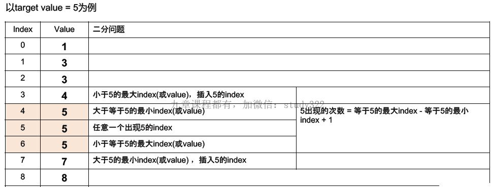

## 快速排序

### python版

```python
class Solution:
    def quickSort(self, nums, start, end):
        if start >= end:
            return
        left, right = start, end
        pivot = nums[(left + right) // 2]
        while left <= right:
            while left <= right and nums[left] < pivot:
                left += 1
            while left <= right and nums[right] > pivot:
                right -= 1
            if left <= right:
                nums[left], nums[right] = nums[right], nums[left]
            	left += 1
                right -= 1
        quickSort(nums, start, right)
        quickSort(nums, left, end)
```

### Java版

```java
public class Solution {
    public void sortInteger(int[] A) {
        quickSort(A, 0, A.length - 1);
    }
    public void quickSort(int[] arr, int start, int end) {
        // 递归的出口
        if (start >= end) {
            return;
        }
        int left = start, right = end;
        int pivot = arr[(left + right) / 2];
        while (left <= right) {
            while (left <= right && arr[left] < pivot) {
                left+;
            }
            while (left <= right && arr[right] > pivot) {
                // 这里的arr[right] > pivot，而不用>=，虽然这样做当出现相等时，还将两个数交换的操作，略显麻烦。但这样保证两边数的个数处于一个平均的情况，而不是极端的一边很多一边几乎没有
                right--;
            }
            if (left <= right) {
            	int temp = arr[left];
            	arr[left] = arr[right];
            	arr[right] = temp;
            	left++;
            	right--;
            }
        }
        quickSort(arr, start, right);
        quickSort(arr, left, end);
    }
}
```


## 快速排序的分区算法

> **这里nums[right] >= k 用> 或者>=都能得出正确结果，用>=会更快，因为分区数组，保证了隔板是两数之间（即k不在nums中）这样就保证了不会出现快排中的极端情况。**
>
> **而快排是以一个数为pivot，只能用>号，如果用>= 会出现极端情况**

### python版

```python
while left <= right:
    while left <= right and nums[left] < k: # 或者是nums[left] 在左边的条件
        left += 1
    while left <= right and nums[right] >= k: # 或者是nums[right] 在右边的条件
        right -= 1
    if left <= right:
        nums[left], nums[right] = nums[right], nums[left]
        left += 1
        right -= 1
```

### Java版

```java
while (left <= right) {
    while (left <= right && nums[left] < k) { 
        left++;
    }
    while (left <= right && nums[right] >= k) {
        right--;
    }
    if (left <= right) {
        int temp = nums[left];
        nums[left] = nums[right];
        nums[right] = temp;
        left++;
        right--;
    }
}
```


## 归并排序

归并思想中，**middle如果是向下取整的，在交换的时候就需要将等于的情况放在小于的情况中**。middle如果向上取整，交换时就需要将等于的情况放在大于的情况中，否则会报错。

### python版

```python
class Solution:
    def mergeSort(self, nums, start, end, temp):
        if start >= end:
            return
        self.mergeSort(nums, start, (start + end) // 2, temp)
        self.mergeSort(nums, (start + end) // 2 + 1, end, temp)
        self.merge(nums, start, end, temp)
    def merge(self, nums,start, end, temp):
        middle = (start + end) // 2
        left, right, index = start, middle + 1, start
        while left <= middle and right <= end:
            if nums[left] <= nums[right]:
                temp[index] = nums[left]
                left += 1
            else:
                temp[index] = nums[right]
                right += 1
            index += 1
        while left <= middle:
            temp[index] = nums[left]
            left += 1
            index += 1
        while right <= end:
            tmep[index] = nums[right]
            index += 1
            right += 1
        for idx in range(start, end + 1):
            nums[idx] = temp[idx]
```


## 彩虹排序：归并的思想

```python
class Solution:
    def sortColors(self, colors, k):
        if not colors:
            return
        self.rainbowSort(colors, 0, len(colors) - 1, 1, k)
    def rainbowSort(self, colors, start, end, colorFrom, colorTo):
        if colorFrom == colorTo:
            return 
        if start >= end:
            return
        colorMid = (colorFrom + colorTo) // 2
        left, right = start, end
        while left <= right:
            while left <= right and colors[left] <= colorMid:
                # 因为mid是向下取整，所以等于的情况要放在小于处，否则结果出错
                left += 1
            while left <= right and colors[right] > colorMid:
                right -= 1
            if left <= right:
                colors[left], colors[right] = colors[right], colors[left]
                left += 1
                right -= 1
        self.rainbowSort(colors, start, right, colorFrom, colorMid)
    	self.rainbowSort(colors, left, end, colorMid + 1, colorTo)
```


## 同向双指针模板

```python
j = 0 or j = 1
for i from 0 to (n - 1):
    j = max(j, i + 1) 	# 保证快指针j在慢指针i的前面，根据具体情况选择是否加这一步
    while j < n and (i,j当前的搭配不满足条件的情况): # 第二个条件因题而异
        j += 1
    while j >= n:
        break
    if i,j的搭配满足问题条件的情况:
        处理i,jd
```


## 二分法模板

用二分法在有序数组上查找的六种情况：

1. 找小于某个值的最大index
2. 找某个值第一次出现的index（或大于等于某个值的最小index）
3. 找某个值任意一次出现的index
4. 找某个值最后一次出现的index（或小于等于某个值的最大index）
5. 找大于某个值的最小index
6. 找某个值出现的次数



```python
class Solution:
    def binarySearch(self, nums, target):
        if not nums:
            return -1
        start, end = 0, len(nums) - 1
        # 1. start + 1 < end而不是start < end是为了避免死循环：
        # 在first position of target的情况不会死循环
        # 但在last position情况下会出现死循环，例如：nums = [1,1],target=1
        while start + 1 < end:
            mid = (start + end) // 2
            # 2. <,=,>的逻辑先分开写，根据问题考虑=的情况和谁合并
            if nums[mid] < target:
                start = mid
            elif nums[mid] > target:
                end = mid
            else:
                # 2. 不考虑target多值时随便归到>或<中都行。
                # 但如果问题是找第一次出现或最后一次出现时，就要注意：
                # end=mid找第一次出现，start=mid找最后一次出现
                end = mid
        # 3. 因为上面退出条件是start+1<end，所以退出时start与end是相邻的
        # 上面虽然做了初筛，但还是存在start和end相等的情况
        # 所以还需要单独判断start和end谁是目标值
        # 如果找first position就先看start，否则先看end（两个if语句位置调换），但两个if都是需要的
        # （target唯一，先看谁都可以）
        if nums[start] == target:
            return start
        if nums[end] == target:
            return end
        # 4. 上面两个if语句中，如果就是找目标值则用==；如果找小于target就用<,反之用>。
        # 4.1 找小于target的最大index（此时上面==情况归在<）：
        # if nums[end] < target:
        #	return end
        # elif nums[start] < target:
        #	return start
        # 4.2 找大于target的最小index（此时上面==情况归在>）：
        # if nums[start] > target:
        # 	return start
        # elif nums[end] > target:
        #	return end
        # 4.3 找小于等于或大于等于target的情况更为一般，需要根据具体情况分解成上面两l
        return -1
```

> 找target出现的次数，就分别找出target第一次和最后一次出现的位置，然后相减

## 宽度优先搜索模板

```python
queue = collections.deque([node])
distance = {node: 0}

while queue:
    # 如果需要获取层的信息，就再此处加上下面一行代码：
    # for _ in range(len(queue)):
    node = queue.popleft()
    # 当前节点的邻接点根据具体问题确定获取规则，即get_neighbors
    for neighbor in node.get_neighbors():
        if neighbor in distance:
            continue
        # 距离增加方式根据具体问题确定
        distance[neighbor] = distance[node] + 1 
        queue.append(neighbor)
```

## BFS拓扑排序模板

```python
"""
class DirectGraphNode:
	def __init__(self, x):
		self.label = x
		self.neighbor = []
"""
class Solution:
    def topSort(self, graph):
        # 1. 统计各节点入度情况
        node2indegree = self.get_indegree(graph)
        # 2. 根据入度统计的dict，取出其中入度为0的节点，放到队列中
        start_node = [x for x in node2indegree if node2indegree[x] == 0]
        queue = collections.deque(start_node)
        # 3. bfs模板
        order = []
        while queue:
            # 4. 如果判断拓扑排序是否唯一，只用保证queue中永远只有一个元素存在即可满足
            # if len(queue) > 1:	# queue中元素大于1，说明不可能唯一了，直接return
            # 	 return None
            node = queue.popleft()
            # 3.0 拓扑排序
            order.append(node)
            for neighbor in node.neighbors:
                # 3.1 每当遍历完一个点的后继节点，就解除该点与后继点的关系，即neighbor的入度减一
                node2indegree[neighbor] -= 1
                # 3.2 入度减一后，判断该点的入度是否为1，是则添加到队列
                if node2indegree[neighbor] == 0:
                    queue.append(neighbor)
        return order
        
        # 根据输入数据的格式进行节点的入度统计。可以用二维list统计，也可以用dict统计
        # 注意是要统计{当前节点node：node的前驱节点个数}
    def get_indegree(self, graph):
        node2indegree = {x:0 for x in graph}
        for node in graph:
            for neighbor in node.neighbors:
                node2indegree[neighbor] += 1
        return node2indegree
```

> - 如果没有上面那种定义的节点与节点之间的neighbor关系
>
> - 就需要额外构建一个neighbor关系，构建方式是形式是：**{当前点node :  node的后继节点组成的list}**

